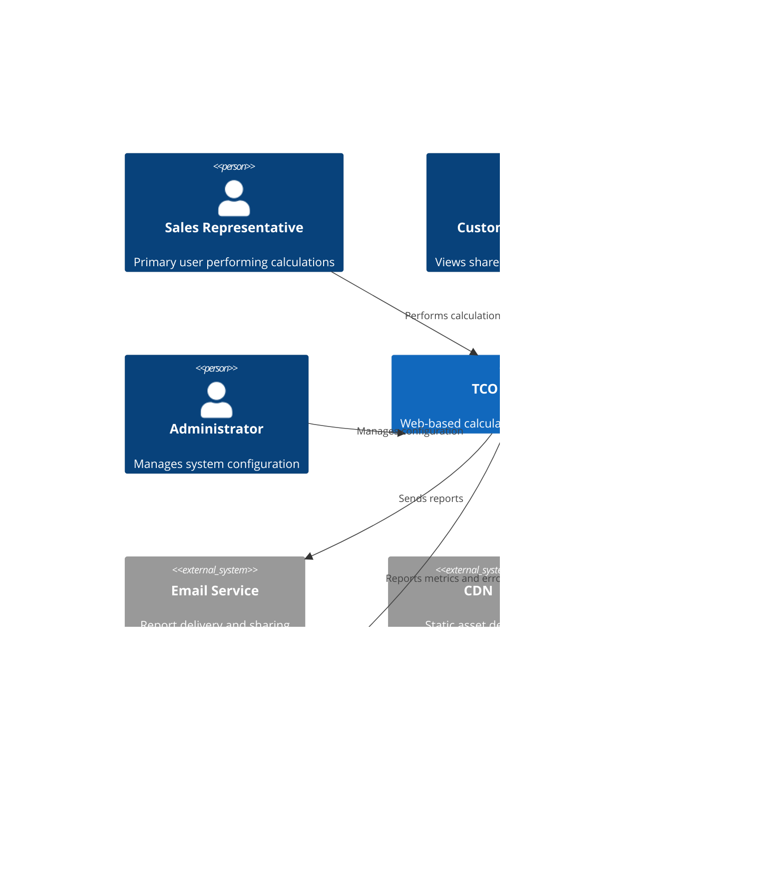

# System Architecture - Immersion Cooling TCO Calculator

## Executive Summary

The Immersion Cooling TCO Calculator is designed as a modern, scalable web application that enables sales teams to demonstrate the financial benefits of immersion cooling systems. The architecture prioritizes performance (<2s load times), security (comprehensive input validation), internationalization (English/Arabic with RTL support), and professional reporting capabilities.

## Architecture Overview

### System Context

The application serves multiple stakeholders with distinct needs:
- **Sales Representatives**: Need fast, accurate calculations for customer presentations
- **Customers**: Require clear financial analysis and professional reports
- **Administrators**: Manage calculation parameters and system configuration
- **International Users**: Access in multiple languages and currencies

### High-Level Architecture



### Container Architecture


## Component Design

### Frontend Components

#### Core Application Components
- **LanguageCurrencySelector**: Handles internationalization and currency selection
- **ConfigurationWizard**: Progressive disclosure interface for input collection
- **CalculationEngine**: Real-time calculation updates and validation
- **VisualizationDashboard**: Interactive charts and graphs using Chart.js
- **ReportGenerator**: PDF and Excel export functionality
- **SharingManager**: Shareable link generation and management

#### Layout and Navigation
- **ResponsiveLayout**: Mobile-first responsive design with breakpoints
- **NavigationHeader**: Language/currency controls and branding
- **ProgressIndicator**: Multi-step workflow progress tracking
- **ErrorBoundary**: Graceful error handling and recovery

#### Input Components
- **RackConfigurationForm**: Air cooling rack specification inputs
- **ImmersionConfigForm**: Flexible immersion cooling configuration
- **FinancialParametersForm**: TCO analysis parameters
- **ValidationFeedback**: Real-time input validation with i18n support

### Backend Components

#### API Layer
- **AuthenticationMiddleware**: Admin authentication and session management
- **ValidationMiddleware**: Comprehensive input validation and sanitization
- **LocalizationMiddleware**: Request locale detection and handling
- **RateLimitingMiddleware**: API abuse protection
- **SecurityMiddleware**: CORS, CSP, and security headers

#### Business Logic Layer
- **CalculationService**: Core TCO calculation algorithms
  - CAPEX calculation engine
  - OPEX projection algorithms
  - NPV and ROI analysis
  - PUE efficiency calculations
- **ConfigurationService**: Parameter management and versioning
- **ReportService**: PDF and Excel generation
- **SharingService**: Secure link generation and management

#### Data Layer
- **DatabaseManager**: Connection pooling and query optimization
- **ConfigurationRepository**: Parameter storage and retrieval
- **SessionRepository**: Temporary calculation data management
- **AuditRepository**: Configuration change tracking

## Data Architecture

### Data Flow Diagram


### Data Models

#### Core Configuration Schema
```sql
-- Equipment pricing and specifications
CREATE TABLE equipment_config (
    id UUID PRIMARY KEY DEFAULT gen_random_uuid(),
    category VARCHAR(50) NOT NULL, -- 'air_cooling', 'immersion_cooling'
    item_type VARCHAR(50) NOT NULL, -- 'rack', 'hvac', 'pump', 'coolant'
    specifications JSONB NOT NULL,
    pricing JSONB NOT NULL, -- Multi-currency pricing
    effective_date TIMESTAMP NOT NULL,
    created_at TIMESTAMP DEFAULT CURRENT_TIMESTAMP,
    version INTEGER NOT NULL DEFAULT 1
);

-- Financial parameters
CREATE TABLE financial_config (
    id UUID PRIMARY KEY DEFAULT gen_random_uuid(),
    parameter_name VARCHAR(100) NOT NULL,
    default_value DECIMAL(10,4) NOT NULL,
    currency_code VARCHAR(3),
    region VARCHAR(10),
    description TEXT,
    effective_date TIMESTAMP NOT NULL,
    created_at TIMESTAMP DEFAULT CURRENT_TIMESTAMP
);

-- Exchange rates
CREATE TABLE exchange_rates (
    id UUID PRIMARY KEY DEFAULT gen_random_uuid(),
    from_currency VARCHAR(3) NOT NULL,
    to_currency VARCHAR(3) NOT NULL,
    rate DECIMAL(10,6) NOT NULL,
    effective_date DATE NOT NULL,
    created_at TIMESTAMP DEFAULT CURRENT_TIMESTAMP,
    UNIQUE(from_currency, to_currency, effective_date)
);

-- Calculation sessions
CREATE TABLE calculation_sessions (
    id UUID PRIMARY KEY DEFAULT gen_random_uuid(),
    session_data JSONB NOT NULL,
    results JSONB NOT NULL,
    language VARCHAR(5) NOT NULL DEFAULT 'en',
    currency VARCHAR(3) NOT NULL DEFAULT 'USD',
    share_token VARCHAR(64) UNIQUE,
    expires_at TIMESTAMP,
    created_at TIMESTAMP DEFAULT CURRENT_TIMESTAMP,
    updated_at TIMESTAMP DEFAULT CURRENT_TIMESTAMP
);

-- Configuration audit trail
CREATE TABLE config_audit (
    id UUID PRIMARY KEY DEFAULT gen_random_uuid(),
    table_name VARCHAR(50) NOT NULL,
    record_id UUID NOT NULL,
    change_type VARCHAR(10) NOT NULL, -- 'INSERT', 'UPDATE', 'DELETE'
    old_values JSONB,
    new_values JSONB,
    changed_by VARCHAR(100),
    changed_at TIMESTAMP DEFAULT CURRENT_TIMESTAMP
);

-- Indexes for performance
CREATE INDEX idx_equipment_config_category ON equipment_config(category, effective_date DESC);
CREATE INDEX idx_financial_config_name ON financial_config(parameter_name, effective_date DESC);
CREATE INDEX idx_exchange_rates_date ON exchange_rates(effective_date DESC);
CREATE INDEX idx_calculation_sessions_token ON calculation_sessions(share_token);
CREATE INDEX idx_calculation_sessions_expires ON calculation_sessions(expires_at);
```

### Configuration Data Structure

#### Equipment Configuration JSON Schema
```json
{
  "air_cooling_rack_42u": {
    "specifications": {
      "height_units": 42,
      "power_capacity_kw": 15,
      "heat_dissipation_kw": 15,
      "space_efficiency": 0.8
    },
    "pricing": {
      "USD": {
        "equipment_cost": 5000,
        "installation_cost": 2000,
        "maintenance_annual_pct": 0.05
      },
      "EUR": {
        "equipment_cost": 4200,
        "installation_cost": 1680,
        "maintenance_annual_pct": 0.05
      }
    }
  },
  "immersion_cooling_tank": {
    "specifications": {
      "capacity_servers": 48,
      "power_density_kw_per_u": 2.0,
      "cooling_efficiency_pue": 1.03,
      "coolant_capacity_liters": 500
    },
    "pricing": {
      "USD": {
        "tank_cost": 15000,
        "pump_system_cost": 8000,
        "coolant_cost_per_liter": 25,
        "installation_cost": 5000,
        "maintenance_annual_pct": 0.03
      }
    }
  }
}
```

## Technology Stack

### Frontend Stack Selection

#### Framework: React 18 with TypeScript
**Rationale**: 
- Team expertise and ecosystem maturity
- Excellent TypeScript integration
- Strong community support for internationalization
- Proven performance with large applications

**Key Libraries**:
- **UI Framework**: Material-UI v5 for consistent design system
- **Internationalization**: react-i18next with RTL support
- **Charts**: Recharts for responsive, accessible visualizations
- **Forms**: Formik with Yup validation
- **State Management**: Zustand for lightweight state management
- **Routing**: React Router v6 for client-side navigation

#### Development Tools
- **Build Tool**: Vite for fast development and optimized builds
- **Testing**: Vitest + React Testing Library for comprehensive testing
- **Code Quality**: ESLint + Prettier + Husky for consistent code standards

### Backend Stack Selection

#### Runtime: Node.js 18 with TypeScript
**Rationale**:
- JavaScript ecosystem consistency with frontend
- Excellent performance for I/O-intensive operations
- Strong typing with TypeScript for maintainability
- Extensive library ecosystem for calculations and reporting

#### Framework: Express.js with TypeScript
**Key Libraries**:
- **API Documentation**: Swagger/OpenAPI 3.0 with automatic generation
- **Validation**: Joi for comprehensive input validation
- **Security**: Helmet.js, express-rate-limit, cors
- **Authentication**: JWT for admin authentication
- **File Processing**: PDFKit for PDF generation, ExcelJS for Excel export

#### Database: PostgreSQL 14
**Rationale**:
- ACID compliance critical for financial calculations
- Excellent JSON support for flexible configuration storage
- Strong performance with proper indexing
- Proven reliability and extensive tooling

#### Caching: Redis 6
**Usage**:
- Session storage for temporary calculation data
- Configuration parameter caching
- Rate limiting state management
- Calculation result caching for performance

## Security Architecture

### Authentication and Authorization

#### Admin Authentication
```typescript
// JWT-based authentication for administrative functions
interface AdminToken {
  user_id: string;
  role: 'admin' | 'super_admin';
  permissions: string[];
  exp: number;
  iat: number;
}

// Role-based access control
const permissions = {
  'config.read': 'Read configuration parameters',
  'config.write': 'Modify configuration parameters',
  'audit.read': 'View audit logs',
  'system.monitor': 'Access monitoring data'
};
```

#### Session Management
- Anonymous user sessions for calculation data
- Secure session tokens for shared link access
- Configurable session expiration (default 24 hours)
- Session cleanup for expired data

### Input Validation and Sanitization

#### Multi-Layer Validation
```typescript
// Client-side validation schema
const configValidation = Yup.object({
  airCoolingRacks: Yup.number()
    .min(1, 'Must have at least 1 rack')
    .max(1000, 'Maximum 1000 racks supported')
    .required('Rack count is required'),
  totalPowerKW: Yup.number()
    .min(1, 'Minimum power 1kW')
    .max(50000, 'Maximum power 50MW')
    .when('inputMode', {
      is: 'power',
      then: Yup.number().required('Total power is required')
    })
});

// Server-side validation middleware
export const validateCalculationInput = (req: Request, res: Response, next: NextFunction) => {
  const schema = {
    airCooling: {
      racks: { type: 'number', min: 1, max: 1000 },
      powerPerRack: { type: 'number', min: 0.5, max: 50 }
    },
    immersionCooling: {
      rackSizes: { type: 'array', items: { type: 'number', min: 1, max: 23 } }
    },
    financial: {
      analysisYears: { type: 'number', min: 1, max: 10 },
      discountRate: { type: 'number', min: 0, max: 0.20 }
    }
  };
  
  // Validation logic with sanitization
  // XSS protection through input sanitization
  // SQL injection prevention through parameterized queries
};
```

### Security Headers and Protection

```typescript
// Security middleware configuration
app.use(helmet({
  contentSecurityPolicy: {
    directives: {
      defaultSrc: ["'self'"],
      scriptSrc: ["'self'", "'unsafe-inline'"],
      styleSrc: ["'self'", "'unsafe-inline'", 'fonts.googleapis.com'],
      fontSrc: ["'self'", 'fonts.gstatic.com'],
      imgSrc: ["'self'", 'data:', 'blob:'],
      connectSrc: ["'self'", 'api.domain.com']
    }
  },
  hsts: {
    maxAge: 31536000,
    includeSubDomains: true,
    preload: true
  }
}));

// Rate limiting configuration
const rateLimiter = rateLimit({
  windowMs: 15 * 60 * 1000, // 15 minutes
  max: 100, // Limit each IP to 100 requests per windowMs
  message: 'Too many requests from this IP',
  standardHeaders: true,
  legacyHeaders: false
});

// CSRF protection for admin functions
app.use('/api/admin', csrf({ cookie: true }));
```

### Data Protection

#### Encryption at Rest and in Transit
- All communications over HTTPS/TLS 1.3
- Database encryption for sensitive configuration data
- Encrypted storage for generated reports
- Secure key management for signing JWTs

#### Privacy and Compliance
```typescript
// Data retention policy
const dataRetentionPolicy = {
  calculationSessions: '90 days',
  auditLogs: '2 years',
  generatedReports: '30 days',
  errorLogs: '6 months'
};

// GDPR compliance measures
interface PrivacySettings {
  collectAnalytics: boolean;
  shareUsageData: boolean;
  retainCalculationHistory: boolean;
}

// Automatic data cleanup
const cleanupExpiredData = async () => {
  await db.query(`
    DELETE FROM calculation_sessions 
    WHERE expires_at < NOW()
  `);
  
  await db.query(`
    DELETE FROM generated_reports 
    WHERE created_at < NOW() - INTERVAL '30 days'
  `);
};
```

## API Architecture

### RESTful API Design

#### Base API Structure
```
/api/v1/
├── /config                 # Configuration management
├── /calculations           # Calculation operations
├── /reports               # Report generation
├── /sharing               # Link sharing
├── /admin                 # Administrative functions
└── /health                # Health checks
```

#### Endpoint Categories

**Configuration Endpoints**
```typescript
GET    /api/v1/config/equipment        # Get equipment pricing and specs
GET    /api/v1/config/financial        # Get financial parameters
GET    /api/v1/config/exchange-rates   # Get current exchange rates
POST   /api/v1/admin/config/update     # Update configuration (admin only)
```

**Calculation Endpoints**
```typescript
POST   /api/v1/calculations/calculate  # Perform TCO calculation
GET    /api/v1/calculations/validate   # Validate input parameters
POST   /api/v1/calculations/save       # Save calculation session
GET    /api/v1/calculations/:id        # Retrieve saved calculation
```

**Report Generation Endpoints**
```typescript
POST   /api/v1/reports/pdf            # Generate PDF report
POST   /api/v1/reports/excel          # Generate Excel export
GET    /api/v1/reports/:id/download    # Download generated report
```

#### API Response Format
```typescript
// Successful response format
interface ApiResponse<T> {
  success: true;
  data: T;
  meta?: {
    timestamp: string;
    version: string;
    locale: string;
    currency: string;
  };
}

// Error response format
interface ApiError {
  success: false;
  error: {
    code: string;
    message: string;
    details?: Record<string, any>;
  };
  meta: {
    timestamp: string;
    request_id: string;
  };
}
```

#### Request/Response Examples

**Calculation Request**
```typescript
POST /api/v1/calculations/calculate
Content-Type: application/json

{
  "configuration": {
    "airCooling": {
      "racks": 100,
      "powerPerRackKW": 12,
      "rackType": "42U_standard"
    },
    "immersionCooling": {
      "tanks": [
        { "size": "23U", "quantity": 25 },
        { "size": "20U", "quantity": 30 }
      ]
    }
  },
  "financial": {
    "analysisYears": 5,
    "discountRate": 0.08,
    "energyCostPerKWh": 0.12,
    "currency": "USD"
  },
  "locale": "en"
}
```

**Calculation Response**
```typescript
{
  "success": true,
  "data": {
    "summary": {
      "totalCapexSavings": 125000.00,
      "totalOpexSavings": 450000.00,
      "totalTcoSavings": 575000.00,
      "roi": 0.23,
      "paybackMonths": 18
    },
    "breakdown": {
      "capex": {
        "airCooling": {
          "equipment": 500000.00,
          "installation": 200000.00,
          "infrastructure": 150000.00,
          "total": 850000.00
        },
        "immersionCooling": {
          "equipment": 525000.00,
          "installation": 100000.00,
          "infrastructure": 100000.00,
          "total": 725000.00
        }
      },
      "opex": {
        "year1": {
          "airCooling": {
            "energy": 86400.00,
            "maintenance": 42500.00,
            "total": 128900.00
          },
          "immersionCooling": {
            "energy": 52000.00,
            "maintenance": 21750.00,
            "coolant": 5000.00,
            "total": 78750.00
          }
        }
      }
    },
    "charts": {
      "tcoProgression": [
        { "year": 1, "airCooling": 978900, "immersionCooling": 803750 },
        { "year": 2, "airCooling": 1107800, "immersionCooling": 882500 }
      ],
      "pueComparison": {
        "airCooling": 1.4,
        "immersionCooling": 1.03
      }
    }
  },
  "meta": {
    "calculationId": "calc_123456789",
    "timestamp": "2025-08-13T10:30:00Z",
    "version": "1.0.0",
    "locale": "en",
    "currency": "USD"
  }
}
```

## Performance Architecture

### Performance Requirements and Strategy

#### Target Performance Metrics
- **Page Load Time**: <2 seconds (including initial data fetch)
- **Calculation Processing**: <1 second for standard configurations
- **Chart Rendering**: <500ms for visualization updates
- **Report Generation**: <10 seconds PDF, <5 seconds Excel
- **API Response Time**: <200ms for configuration data, <1 second for calculations

#### Frontend Performance Optimization

**Code Splitting and Lazy Loading**
```typescript
// Route-based code splitting
const Calculator = lazy(() => import('./components/Calculator'));
const Reports = lazy(() => import('./components/Reports'));
const Admin = lazy(() => import('./components/Admin'));

// Component-based lazy loading
const Chart = lazy(() => import('./components/Chart'));

// Progressive loading strategy
const App = () => (
  <Suspense fallback={<LoadingSpinner />}>
    <Routes>
      <Route path="/calculator" element={<Calculator />} />
      <Route path="/reports" element={<Reports />} />
      <Route path="/admin" element={<Admin />} />
    </Routes>
  </Suspense>
);
```

**Optimized State Management**
```typescript
// Zustand store with computed selectors
interface CalculatorStore {
  configuration: ConfigurationState;
  results: CalculationResults | null;
  isCalculating: boolean;
  
  // Computed values for performance
  get capexSavings(): number;
  get opexSavings(): number;
  get totalTcoSavings(): number;
  
  // Optimized actions
  updateConfiguration: (config: Partial<ConfigurationState>) => void;
  calculate: () => Promise<void>;
}

// Memoized selectors for expensive calculations
const useCapexSavings = () => useCalculatorStore(
  useCallback((state) => state.capexSavings, [])
);
```

**Chart Performance Optimization**
```typescript
// Optimized chart rendering with virtualization
const OptimizedChart = memo(({ data, type }: ChartProps) => {
  const chartData = useMemo(() => 
    processChartData(data), [data]
  );
  
  const chartOptions = useMemo(() => ({
    responsive: true,
    maintainAspectRatio: false,
    animation: {
      duration: 300 // Reduced animation time
    },
    elements: {
      point: {
        radius: 0 // Hide points for better performance
      }
    }
  }), []);
  
  return (
    <Chart 
      data={chartData} 
      options={chartOptions}
      redraw={false} // Prevent unnecessary redraws
    />
  );
});
```

#### Backend Performance Optimization

**Calculation Engine Optimization**
```typescript
// Optimized calculation service with caching
class CalculationService {
  private cache = new Map<string, CalculationResults>();
  
  async calculateTCO(config: ConfigurationInput): Promise<CalculationResults> {
    const cacheKey = this.generateCacheKey(config);
    
    // Check cache first
    if (this.cache.has(cacheKey)) {
      return this.cache.get(cacheKey)!;
    }
    
    // Parallel calculation processing
    const [capexResults, opexResults, pueResults] = await Promise.all([
      this.calculateCapex(config),
      this.calculateOpex(config),
      this.calculatePUE(config)
    ]);
    
    const results = this.combineResults(capexResults, opexResults, pueResults);
    
    // Cache results with TTL
    this.cache.set(cacheKey, results);
    setTimeout(() => this.cache.delete(cacheKey), 300000); // 5 min TTL
    
    return results;
  }
  
  private async calculateCapex(config: ConfigurationInput): Promise<CapexResults> {
    // Optimized CAPEX calculation with vectorized operations
    const airCoolingCosts = this.vectorCalculateAirCooling(config.airCooling);
    const immersionCosts = this.vectorCalculateImmersion(config.immersionCooling);
    
    return {
      airCooling: airCoolingCosts,
      immersionCooling: immersionCosts,
      savings: airCoolingCosts.total - immersionCosts.total
    };
  }
}
```

**Database Query Optimization**
```sql
-- Optimized configuration query with proper indexing
CREATE INDEX CONCURRENTLY idx_equipment_config_lookup 
ON equipment_config (category, item_type, effective_date DESC);

CREATE INDEX CONCURRENTLY idx_financial_config_lookup 
ON financial_config (parameter_name, currency_code, effective_date DESC);

-- Materialized view for frequently accessed data
CREATE MATERIALIZED VIEW current_configuration AS
SELECT DISTINCT ON (category, item_type)
  id, category, item_type, specifications, pricing
FROM equipment_config
WHERE effective_date <= CURRENT_DATE
ORDER BY category, item_type, effective_date DESC;

-- Refresh strategy
CREATE OR REPLACE FUNCTION refresh_config_cache()
RETURNS void AS $$
BEGIN
  REFRESH MATERIALIZED VIEW CONCURRENTLY current_configuration;
END;
$$ LANGUAGE plpgsql;
```

**Redis Caching Strategy**
```typescript
// Multi-level caching implementation
class CacheService {
  private redis: Redis;
  private localCache = new Map<string, { data: any; expiry: number }>();
  
  async get<T>(key: string): Promise<T | null> {
    // L1 Cache: In-memory
    const localData = this.localCache.get(key);
    if (localData && localData.expiry > Date.now()) {
      return localData.data;
    }
    
    // L2 Cache: Redis
    const redisData = await this.redis.get(key);
    if (redisData) {
      const parsed = JSON.parse(redisData);
      // Populate L1 cache
      this.localCache.set(key, {
        data: parsed,
        expiry: Date.now() + 30000 // 30 sec local cache
      });
      return parsed;
    }
    
    return null;
  }
  
  async set(key: string, value: any, ttl: number = 300): Promise<void> {
    // Set in both caches
    this.localCache.set(key, {
      data: value,
      expiry: Date.now() + Math.min(ttl * 1000, 30000)
    });
    
    await this.redis.setex(key, ttl, JSON.stringify(value));
  }
}
```

## Deployment Architecture

### Cloud Infrastructure Design

#### Multi-Environment Strategy
```yaml
# Development Environment
development:
  compute:
    - Web Application: 1 instance (2 vCPU, 4GB RAM)
    - API Server: 1 instance (2 vCPU, 4GB RAM)
  data:
    - PostgreSQL: 1 instance (2 vCPU, 8GB RAM, 100GB SSD)
    - Redis: 1 instance (1 vCPU, 2GB RAM)

# Staging Environment  
staging:
  compute:
    - Web Application: 2 instances (2 vCPU, 4GB RAM each)
    - API Server: 2 instances (4 vCPU, 8GB RAM each)
  data:
    - PostgreSQL: 1 instance (4 vCPU, 16GB RAM, 200GB SSD)
    - Redis: 1 instance (2 vCPU, 4GB RAM)

# Production Environment
production:
  compute:
    - Web Application: 3+ instances (4 vCPU, 8GB RAM each)
    - API Server: 3+ instances (4 vCPU, 16GB RAM each)
  data:
    - PostgreSQL: Primary + Read Replica (8 vCPU, 32GB RAM, 500GB SSD)
    - Redis: Cluster (3 nodes, 4 vCPU, 8GB RAM each)
```

#### Container Architecture
```dockerfile
# Multi-stage Docker build for API server
FROM node:18-alpine AS builder
WORKDIR /app
COPY package*.json ./
RUN npm ci --only=production

FROM node:18-alpine AS runtime
RUN addgroup -g 1001 -S nodejs && \
    adduser -S nodejs -u 1001
WORKDIR /app
COPY --from=builder --chown=nodejs:nodejs /app/node_modules ./node_modules
COPY --chown=nodejs:nodejs . .
USER nodejs
EXPOSE 3000
HEALTHCHECK --interval=30s --timeout=3s --start-period=5s --retries=3 \
  CMD node healthcheck.js
CMD ["node", "dist/server.js"]
```

#### Kubernetes Deployment
```yaml
# API Server Deployment
apiVersion: apps/v1
kind: Deployment
metadata:
  name: tco-calculator-api
spec:
  replicas: 3
  selector:
    matchLabels:
      app: tco-calculator-api
  template:
    metadata:
      labels:
        app: tco-calculator-api
    spec:
      containers:
      - name: api
        image: tco-calculator-api:latest
        ports:
        - containerPort: 3000
        env:
        - name: DATABASE_URL
          valueFrom:
            secretKeyRef:
              name: database-secret
              key: url
        - name: REDIS_URL
          valueFrom:
            secretKeyRef:
              name: redis-secret
              key: url
        resources:
          requests:
            memory: "512Mi"
            cpu: "250m"
          limits:
            memory: "1Gi"
            cpu: "500m"
        livenessProbe:
          httpGet:
            path: /health
            port: 3000
          initialDelaySeconds: 30
          periodSeconds: 10
        readinessProbe:
          httpGet:
            path: /ready
            port: 3000
          initialDelaySeconds: 5
          periodSeconds: 5

---
# Service configuration
apiVersion: v1
kind: Service
metadata:
  name: tco-calculator-api-service
spec:
  selector:
    app: tco-calculator-api
  ports:
  - protocol: TCP
    port: 80
    targetPort: 3000
  type: ClusterIP

---
# Horizontal Pod Autoscaler
apiVersion: autoscaling/v2
kind: HorizontalPodAutoscaler
metadata:
  name: tco-calculator-api-hpa
spec:
  scaleTargetRef:
    apiVersion: apps/v1
    kind: Deployment
    name: tco-calculator-api
  minReplicas: 3
  maxReplicas: 10
  metrics:
  - type: Resource
    resource:
      name: cpu
      target:
        type: Utilization
        averageUtilization: 70
  - type: Resource
    resource:
      name: memory
      target:
        type: Utilization
        averageUtilization: 80
```

### Monitoring and Observability

#### Application Performance Monitoring
```typescript
// Custom metrics collection
import { register, Counter, Histogram, Gauge } from 'prom-client';

export const metrics = {
  calculationRequests: new Counter({
    name: 'tco_calculations_total',
    help: 'Total number of TCO calculations performed',
    labelNames: ['currency', 'language', 'status']
  }),
  
  calculationDuration: new Histogram({
    name: 'tco_calculation_duration_seconds',
    help: 'Time taken to perform TCO calculations',
    buckets: [0.1, 0.5, 1, 2, 5, 10]
  }),
  
  activeUsers: new Gauge({
    name: 'tco_active_users',
    help: 'Number of currently active users'
  }),
  
  reportGeneration: new Histogram({
    name: 'tco_report_generation_duration_seconds',
    help: 'Time taken to generate reports',
    labelNames: ['format'],
    buckets: [1, 2, 5, 10, 15, 30]
  })
};

// Middleware for automatic metrics collection
export const metricsMiddleware = (req: Request, res: Response, next: NextFunction) => {
  const start = Date.now();
  
  res.on('finish', () => {
    const duration = (Date.now() - start) / 1000;
    
    if (req.path.includes('/calculate')) {
      metrics.calculationDuration.observe(duration);
      metrics.calculationRequests.inc({
        currency: req.body.currency || 'USD',
        language: req.body.locale || 'en',
        status: res.statusCode < 400 ? 'success' : 'error'
      });
    }
  });
  
  next();
};
```

#### Health Check Implementation
```typescript
// Comprehensive health check service
interface HealthCheckResult {
  status: 'healthy' | 'degraded' | 'unhealthy';
  checks: Record<string, {
    status: 'pass' | 'fail' | 'warn';
    time: string;
    output?: string;
  }>;
}

export class HealthCheckService {
  async performHealthCheck(): Promise<HealthCheckResult> {
    const checks = await Promise.allSettled([
      this.checkDatabase(),
      this.checkRedis(),
      this.checkFileSystem(),
      this.checkExternalServices()
    ]);
    
    const results: HealthCheckResult = {
      status: 'healthy',
      checks: {}
    };
    
    // Process check results
    const checkNames = ['database', 'redis', 'filesystem', 'external'];
    checks.forEach((check, index) => {
      const name = checkNames[index];
      if (check.status === 'fulfilled') {
        results.checks[name] = check.value;
      } else {
        results.checks[name] = {
          status: 'fail',
          time: new Date().toISOString(),
          output: check.reason.message
        };
        results.status = 'unhealthy';
      }
    });
    
    return results;
  }
  
  private async checkDatabase(): Promise<any> {
    try {
      const start = Date.now();
      await db.query('SELECT 1');
      return {
        status: 'pass',
        time: new Date().toISOString(),
        output: `Database connection successful (${Date.now() - start}ms)`
      };
    } catch (error) {
      throw new Error(`Database connection failed: ${error.message}`);
    }
  }
}
```

This comprehensive system architecture provides a solid foundation for building a scalable, secure, and high-performance Immersion Cooling TCO Calculator that meets all specified requirements while allowing for future growth and enhancement.