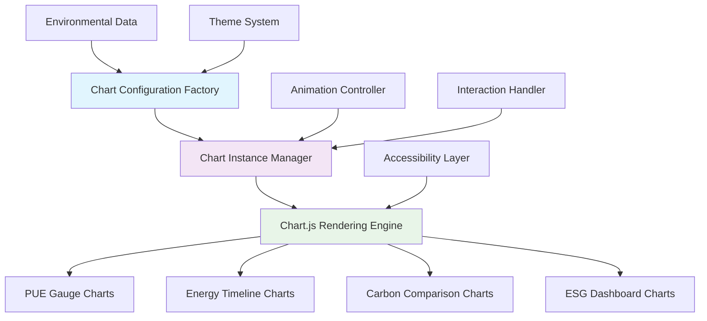

# Chart.js Integration Architecture for Environmental Visualizations

## Executive Summary

This document defines the comprehensive Chart.js integration architecture for creating professional environmental impact visualizations in the enhanced TCO Calculator. The design leverages Chart.js 4.x capabilities to create compelling, accessible, and performant charts that prominently display PUE improvements, energy savings, and carbon reduction metrics.

## Chart.js Integration Overview

### Architecture Components



### Enhanced Chart.js Plugin System

```javascript
// Environmental Chart Plugin Registry
class EnvironmentalChartPlugins {
  constructor() {
    this.plugins = new Map();
    this.registerCorePlugins();
  }
  
  registerCorePlugins() {
    // Center text plugin for gauge charts
    this.registerPlugin('centerText', {
      id: 'centerText',
      beforeDraw: (chart) => {
        if (chart.config.options.plugins.centerText) {
          this.drawCenterText(chart);
        }
      }
    });
    
    // Environmental progress indicator
    this.registerPlugin('environmentalProgress', {
      id: 'environmentalProgress',
      afterDraw: (chart) => {
        if (chart.config.options.plugins.environmentalProgress) {
          this.drawProgressIndicators(chart);
        }
      }
    });
    
    // Contextual annotations
    this.registerPlugin('contextualAnnotations', {
      id: 'contextualAnnotations',
      afterDatasetsDraw: (chart) => {
        if (chart.config.options.plugins.contextualAnnotations) {
          this.drawContextualAnnotations(chart);
        }
      }
    });
    
    // Accessibility enhancements
    this.registerPlugin('accessibilityEnhanced', {
      id: 'accessibilityEnhanced',
      afterInit: (chart) => {
        this.enhanceAccessibility(chart);
      }
    });
  }
  
  drawCenterText(chart) {
    const { ctx, chartArea } = chart;
    const centerX = (chartArea.left + chartArea.right) / 2;
    const centerY = (chartArea.top + chartArea.bottom) / 2;
    
    const { text, subtext, color = '#333', fontSize = 24 } = chart.config.options.plugins.centerText;
    
    ctx.save();
    ctx.textAlign = 'center';
    ctx.textBaseline = 'middle';
    ctx.fillStyle = color;
    ctx.font = `bold ${fontSize}px -apple-system, BlinkMacSystemFont, 'Segoe UI', Roboto, sans-serif`;
    
    if (subtext) {
      ctx.fillText(text, centerX, centerY - 10);
      ctx.font = `normal ${fontSize * 0.6}px -apple-system, BlinkMacSystemFont, 'Segoe UI', Roboto, sans-serif`;
      ctx.fillStyle = color + '80'; // Add opacity
      ctx.fillText(subtext, centerX, centerY + 15);
    } else {
      ctx.fillText(text, centerX, centerY);
    }
    
    ctx.restore();
  }
  
  drawProgressIndicators(chart) {
    const { ctx, chartArea, data } = chart;
    const progress = chart.config.options.plugins.environmentalProgress;
    
    if (progress.type === 'efficiency') {
      this.drawEfficiencyIndicator(ctx, chartArea, progress.value);
    } else if (progress.type === 'improvement') {
      this.drawImprovementIndicator(ctx, chartArea, progress.value);
    }
  }
  
  enhanceAccessibility(chart) {
    const canvas = chart.canvas;
    
    // Add comprehensive ARIA labels
    this.addChartARIALabels(chart);
    
    // Add keyboard navigation
    this.addKeyboardNavigation(chart);
    
    // Add screen reader announcements
    this.addScreenReaderAnnouncements(chart);
  }
}
```

## Chart Factory System

### Environmental Chart Factory

```javascript
class EnvironmentalChartFactory {
  constructor() {
    this.colorPalette = new EnvironmentalColorPalette();
    this.animationPresets = new EnvironmentalAnimationPresets();
    this.pluginManager = new EnvironmentalChartPlugins();
    
    // Register all plugins with Chart.js
    Object.values(this.pluginManager.plugins).forEach(plugin => {
      Chart.register(plugin);
    });
  }
  
  /**
   * Create PUE Efficiency Gauge Chart
   * Displays PUE improvement with industry context
   */
  createPUEGaugeChart(ctx, environmentalData, options = {}) {
    const { pueAnalysis } = environmentalData.core;
    const config = {
      type: 'doughnut',
      data: {
        labels: ['Efficient Operation', 'Infrastructure Overhead'],
        datasets: [{
          data: [
            100 - ((pueAnalysis.immersionPUE - 1) * 100), // Efficiency percentage
            (pueAnalysis.immersionPUE - 1) * 100 // Overhead percentage
          ],
          backgroundColor: [
            this.colorPalette.getGradient(ctx, 'efficiency'),
            this.colorPalette.get('inefficiency')
          ],
          borderWidth: 0,
          cutout: '75%'
        }]
      },
      options: {
        responsive: true,
        maintainAspectRatio: options.maintainAspectRatio !== false,
        aspectRatio: options.aspectRatio || 1,
        
        plugins: {
          legend: { display: false },
          tooltip: {
            enabled: true,
            backgroundColor: 'rgba(0, 0, 0, 0.9)',
            titleColor: '#fff',
            bodyColor: '#fff',
            borderColor: this.colorPalette.get('primary'),
            borderWidth: 2,
            cornerRadius: 8,
            displayColors: false,
            callbacks: {
              title: () => 'PUE Efficiency',
              label: (context) => {
                const label = context.label;
                const value = context.parsed;
                return `${label}: ${value.toFixed(1)}%`;
              },
              afterBody: () => [
                `PUE: ${pueAnalysis.immersionPUE}`,
                `Industry Avg: ${pueAnalysis.industryBenchmark}`,
                `Rating: ${pueAnalysis.efficiencyRating}`
              ]
            }
          },
          
          // Custom center text plugin
          centerText: {
            text: `PUE ${pueAnalysis.immersionPUE}`,
            subtext: `${pueAnalysis.improvementPercent}% Better`,
            color: this.colorPalette.get('text-primary'),
            fontSize: options.fontSize || 28
          },
          
          // Environmental progress indicator
          environmentalProgress: {
            type: 'efficiency',
            value: pueAnalysis.improvementPercent,
            benchmarks: {
              excellent: 35,
              good: 25,
              average: 15
            }
          }
        },
        
        animation: {
          duration: this.animationPresets.getDuration('gauge'),
          easing: 'easeOutQuart',
          animateRotate: true,
          animateScale: true,
          onComplete: () => {
            this.announceChartCompletion(ctx.canvas, 'PUE efficiency gauge');
          }
        },
        
        // Enhanced accessibility
        onHover: (event, elements) => {
          ctx.canvas.style.cursor = elements.length > 0 ? 'pointer' : 'default';
        }
      }
    };
    
    return new Chart(ctx, config);
  }
  
  /**
   * Create Energy Savings Timeline Chart
   * Shows energy savings trend over analysis period
   */
  createEnergyTimelineChart(ctx, environmentalData, options = {}) {
    const { projections } = environmentalData;
    const { energyImpact } = environmentalData.core;
    
    // Generate timeline data
    const timelineLabels = Array.from({length: 5}, (_, i) => `Year ${i + 1}`);
    const energySavingsData = projections.fiveYearEnergyTrend;
    const cumulativeData = energySavingsData.map((value, index) => 
      energySavingsData.slice(0, index + 1).reduce((sum, val) => sum + val, 0)
    );
    
    const config = {
      type: 'line',
      data: {
        labels: timelineLabels,
        datasets: [
          {
            label: 'Annual Energy Savings (MWh)',
            data: energySavingsData,
            borderColor: this.colorPalette.get('energy-primary'),
            backgroundColor: this.colorPalette.getGradient(ctx, 'energy-area'),
            borderWidth: 3,
            fill: true,
            tension: 0.4,
            pointBackgroundColor: '#fff',
            pointBorderColor: this.colorPalette.get('energy-primary'),
            pointBorderWidth: 3,
            pointRadius: 6,
            pointHoverRadius: 8,
            pointHoverBorderWidth: 4
          },
          {
            label: 'Cumulative Savings (MWh)',
            data: cumulativeData,
            borderColor: this.colorPalette.get('energy-secondary'),
            backgroundColor: 'transparent',
            borderWidth: 2,
            borderDash: [5, 5],
            fill: false,
            tension: 0.4,
            pointBackgroundColor: this.colorPalette.get('energy-secondary'),
            pointBorderColor: '#fff',
            pointBorderWidth: 2,
            pointRadius: 4
          }
        ]
      },
      options: {
        responsive: true,
        maintainAspectRatio: options.maintainAspectRatio !== false,
        aspectRatio: options.aspectRatio || 2,
        
        scales: {
          x: {
            grid: {
              display: false
            },
            ticks: {
              color: this.colorPalette.get('text-secondary'),
              font: { size: 12, weight: '600' }
            }
          },
          y: {
            beginAtZero: true,
            grid: {
              color: this.colorPalette.get('grid'),
              drawBorder: false
            },
            ticks: {
              color: this.colorPalette.get('text-secondary'),
              font: { size: 12 },
              callback: (value) => `${value.toLocaleString()} MWh`
            },
            title: {
              display: true,
              text: 'Energy Savings (MWh)',
              color: this.colorPalette.get('text-primary'),
              font: { size: 14, weight: '600' }
            }
          }
        },
        
        plugins: {
          legend: {
            display: true,
            position: 'top',
            labels: {
              color: this.colorPalette.get('text-primary'),
              font: { size: 12, weight: '600' },
              usePointStyle: true,
              pointStyle: 'line',
              padding: 20
            }
          },
          tooltip: {
            mode: 'index',
            intersect: false,
            backgroundColor: 'rgba(0, 0, 0, 0.9)',
            titleColor: '#fff',
            bodyColor: '#fff',
            borderColor: this.colorPalette.get('energy-primary'),
            borderWidth: 2,
            cornerRadius: 8,
            callbacks: {
              title: (context) => `Energy Savings - ${context[0].label}`,
              label: (context) => {
                const value = context.parsed.y;
                const dataset = context.dataset.label;
                return `${dataset}: ${value.toLocaleString()} MWh`;
              },
              footer: (context) => {
                if (context[0]) {
                  const year = parseInt(context[0].label.split(' ')[1]);
                  const homeEquivalent = Math.round(context[0].parsed.y * 1000 / 10800); // 10,800 kWh per home
                  return `≈ ${homeEquivalent.toLocaleString()} homes powered for 1 year`;
                }
                return '';
              }
            }
          },
          
          // Contextual annotations for milestones
          contextualAnnotations: {
            enabled: true,
            annotations: [
              {
                type: 'line',
                yMin: energyImpact.annualSavingsMWh,
                yMax: energyImpact.annualSavingsMWh,
                borderColor: this.colorPalette.get('accent'),
                borderWidth: 2,
                borderDash: [3, 3],
                label: {
                  enabled: true,
                  content: 'Baseline Annual Savings',
                  position: 'end'
                }
              }
            ]
          }
        },
        
        interaction: {
          mode: 'nearest',
          axis: 'x',
          intersect: false
        },
        
        animation: {
          duration: this.animationPresets.getDuration('timeline'),
          easing: 'easeOutQuart',
          delay: (context) => context.dataIndex * 100
        }
      }
    };
    
    return new Chart(ctx, config);
  }
  
  /**
   * Create Carbon Reduction Comparison Chart
   * Displays before/after carbon footprint with equivalents
   */
  createCarbonComparisonChart(ctx, environmentalData, options = {}) {
    const { carbonFootprint } = environmentalData.core;
    const { carbonEquivalents } = environmentalData.comparisons;
    
    const beforeCarbon = carbonFootprint.annualReductionTons / (1 - carbonFootprint.reductionPercent / 100);
    const afterCarbon = beforeCarbon - carbonFootprint.annualReductionTons;
    
    const config = {
      type: 'bar',
      data: {
        labels: ['Before', 'After', 'Reduction'],
        datasets: [{
          label: 'CO₂ Emissions (tons/year)',
          data: [
            Math.round(beforeCarbon),
            Math.round(afterCarbon),
            carbonFootprint.annualReductionTons
          ],
          backgroundColor: [
            this.colorPalette.get('carbon-before'),
            this.colorPalette.get('carbon-after'),
            this.colorPalette.getGradient(ctx, 'carbon-reduction')
          ],
          borderColor: [
            this.colorPalette.get('carbon-before-border'),
            this.colorPalette.get('carbon-after-border'),
            this.colorPalette.get('carbon-reduction-border')
          ],
          borderWidth: 2,
          borderRadius: 8,
          borderSkipped: false
        }]
      },
      options: {
        responsive: true,
        maintainAspectRatio: options.maintainAspectRatio !== false,
        aspectRatio: options.aspectRatio || 1.8,
        
        scales: {
          x: {
            grid: { display: false },
            ticks: {
              color: this.colorPalette.get('text-primary'),
              font: { size: 14, weight: '600' }
            }
          },
          y: {
            beginAtZero: true,
            grid: {
              color: this.colorPalette.get('grid'),
              drawBorder: false
            },
            ticks: {
              color: this.colorPalette.get('text-secondary'),
              font: { size: 12 },
              callback: (value) => `${value} tons`
            },
            title: {
              display: true,
              text: 'Annual CO₂ Emissions (tons)',
              color: this.colorPalette.get('text-primary'),
              font: { size: 14, weight: '600' }
            }
          }
        },
        
        plugins: {
          legend: { display: false },
          tooltip: {
            backgroundColor: 'rgba(0, 0, 0, 0.9)',
            titleColor: '#fff',
            bodyColor: '#fff',
            borderColor: this.colorPalette.get('carbon-primary'),
            borderWidth: 2,
            cornerRadius: 8,
            callbacks: {
              title: (context) => `Carbon Footprint - ${context[0].label}`,
              label: (context) => {
                const value = context.parsed.y;
                return `${value.toLocaleString()} tons CO₂/year`;
              },
              afterBody: (context) => {
                if (context[0].label === 'Reduction') {
                  return [
                    '',
                    '🚗 Equivalent to:',
                    `${carbonEquivalents.carsRemovedFromRoad} cars removed`,
                    `${carbonEquivalents.treesPlantedEquivalent} trees planted`,
                    `${carbonEquivalents.gasolineGallonsAvoided.toLocaleString()} gallons gas avoided`
                  ];
                }
                return [];
              }
            }
          }
        },
        
        animation: {
          duration: this.animationPresets.getDuration('bar'),
          easing: 'easeOutBounce',
          delay: (context) => context.dataIndex * 200
        }
      }
    };
    
    return new Chart(ctx, config);
  }
  
  /**
   * Create ESG Dashboard Chart
   * Comprehensive radar chart for ESG metrics
   */
  createESGDashboardChart(ctx, environmentalData, options = {}) {
    const { industryContext } = environmentalData;
    const { pueAnalysis, carbonFootprint, energyImpact } = environmentalData.core;
    
    // Calculate ESG scores (0-100 scale)
    const esgScores = {
      energyEfficiency: Math.min(100, pueAnalysis.improvementPercent * 2.5),
      carbonReduction: Math.min(100, carbonFootprint.reductionPercent * 3),
      costEffectiveness: Math.min(100, (energyImpact.annualSavingsMWh / 1000) * 10),
      industryLeadership: industryContext.percentilePUEImprovement,
      compliance: Object.values(industryContext.complianceStatus).filter(Boolean).length * 33.33,
      sustainability: Math.min(100, carbonFootprint.reductionPercent * 2.5)
    };
    
    const config = {
      type: 'radar',
      data: {
        labels: [
          'Energy Efficiency',
          'Carbon Reduction',
          'Cost Effectiveness',
          'Industry Leadership',
          'Compliance',
          'Sustainability'
        ],
        datasets: [{
          label: 'Current Performance',
          data: Object.values(esgScores),
          borderColor: this.colorPalette.get('esg-primary'),
          backgroundColor: this.colorPalette.get('esg-area'),
          borderWidth: 3,
          pointBackgroundColor: this.colorPalette.get('esg-primary'),
          pointBorderColor: '#fff',
          pointBorderWidth: 2,
          pointRadius: 6
        }, {
          label: 'Industry Average',
          data: [60, 45, 55, 50, 65, 50], // Industry benchmarks
          borderColor: this.colorPalette.get('benchmark'),
          backgroundColor: 'transparent',
          borderWidth: 2,
          borderDash: [5, 5],
          pointBackgroundColor: this.colorPalette.get('benchmark'),
          pointBorderColor: '#fff',
          pointBorderWidth: 1,
          pointRadius: 4
        }]
      },
      options: {
        responsive: true,
        maintainAspectRatio: options.maintainAspectRatio !== false,
        aspectRatio: options.aspectRatio || 1,
        
        scales: {
          r: {
            beginAtZero: true,
            max: 100,
            grid: {
              color: this.colorPalette.get('grid'),
              circular: true
            },
            angleLines: {
              color: this.colorPalette.get('grid')
            },
            pointLabels: {
              color: this.colorPalette.get('text-primary'),
              font: { size: 12, weight: '600' }
            },
            ticks: {
              color: this.colorPalette.get('text-secondary'),
              font: { size: 10 },
              stepSize: 20,
              showLabelBackdrop: false
            }
          }
        },
        
        plugins: {
          legend: {
            display: true,
            position: 'bottom',
            labels: {
              color: this.colorPalette.get('text-primary'),
              font: { size: 12, weight: '600' },
              padding: 20,
              usePointStyle: true
            }
          },
          tooltip: {
            backgroundColor: 'rgba(0, 0, 0, 0.9)',
            titleColor: '#fff',
            bodyColor: '#fff',
            borderColor: this.colorPalette.get('esg-primary'),
            borderWidth: 2,
            cornerRadius: 8,
            callbacks: {
              title: (context) => context[0].label,
              label: (context) => {
                const score = context.parsed.r;
                let rating;
                if (score >= 80) rating = 'Excellent';
                else if (score >= 60) rating = 'Good';
                else if (score >= 40) rating = 'Average';
                else rating = 'Needs Improvement';
                
                return `${context.dataset.label}: ${score.toFixed(0)}/100 (${rating})`;
              }
            }
          }
        },
        
        animation: {
          duration: this.animationPresets.getDuration('radar'),
          easing: 'easeOutQuart'
        }
      }
    };
    
    return new Chart(ctx, config);
  }
}
```

## Color Palette System

### Environmental Color Management

```javascript
class EnvironmentalColorPalette {
  constructor() {
    this.colors = {
      // Primary environmental colors
      'primary': '#4CAF50',
      'secondary': '#81C784',
      'accent': '#2196F3',
      
      // PUE efficiency colors
      'efficiency': '#00E676',
      'inefficiency': '#FF5722',
      'pue-excellent': '#4CAF50',
      'pue-good': '#8BC34A',
      'pue-average': '#FFC107',
      'pue-poor': '#FF5722',
      
      // Energy colors
      'energy-primary': '#2196F3',
      'energy-secondary': '#64B5F6',
      'energy-savings': '#00BCD4',
      
      // Carbon colors
      'carbon-before': '#F44336',
      'carbon-after': '#4CAF50',
      'carbon-reduction': '#00E676',
      'carbon-primary': '#2E7D32',
      'carbon-before-border': '#D32F2F',
      'carbon-after-border': '#388E3C',
      'carbon-reduction-border': '#00C853',
      
      // ESG colors
      'esg-primary': '#9C27B0',
      'esg-area': 'rgba(156, 39, 176, 0.1)',
      'benchmark': '#FF9800',
      
      // Text colors
      'text-primary': '#333333',
      'text-secondary': '#666666',
      'grid': 'rgba(0, 0, 0, 0.1)'
    };
    
    this.gradients = new Map();
  }
  
  get(colorName) {
    return this.colors[colorName] || '#333333';
  }
  
  getGradient(ctx, gradientName) {
    if (this.gradients.has(gradientName)) {
      return this.gradients.get(gradientName);
    }
    
    let gradient;
    const { width, height } = ctx.canvas;
    
    switch (gradientName) {
      case 'efficiency':
        gradient = ctx.createLinearGradient(0, 0, width, 0);
        gradient.addColorStop(0, '#4CAF50');
        gradient.addColorStop(1, '#2E7D32');
        break;
        
      case 'energy-area':
        gradient = ctx.createLinearGradient(0, 0, 0, height);
        gradient.addColorStop(0, 'rgba(33, 150, 243, 0.3)');
        gradient.addColorStop(1, 'rgba(33, 150, 243, 0.05)');
        break;
        
      case 'carbon-reduction':
        gradient = ctx.createLinearGradient(0, 0, 0, height);
        gradient.addColorStop(0, '#00E676');
        gradient.addColorStop(1, '#00C853');
        break;
        
      default:
        gradient = this.get('primary');
    }
    
    this.gradients.set(gradientName, gradient);
    return gradient;
  }
}
```

## Animation System

### Environmental Animation Presets

```javascript
class EnvironmentalAnimationPresets {
  constructor() {
    this.durations = {
      'gauge': 2500,
      'timeline': 2000,
      'bar': 1800,
      'radar': 2200,
      'counter': 3000
    };
    
    this.easings = {
      'gauge': 'easeOutQuart',
      'timeline': 'easeOutQuart',
      'bar': 'easeOutBounce',
      'radar': 'easeOutQuart',
      'counter': 'easeOutExpo'
    };
  }
  
  getDuration(animationType) {
    return this.durations[animationType] || 2000;
  }
  
  getEasing(animationType) {
    return this.easings[animationType] || 'easeOutQuart';
  }
  
  createStaggeredDelay(dataIndex, baseDelay = 100) {
    return dataIndex * baseDelay;
  }
  
  createProgressiveAnimation(context) {
    const totalElements = context.chart.data.datasets[0].data.length;
    const progress = context.dataIndex / (totalElements - 1);
    return {
      delay: progress * 1000,
      duration: this.getDuration('timeline')
    };
  }
}
```

## Chart Instance Management

### Environmental Chart Manager

```javascript
class EnvironmentalChartManager {
  constructor() {
    this.chartInstances = new Map();
    this.chartFactory = new EnvironmentalChartFactory();
    this.resizeObserver = null;
    this.intersectionObserver = null;
    this.setupObservers();
  }
  
  createChart(canvasId, chartType, data, options = {}) {
    const canvas = document.getElementById(canvasId);
    if (!canvas) {
      throw new Error(`Canvas element with id '${canvasId}' not found`);
    }
    
    // Destroy existing chart if it exists
    this.destroyChart(canvasId);
    
    const ctx = canvas.getContext('2d');
    let chart;
    
    try {
      switch (chartType) {
        case 'pue-gauge':
          chart = this.chartFactory.createPUEGaugeChart(ctx, data, options);
          break;
        case 'energy-timeline':
          chart = this.chartFactory.createEnergyTimelineChart(ctx, data, options);
          break;
        case 'carbon-comparison':
          chart = this.chartFactory.createCarbonComparisonChart(ctx, data, options);
          break;
        case 'esg-dashboard':
          chart = this.chartFactory.createESGDashboardChart(ctx, data, options);
          break;
        default:
          throw new Error(`Unknown chart type: ${chartType}`);
      }
      
      // Store chart instance
      this.chartInstances.set(canvasId, {
        chart,
        type: chartType,
        data,
        options,
        canvas
      });
      
      // Setup chart-specific event listeners
      this.setupChartEvents(canvasId, chart);
      
      // Observe for intersection (lazy loading)
      if (this.intersectionObserver) {
        this.intersectionObserver.observe(canvas);
      }
      
      return chart;
      
    } catch (error) {
      console.error(`Failed to create ${chartType} chart:`, error);
      this.showChartError(canvas, error.message);
      return null;
    }
  }
  
  destroyChart(canvasId) {
    const chartInstance = this.chartInstances.get(canvasId);
    if (chartInstance) {
      chartInstance.chart.destroy();
      this.chartInstances.delete(canvasId);
      
      // Unobserve canvas
      if (this.intersectionObserver) {
        this.intersectionObserver.unobserve(chartInstance.canvas);
      }
    }
  }
  
  updateChart(canvasId, newData) {
    const chartInstance = this.chartInstances.get(canvasId);
    if (!chartInstance) {
      console.warn(`No chart instance found for canvas '${canvasId}'`);
      return;
    }
    
    try {
      // Update chart data
      chartInstance.data = newData;
      
      // Recreate chart with new data
      this.createChart(canvasId, chartInstance.type, newData, chartInstance.options);
      
    } catch (error) {
      console.error(`Failed to update chart '${canvasId}':`, error);
    }
  }
  
  setupObservers() {
    // Resize observer for responsive charts
    if (window.ResizeObserver) {
      this.resizeObserver = new ResizeObserver((entries) => {
        entries.forEach((entry) => {
          const canvas = entry.target;
          const chartInstance = Array.from(this.chartInstances.values())
            .find(instance => instance.canvas === canvas);
          
          if (chartInstance) {
            // Debounced resize
            clearTimeout(canvas.resizeTimeout);
            canvas.resizeTimeout = setTimeout(() => {
              chartInstance.chart.resize();
            }, 250);
          }
        });
      });
    }
    
    // Intersection observer for performance
    this.intersectionObserver = new IntersectionObserver((entries) => {
      entries.forEach((entry) => {
        const canvas = entry.target;
        const chartInstance = Array.from(this.chartInstances.values())
          .find(instance => instance.canvas === canvas);
          
        if (chartInstance) {
          if (entry.isIntersecting) {
            // Chart is visible, ensure animations are running
            chartInstance.chart.update('active');
          } else {
            // Chart is not visible, pause animations if possible
            if (chartInstance.chart.isAnimating) {
              chartInstance.chart.stop();
            }
          }
        }
      });
    }, {
      threshold: 0.1
    });
  }
  
  setupChartEvents(canvasId, chart) {
    const canvas = chart.canvas;
    
    // Accessibility: keyboard navigation
    canvas.addEventListener('keydown', (e) => {
      if (e.key === 'Enter' || e.key === ' ') {
        e.preventDefault();
        this.announceChartData(chart);
      }
    });
    
    // Click events for interaction
    canvas.addEventListener('click', (e) => {
      const elements = chart.getElementsAtEventForMode(e, 'nearest', { intersect: true }, false);
      if (elements.length > 0) {
        this.handleChartClick(chart, elements[0]);
      }
    });
  }
  
  announceChartData(chart) {
    // Create accessibility announcement
    const chartType = chart.config.type;
    const datasets = chart.data.datasets;
    
    let announcement = `${chartType} chart with ${datasets.length} dataset${datasets.length > 1 ? 's' : ''}. `;
    
    datasets.forEach((dataset, index) => {
      announcement += `Dataset ${index + 1}: ${dataset.label}. `;
    });
    
    // Use live region for announcement
    this.announceToScreenReader(announcement);
  }
  
  announceToScreenReader(message) {
    const announcer = document.getElementById('chart-announcer') || this.createAnnouncer();
    announcer.textContent = message;
  }
  
  createAnnouncer() {
    const announcer = document.createElement('div');
    announcer.id = 'chart-announcer';
    announcer.setAttribute('aria-live', 'polite');
    announcer.setAttribute('aria-atomic', 'true');
    announcer.className = 'sr-only';
    announcer.style.cssText = `
      position: absolute;
      width: 1px;
      height: 1px;
      padding: 0;
      margin: -1px;
      overflow: hidden;
      clip: rect(0, 0, 0, 0);
      white-space: nowrap;
      border: 0;
    `;
    document.body.appendChild(announcer);
    return announcer;
  }
  
  showChartError(canvas, message) {
    const container = canvas.parentElement;
    const errorDiv = document.createElement('div');
    errorDiv.className = 'chart-error';
    errorDiv.innerHTML = `
      <div class="error-icon">⚠️</div>
      <div class="error-message">${message}</div>
      <button class="error-retry" onclick="location.reload()">Retry</button>
    `;
    
    canvas.style.display = 'none';
    container.appendChild(errorDiv);
  }
  
  exportChart(canvasId, format = 'png', filename = null) {
    const chartInstance = this.chartInstances.get(canvasId);
    if (!chartInstance) {
      console.error(`No chart found for canvas '${canvasId}'`);
      return;
    }
    
    const chart = chartInstance.chart;
    const url = chart.toBase64Image(format === 'jpg' ? 'image/jpeg' : 'image/png', 1.0);
    
    const link = document.createElement('a');
    link.download = filename || `environmental-${chartInstance.type}-${Date.now()}.${format}`;
    link.href = url;
    link.click();
  }
  
  cleanup() {
    // Destroy all chart instances
    this.chartInstances.forEach((instance, canvasId) => {
      this.destroyChart(canvasId);
    });
    
    // Cleanup observers
    if (this.resizeObserver) {
      this.resizeObserver.disconnect();
    }
    
    if (this.intersectionObserver) {
      this.intersectionObserver.disconnect();
    }
  }
}
```

## Integration with Single-File Architecture

### Embedded Chart System

```javascript
// Integration approach for single-file tco-calculator.js
function enhanceCalculatorWithEnvironmentalCharts() {
  // Add Chart.js integration to existing HTML
  const chartIntegrationHTML = `
    <!-- Environmental Chart Manager -->
    <script>
      // Embedded Environmental Chart Factory
      ${EnvironmentalChartFactory.toString()}
      
      // Chart Manager Instance
      const environmentalChartManager = new EnvironmentalChartManager();
      
      // Integration with existing displayResults function
      const originalDisplayResults = displayResults;
      displayResults = function(data) {
        // Call original function
        originalDisplayResults(data);
        
        // Add environmental charts
        if (data.environmental) {
          displayEnvironmentalCharts(data);
        }
      };
      
      function displayEnvironmentalCharts(data) {
        // Create environmental chart containers
        addEnvironmentalChartContainers();
        
        // Initialize charts
        setTimeout(() => {
          environmentalChartManager.createChart('pueGaugeChart', 'pue-gauge', data);
          environmentalChartManager.createChart('energyTimelineChart', 'energy-timeline', data);
          environmentalChartManager.createChart('carbonComparisonChart', 'carbon-comparison', data);
          environmentalChartManager.createChart('esgDashboardChart', 'esg-dashboard', data);
        }, 500);
      }
      
      function addEnvironmentalChartContainers() {
        const resultsSection = document.getElementById('resultsContent');
        
        const environmentalChartsHTML = \`
          <div class="environmental-charts-section">
            <h3>Environmental Impact Visualizations</h3>
            
            <div class="env-charts-grid">
              <div class="env-chart-container">
                <h4>PUE Efficiency</h4>
                <canvas id="pueGaugeChart" width="300" height="300"></canvas>
              </div>
              
              <div class="env-chart-container">
                <h4>Energy Savings Timeline</h4>
                <canvas id="energyTimelineChart" width="400" height="200"></canvas>
              </div>
              
              <div class="env-chart-container">
                <h4>Carbon Reduction</h4>
                <canvas id="carbonComparisonChart" width="400" height="200"></canvas>
              </div>
              
              <div class="env-chart-container">
                <h4>ESG Overview</h4>
                <canvas id="esgDashboardChart" width="300" height="300"></canvas>
              </div>
            </div>
          </div>
        \`;
        
        resultsSection.insertAdjacentHTML('beforeend', environmentalChartsHTML);
      }
    </script>
  `;
  
  return chartIntegrationHTML;
}
```

This comprehensive Chart.js integration architecture provides a robust foundation for creating professional environmental impact visualizations while maintaining compatibility with the single-file TCO Calculator architecture.