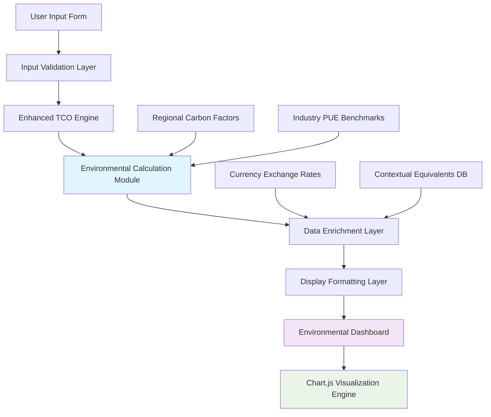
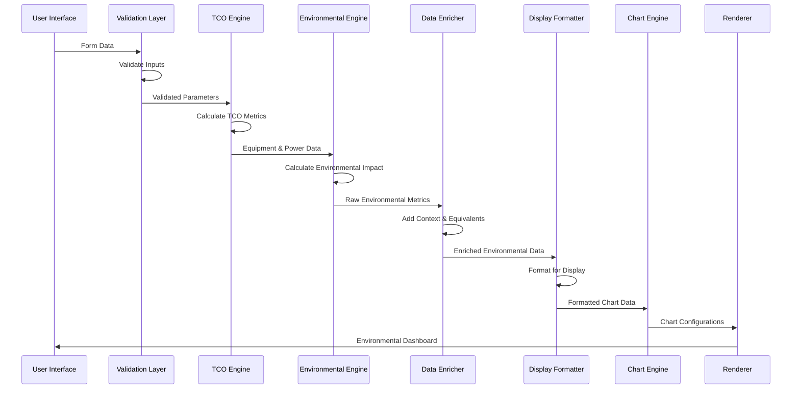

# Environmental Data Flow Architecture

## Executive Summary

This document defines the comprehensive data flow architecture for environmental metrics in the enhanced TCO Calculator, detailing how environmental impact data flows from user input through calculation processing to professional visualization display.

## Data Flow Overview

### High-Level Data Flow



### Detailed Processing Pipeline



## Data Structures and Transformations

### Input Data Structure

```javascript
// User input data structure
interface CalculationInput {
  // Air cooling parameters
  airRacks: number;
  airPowerPerRack: number;
  airRackCost: number;
  airPUE: number;
  
  // Immersion cooling parameters
  immersionTanks: number;
  immersionPowerPerTank: number;
  immersionTankCost: number;
  immersionPUE: number;
  
  // Analysis parameters
  analysisYears: number;
  electricityPrice: number;
  discountRate: number;
  maintenanceCost: number;
  
  // Regional parameters (optional)
  region?: string;
  carbonEmissionFactor?: number;
  timezone?: string;
}
```

### Intermediate Calculation Data

```javascript
// TCO calculation results (existing structure extended)
interface TCOCalculationData {
  // Existing TCO structure...
  
  // Equipment power data for environmental calculations
  powerMetrics: {
    airTotalPowerKW: number;
    airTotalWithPUE: number;
    immersionTotalPowerKW: number;
    immersionTotalWithPUE: number;
    powerDifferenceKW: number;
  };
  
  // Annual consumption data
  annualConsumption: {
    airAnnualKWh: number;
    immersionAnnualKWh: number;
    energySavingsKWh: number;
    energySavingsMWh: number;
  };
}
```

### Environmental Calculation Data

```javascript
// Environmental metrics calculation results
interface EnvironmentalMetrics {
  pueAnalysis: {
    airPUE: number;
    immersionPUE: number;
    improvementAbsolute: number;
    improvementPercent: number;
    industryBenchmark: number;
    efficiencyRating: 'Excellent' | 'Good' | 'Average' | 'Poor';
  };
  
  energyImpact: {
    annualSavingsKWh: number;
    annualSavingsMWh: number;
    lifetimeSavingsKWh: number;
    lifetimeSavingsMWh: number;
    peakDemandReductionKW: number;
  };
  
  carbonFootprint: {
    airAnnualTonsC02: number;
    immersionAnnualTonsC02: number;
    annualReductionTons: number;
    lifetimeReductionTons: number;
    reductionPercent: number;
    emissionFactor: number;
  };
  
  economicImpact: {
    annualEnergyCostSavings: number;
    lifetimeEnergyCostSavings: number;
    carbonCreditValue?: number;
    utilityIncentives?: number;
  };
}
```

### Enriched Environmental Data

```javascript
// Data enriched with contextual comparisons and equivalents
interface EnrichedEnvironmentalData {
  core: EnvironmentalMetrics;
  
  comparisons: {
    energyEquivalents: {
      homesPerYear: number;
      lighBulbHours: number;
      electricVehicleMiles: number;
      smartphoneCharges: number;
    };
    
    carbonEquivalents: {
      carsRemovedFromRoad: number;
      treesPlantedEquivalent: number;
      gasoline GallonsAvoided: number;
      coalPoundsAvoided: number;
      flightsAvoided: number;
    };
    
    financialEquivalents: {
      costPerTonCarbon: number;
      energyBillSavings: number;
      maintenanceSavings: number;
      totalEnvironmentalValue: number;
    };
  };
  
  industryContext: {
    percentilePUEImprovement: number;
    industryCarbonReductionGoal: number;
    complianceStatus: {
      energyEfficiencyStandards: boolean;
      carbonReductionTargets: boolean;
      esgReportingReady: boolean;
    };
  };
  
  projections: {
    fiveYearEnergyTrend: number[];
    tenYearCarbonProjection: number[];
    scalingProjections: {
      doubleCapacity: EnvironmentalMetrics;
      tripleCapacity: EnvironmentalMetrics;
    };
  };
}
```

### Display-Ready Data Structure

```javascript
// Final data structure optimized for display
interface EnvironmentalDisplayData {
  // Hero metrics for main display
  heroMetrics: {
    pueImprovementPercent: {
      value: number;
      formatted: string;
      color: string;
      trend: 'up' | 'down' | 'neutral';
    };
    
    energySavingsAnnual: {
      value: number;
      unit: 'MWh/year';
      formatted: string;
      monetaryValue: string;
      comparison: string;
    };
    
    carbonReductionAnnual: {
      value: number;
      unit: 'tons CO₂/year';
      formatted: string;
      percentage: string;
      equivalent: string;
    };
  };
  
  // Chart data structures
  chartData: {
    pueComparison: ChartDataSet;
    energySavingsTimeline: ChartDataSet;
    carbonReductionVisualization: ChartDataSet;
    esgDashboard: ChartDataSet;
    costBenefitAnalysis: ChartDataSet;
  };
  
  // Executive summary data
  executiveSummary: {
    keyFindings: string[];
    recommendations: string[];
    complianceNotes: string[];
    nextSteps: string[];
  };
  
  // Detailed breakdowns
  detailedBreakdowns: {
    monthlyProjections: MonthlyEnvironmentalData[];
    equipmentLevelAnalysis: EquipmentEnvironmentalData[];
    regionalComparisons: RegionalEnvironmentalData[];
  };
}
```

## Data Processing Modules

### 1. Environmental Calculation Engine

```javascript
class EnvironmentalCalculationEngine {
  constructor(config = {}) {
    this.carbonEmissionFactor = config.carbonEmissionFactor || 0.4; // kg CO2/kWh
    this.industryBenchmarks = config.industryBenchmarks || {
      pueExcellent: 1.2,
      pueGood: 1.5,
      pueAverage: 1.8,
      puePoor: 2.0
    };
  }
  
  /**
   * Calculate comprehensive environmental metrics
   */
  calculateEnvironmentalImpact(tcoData, parameters) {
    // PUE Analysis
    const pueAnalysis = this.calculatePUEAnalysis(
      tcoData.airCooling.equipment.pue,
      tcoData.immersionCooling.equipment.pue
    );
    
    // Energy Impact
    const energyImpact = this.calculateEnergyImpact(
      tcoData.powerMetrics,
      parameters.analysisYears
    );
    
    // Carbon Footprint
    const carbonFootprint = this.calculateCarbonFootprint(
      energyImpact,
      this.carbonEmissionFactor
    );
    
    // Economic Impact
    const economicImpact = this.calculateEconomicImpact(
      energyImpact,
      parameters.electricityPrice
    );
    
    return {
      pueAnalysis,
      energyImpact,
      carbonFootprint,
      economicImpact,
      calculationTimestamp: new Date().toISOString(),
      calculationVersion: '2.0'
    };
  }
  
  calculatePUEAnalysis(airPUE, immersionPUE) {
    const improvementAbsolute = airPUE - immersionPUE;
    const improvementPercent = (improvementAbsolute / airPUE) * 100;
    
    let efficiencyRating;
    if (immersionPUE <= this.industryBenchmarks.pueExcellent) {
      efficiencyRating = 'Excellent';
    } else if (immersionPUE <= this.industryBenchmarks.pueGood) {
      efficiencyRating = 'Good';
    } else if (immersionPUE <= this.industryBenchmarks.pueAverage) {
      efficiencyRating = 'Average';
    } else {
      efficiencyRating = 'Poor';
    }
    
    return {
      airPUE,
      immersionPUE,
      improvementAbsolute: Math.round(improvementAbsolute * 100) / 100,
      improvementPercent: Math.round(improvementPercent * 10) / 10,
      industryBenchmark: 1.58, // Industry average
      efficiencyRating
    };
  }
  
  calculateEnergyImpact(powerMetrics, analysisYears) {
    const annualSavingsKWh = powerMetrics.powerDifferenceKW * 8760; // 8760 hours/year
    const annualSavingsMWh = annualSavingsKWh / 1000;
    
    return {
      annualSavingsKWh: Math.round(annualSavingsKWh),
      annualSavingsMWh: Math.round(annualSavingsMWh),
      lifetimeSavingsKWh: Math.round(annualSavingsKWh * analysisYears),
      lifetimeSavingsMWh: Math.round(annualSavingsMWh * analysisYears),
      peakDemandReductionKW: Math.round(powerMetrics.powerDifferenceKW)
    };
  }
  
  calculateCarbonFootprint(energyImpact, emissionFactor) {
    const annualReductionTons = (energyImpact.annualSavingsKWh * emissionFactor) / 1000;
    const lifetimeReductionTons = annualReductionTons * (energyImpact.lifetimeSavingsKWh / energyImpact.annualSavingsKWh);
    
    // Calculate baseline emissions for percentage calculation
    const airAnnualTons = (energyImpact.annualSavingsKWh * emissionFactor) / 1000;
    const immersionAnnualTons = 0; // Savings represent the difference
    const reductionPercent = (annualReductionTons / (airAnnualTons + annualReductionTons)) * 100;
    
    return {
      airAnnualTonsC02: Math.round(airAnnualTons),
      immersionAnnualTonsC02: Math.round(immersionAnnualTons),
      annualReductionTons: Math.round(annualReductionTons),
      lifetimeReductionTons: Math.round(lifetimeReductionTons),
      reductionPercent: Math.round(reductionPercent * 10) / 10,
      emissionFactor
    };
  }
}
```

### 2. Data Enrichment Module

```javascript
class EnvironmentalDataEnrichment {
  constructor(equivalenceData) {
    this.equivalents = equivalenceData || this.getDefaultEquivalents();
  }
  
  enrichEnvironmentalData(coreMetrics) {
    return {
      core: coreMetrics,
      comparisons: this.generateComparisons(coreMetrics),
      industryContext: this.generateIndustryContext(coreMetrics),
      projections: this.generateProjections(coreMetrics)
    };
  }
  
  generateComparisons(metrics) {
    const energyKWh = metrics.energyImpact.annualSavingsKWh;
    const carbonTons = metrics.carbonFootprint.annualReductionTons;
    
    return {
      energyEquivalents: {
        homesPerYear: Math.round(energyKWh / 10800), // Average home uses 10,800 kWh/year
        lightBulbHours: Math.round(energyKWh / 0.06), // 60W bulb
        electricVehicleMiles: Math.round(energyKWh / 0.3), // 0.3 kWh/mile
        smartphoneCharges: Math.round(energyKWh / 0.0055) // 5.5Wh per charge
      },
      
      carbonEquivalents: {
        carsRemovedFromRoad: Math.round(carbonTons / 4.6), // Average car emits 4.6 tons/year
        treesPlantedEquivalent: Math.round(carbonTons * 16), // Tree absorbs ~62 lbs CO2/year
        gasolineGallonsAvoided: Math.round(carbonTons * 112), // Gallon produces 19.6 lbs CO2
        coalPoundsAvoided: Math.round(carbonTons * 1000), // Coal produces ~2 lbs CO2/lb
        flightsAvoided: Math.round(carbonTons / 0.4) // Domestic flight ~0.4 tons CO2
      }
    };
  }
  
  generateIndustryContext(metrics) {
    const pueImprovement = metrics.pueAnalysis.improvementPercent;
    
    // Determine percentile based on PUE improvement
    let percentile;
    if (pueImprovement >= 35) percentile = 95;
    else if (pueImprovement >= 30) percentile = 90;
    else if (pueImprovement >= 25) percentile = 80;
    else if (pueImprovement >= 20) percentile = 70;
    else if (pueImprovement >= 15) percentile = 60;
    else percentile = 50;
    
    return {
      percentilePUEImprovement: percentile,
      industryCarbonReductionGoal: 30, // Industry target: 30% reduction by 2030
      complianceStatus: {
        energyEfficiencyStandards: metrics.pueAnalysis.immersionPUE <= 1.3,
        carbonReductionTargets: metrics.carbonFootprint.reductionPercent >= 20,
        esgReportingReady: true
      }
    };
  }
  
  generateProjections(metrics) {
    const baseEnergy = metrics.energyImpact.annualSavingsMWh;
    const baseCarbon = metrics.carbonFootprint.annualReductionTons;
    
    // 5-year energy trend (assuming 2% efficiency improvement per year)
    const fiveYearTrend = Array.from({length: 5}, (_, i) => 
      Math.round(baseEnergy * Math.pow(1.02, i + 1))
    );
    
    // 10-year carbon projection
    const tenYearProjection = Array.from({length: 10}, (_, i) => 
      Math.round(baseCarbon * (i + 1) * Math.pow(1.02, i))
    );
    
    return {
      fiveYearEnergyTrend,
      tenYearCarbonProjection,
      scalingProjections: {
        doubleCapacity: this.scaleMetrics(metrics, 2),
        tripleCapacity: this.scaleMetrics(metrics, 3)
      }
    };
  }
}
```

### 3. Display Data Formatter

```javascript
class EnvironmentalDisplayFormatter {
  constructor(localeConfig = {}) {
    this.locale = localeConfig.locale || 'en-US';
    this.currency = localeConfig.currency || 'USD';
    this.numberFormat = new Intl.NumberFormat(this.locale);
    this.currencyFormat = new Intl.NumberFormat(this.locale, {
      style: 'currency',
      currency: this.currency
    });
  }
  
  formatForDisplay(enrichedData) {
    return {
      heroMetrics: this.formatHeroMetrics(enrichedData),
      chartData: this.prepareChartData(enrichedData),
      executiveSummary: this.generateExecutiveSummary(enrichedData),
      detailedBreakdowns: this.prepareDetailedBreakdowns(enrichedData)
    };
  }
  
  formatHeroMetrics(data) {
    const { core, comparisons } = data;
    
    return {
      pueImprovementPercent: {
        value: core.pueAnalysis.improvementPercent,
        formatted: `${core.pueAnalysis.improvementPercent}%`,
        color: this.getPUEColor(core.pueAnalysis.improvementPercent),
        trend: 'up'
      },
      
      energySavingsAnnual: {
        value: core.energyImpact.annualSavingsMWh,
        unit: 'MWh/year',
        formatted: `${this.numberFormat.format(core.energyImpact.annualSavingsMWh)} MWh/year`,
        monetaryValue: this.currencyFormat.format(core.economicImpact.annualEnergyCostSavings),
        comparison: `Powers ${comparisons.energyEquivalents.homesPerYear} homes annually`
      },
      
      carbonReductionAnnual: {
        value: core.carbonFootprint.annualReductionTons,
        unit: 'tons CO₂/year',
        formatted: `${this.numberFormat.format(core.carbonFootprint.annualReductionTons)} tons CO₂/year`,
        percentage: `${core.carbonFootprint.reductionPercent}%`,
        equivalent: `Equal to removing ${comparisons.carbonEquivalents.carsRemovedFromRoad} cars from roads`
      }
    };
  }
  
  prepareChartData(data) {
    return {
      pueComparison: this.preparePUEChartData(data.core.pueAnalysis),
      energySavingsTimeline: this.prepareEnergyTimelineData(data),
      carbonReductionVisualization: this.prepareCarbonChartData(data),
      esgDashboard: this.prepareESGDashboardData(data),
      costBenefitAnalysis: this.prepareCostBenefitData(data)
    };
  }
  
  preparePUEChartData(pueData) {
    return {
      type: 'doughnut',
      data: {
        labels: ['Efficient Operation', 'Wasted Energy'],
        datasets: [{
          data: [
            100 - ((pueData.immersionPUE - 1) * 100),
            (pueData.immersionPUE - 1) * 100
          ],
          backgroundColor: ['#4CAF50', '#FF6B6B'],
          borderWidth: 0
        }]
      },
      options: {
        cutout: '70%',
        plugins: {
          legend: { display: false },
          tooltip: {
            callbacks: {
              label: (context) => `${context.label}: ${context.parsed}%`
            }
          }
        }
      },
      centerText: {
        text: `PUE ${pueData.immersionPUE}`,
        subtext: `${pueData.improvementPercent}% Better`
      }
    };
  }
  
  prepareEnergyTimelineData(data) {
    const projections = data.projections.fiveYearEnergyTrend;
    
    return {
      type: 'line',
      data: {
        labels: ['Year 1', 'Year 2', 'Year 3', 'Year 4', 'Year 5'],
        datasets: [{
          label: 'Energy Savings (MWh)',
          data: projections,
          borderColor: '#2196F3',
          backgroundColor: 'rgba(33, 150, 243, 0.1)',
          borderWidth: 3,
          fill: true,
          tension: 0.4
        }]
      },
      options: {
        responsive: true,
        scales: {
          y: {
            beginAtZero: true,
            title: {
              display: true,
              text: 'MWh Saved'
            }
          }
        }
      }
    };
  }
}
```

## Data Flow Optimization

### Caching Strategy

```javascript
class EnvironmentalDataCache {
  constructor() {
    this.cache = new Map();
    this.cacheTimeout = 5 * 60 * 1000; // 5 minutes
  }
  
  getCachedCalculation(inputHash) {
    const cached = this.cache.get(inputHash);
    if (cached && (Date.now() - cached.timestamp) < this.cacheTimeout) {
      return cached.data;
    }
    return null;
  }
  
  cacheCalculation(inputHash, data) {
    this.cache.set(inputHash, {
      data,
      timestamp: Date.now()
    });
  }
  
  generateInputHash(input) {
    return btoa(JSON.stringify(input)).replace(/[^a-zA-Z0-9]/g, '');
  }
}
```

### Performance Monitoring

```javascript
class EnvironmentalDataFlowMonitor {
  constructor() {
    this.performanceMetrics = new Map();
  }
  
  startTimer(operation) {
    this.performanceMetrics.set(operation, {
      startTime: performance.now(),
      memoryStart: this.getMemoryUsage()
    });
  }
  
  endTimer(operation) {
    const metrics = this.performanceMetrics.get(operation);
    if (metrics) {
      const duration = performance.now() - metrics.startTime;
      const memoryUsed = this.getMemoryUsage() - metrics.memoryStart;
      
      console.log(`Environmental ${operation}: ${duration.toFixed(2)}ms, ${memoryUsed.toFixed(2)}MB`);
      
      return { duration, memoryUsed };
    }
  }
  
  getMemoryUsage() {
    return (performance.memory?.usedJSHeapSize || 0) / 1024 / 1024;
  }
}
```

This comprehensive data flow architecture ensures that environmental impact data is processed efficiently, accurately, and formatted appropriately for professional display while maintaining the single-file architecture constraint.