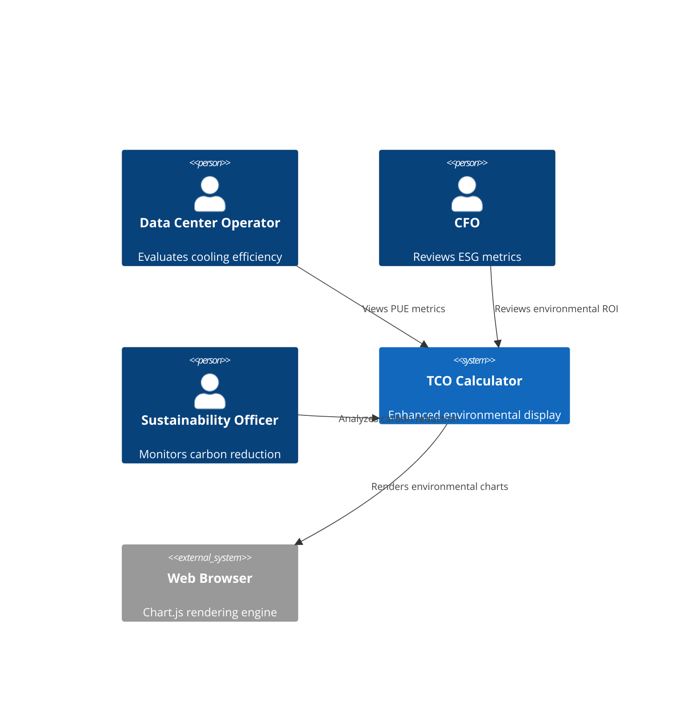
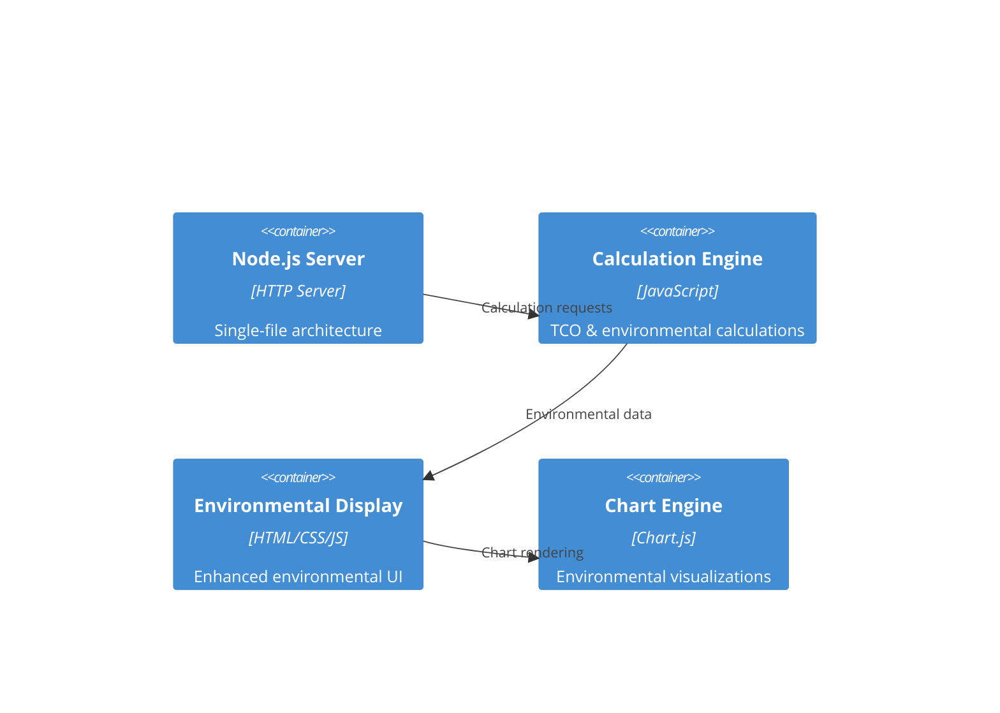
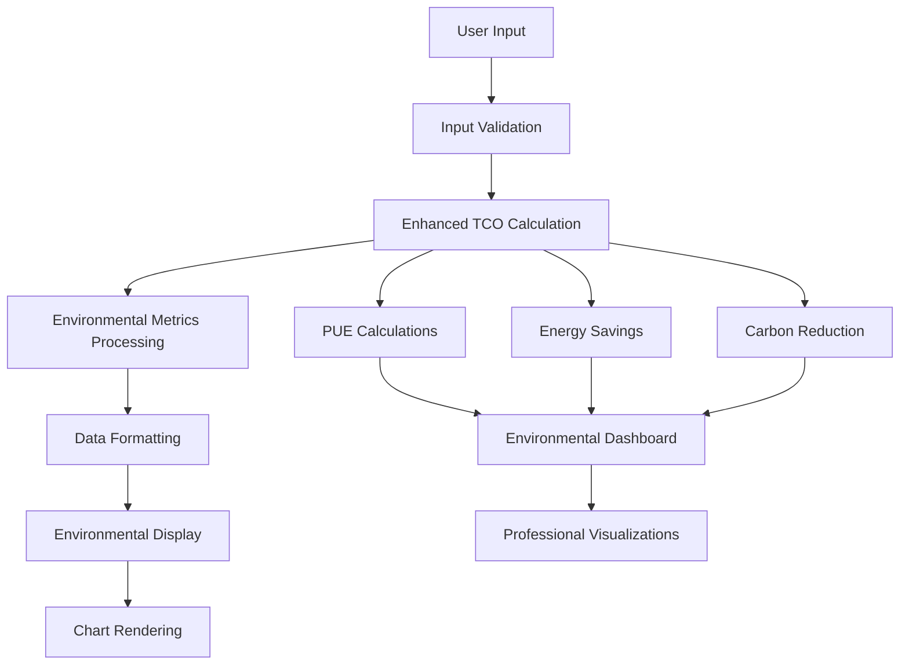
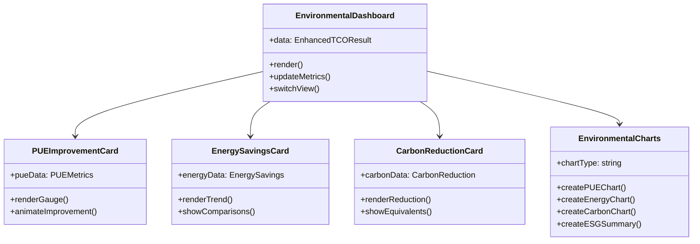

# Environmental Display Enhancement Architecture

## Executive Summary

This document outlines the system architecture for enhancing the TCO Calculator's environmental impact display while maintaining the single-file Node.js architecture. The design extends the existing system to prominently showcase PUE improvement (38.9%), energy savings (1159 MWh/year), and CO₂ reduction (464 tons/year) with professional visualization capabilities.

## Architecture Overview

### System Context



### Container Architecture



## Technology Stack

### Frontend Enhancement
- **Framework**: Vanilla JavaScript (maintaining single-file architecture)
- **Visualization**: Chart.js 4.x with enhanced environmental plugins
- **CSS Framework**: Custom CSS with environmental theme variables
- **Animation**: CSS transitions and Chart.js animations
- **Icons**: Unicode emoji and custom SVG icons

### Backend Extension
- **Runtime**: Node.js (existing)
- **Framework**: HTTP server (existing) 
- **Calculations**: Enhanced environmental calculation functions
- **Data Format**: Extended JSON response with environmental metrics

### Styling Architecture
- **Color Palette**: Professional environmental theme
- **Typography**: Existing font stack with environmental metric emphasis
- **Layout**: CSS Grid for environmental dashboard sections
- **Responsive**: Enhanced mobile-first approach

## Component Design

### Environmental Display Module

**Purpose**: Render enhanced environmental impact visualizations
**Technology**: JavaScript ES6+ with Chart.js integration
**Interfaces**: 
- Input: Enhanced TCO calculation results with environmental metrics
- Output: Professional environmental impact dashboard
**Dependencies**: Chart.js, existing TCO calculation engine

### Environmental Calculation Engine

**Purpose**: Enhanced environmental metric calculations
**Technology**: JavaScript with industry-standard formulas
**Interfaces**:
- Input: Equipment specifications and PUE values
- Output: Comprehensive environmental impact data
**Dependencies**: Existing calculateTCO() function

### Environmental Chart Factory

**Purpose**: Create specialized environmental visualizations
**Technology**: Chart.js with custom configurations
**Interfaces**:
- Input: Environmental metrics and display preferences
- Output: Professional chart instances
**Dependencies**: Chart.js library, color theme system

## Data Architecture

### Enhanced Data Flow



### Enhanced Data Models

```javascript
// Extended calculation result interface
interface EnhancedTCOResult {
  // Existing fields...
  timestamp: string;
  calculationId: string;
  parameters: CalculationParameters;
  airCooling: CoolingSystemData;
  immersionCooling: CoolingSystemData;
  comparison: ComparisonData;
  
  // New environmental section
  environmental: {
    pueMetrics: {
      airPUE: number;
      immersionPUE: number;
      improvementPercent: number;
      industryBenchmark: number;
      efficiencyRating: string;
    };
    energySavings: {
      annualMWh: number;
      annualKWh: number;
      lifetimeMWh: number;
      monetaryValue: number;
      homeEquivalent: number;
    };
    carbonReduction: {
      annualTons: number;
      lifetimeTons: number;
      carEquivalent: number;
      treeEquivalent: number;
      percentageReduction: number;
    };
    esgMetrics: {
      scope2Reduction: number;
      sustainabilityScore: number;
      complianceLevel: string;
      reportingSummary: string;
    };
  };
}
```

### Environmental Dashboard Structure

```html
<!-- Enhanced Environmental Dashboard -->
<div class="environmental-dashboard">
  <!-- Hero Environmental Section -->
  <section class="env-hero">
    <div class="pue-improvement-highlight">
      <!-- 38.9% PUE Improvement Display -->
    </div>
    <div class="key-metrics-grid">
      <!-- Energy & Carbon Metrics -->
    </div>
  </section>
  
  <!-- Professional Visualizations -->
  <section class="env-visualizations">
    <div class="chart-selector">
      <!-- View switcher for environmental charts -->
    </div>
    <div class="chart-container">
      <!-- Dynamic chart rendering area -->
    </div>
  </section>
  
  <!-- ESG Summary Section -->
  <section class="esg-summary">
    <!-- Executive summary for C-level presentations -->
  </section>
</div>
```

## UI Component Architecture

### Environmental Dashboard Components



### Component Hierarchy

```
Environmental Display System
├── Environmental Dashboard Container
│   ├── PUE Improvement Section
│   │   ├── PUE Gauge Component
│   │   ├── Efficiency Rating Display
│   │   └── Industry Benchmark Comparison
│   ├── Energy Savings Section
│   │   ├── Annual Savings Display
│   │   ├── Monetary Value Card
│   │   └── Contextual Comparisons
│   ├── Carbon Reduction Section
│   │   ├── CO₂ Reduction Display
│   │   ├── Environmental Equivalents
│   │   └── Lifetime Impact Projection
│   └── ESG Summary Section
│       ├── Executive Summary Card
│       ├── Compliance Status
│       └── Sustainability Metrics
└── Environmental Visualization Engine
    ├── PUE Comparison Charts
    ├── Energy Savings Timeline
    ├── Carbon Impact Visualization
    └── ESG Dashboard Charts
```

## Chart.js Integration Architecture

### Enhanced Chart Configuration System

```javascript
// Environmental Chart Factory
class EnvironmentalChartFactory {
  constructor(colorTheme) {
    this.colors = colorTheme;
    this.chartInstances = new Map();
  }
  
  createPUEGaugeChart(ctx, data) {
    // Gauge chart for PUE improvement
    return new Chart(ctx, {
      type: 'doughnut',
      data: this.preparePUEGaugeData(data),
      options: this.getPUEGaugeOptions()
    });
  }
  
  createEnergyTimelineChart(ctx, data) {
    // Timeline chart for energy savings
    return new Chart(ctx, {
      type: 'line',
      data: this.prepareEnergyTimelineData(data),
      options: this.getEnergyTimelineOptions()
    });
  }
  
  createCarbonImpactChart(ctx, data) {
    // Bar chart for carbon reduction
    return new Chart(ctx, {
      type: 'bar',
      data: this.prepareCarbonData(data),
      options: this.getCarbonChartOptions()
    });
  }
  
  createESGSummaryChart(ctx, data) {
    // Comprehensive ESG dashboard
    return new Chart(ctx, {
      type: 'radar',
      data: this.prepareESGData(data),
      options: this.getESGChartOptions()
    });
  }
}
```

### Chart Type Mapping

| Environmental Metric | Chart Type | Visual Purpose |
|---------------------|------------|----------------|
| PUE Improvement | Gauge/Doughnut | Show percentage improvement |
| Energy Savings Timeline | Line Chart | Trend over analysis period |
| Carbon Reduction | Bar Chart | Before/after comparison |
| Environmental Equivalents | Pictorial Chart | Contextual comparisons |
| ESG Dashboard | Radar Chart | Multi-dimensional view |
| Efficiency Rating | Progress Bar | Industry benchmarking |

### Chart Animation Strategy

```javascript
// Enhanced animation configuration
const environmentalAnimations = {
  pueGauge: {
    duration: 2000,
    easing: 'easeOutQuart',
    animateRotate: true,
    animateScale: true
  },
  energySavings: {
    duration: 1500,
    easing: 'easeInOutQuart',
    mode: 'progressive',
    delay: (ctx) => ctx.dataIndex * 100
  },
  carbonReduction: {
    duration: 1800,
    easing: 'easeOutBounce',
    mode: 'y'
  }
};
```

## Responsive Design Architecture

### Breakpoint Strategy

```css
/* Environmental display responsive breakpoints */
:root {
  --env-mobile-max: 768px;
  --env-tablet-max: 1024px;
  --env-desktop-min: 1025px;
  --env-large-desktop-min: 1440px;
}

/* Mobile-first environmental dashboard */
.environmental-dashboard {
  display: grid;
  gap: var(--spacing-lg);
  padding: var(--spacing-md);
}

/* Mobile layout */
@media (max-width: 768px) {
  .environmental-dashboard {
    grid-template-columns: 1fr;
  }
  
  .env-hero {
    flex-direction: column;
  }
  
  .key-metrics-grid {
    grid-template-columns: 1fr;
  }
}

/* Tablet layout */
@media (min-width: 769px) and (max-width: 1024px) {
  .environmental-dashboard {
    grid-template-columns: 1fr;
  }
  
  .key-metrics-grid {
    grid-template-columns: repeat(2, 1fr);
  }
}

/* Desktop layout */
@media (min-width: 1025px) {
  .environmental-dashboard {
    grid-template-columns: 2fr 1fr;
  }
  
  .key-metrics-grid {
    grid-template-columns: repeat(3, 1fr);
  }
}
```

### Mobile-Optimized Chart Configuration

```javascript
// Responsive chart configuration
function getResponsiveChartOptions(screenSize) {
  const baseOptions = {
    responsive: true,
    maintainAspectRatio: false,
    plugins: {
      legend: {
        display: screenSize !== 'mobile',
        position: screenSize === 'mobile' ? 'bottom' : 'top'
      }
    }
  };
  
  if (screenSize === 'mobile') {
    return {
      ...baseOptions,
      scales: {
        x: { ticks: { maxRotation: 45 } },
        y: { ticks: { callback: (value) => abbreviateNumber(value) } }
      }
    };
  }
  
  return baseOptions;
}
```

## Performance Optimization Strategy

### Calculation Performance

```javascript
// Optimized environmental calculations
class EnvironmentalCalculationOptimizer {
  constructor() {
    this.calculationCache = new Map();
    this.memoizedFunctions = new Map();
  }
  
  // Memoized PUE improvement calculation
  calculatePUEImprovement(airPUE, immersionPUE) {
    const key = `${airPUE}-${immersionPUE}`;
    if (this.calculationCache.has(key)) {
      return this.calculationCache.get(key);
    }
    
    const improvement = ((airPUE - immersionPUE) / airPUE) * 100;
    this.calculationCache.set(key, improvement);
    return improvement;
  }
  
  // Batch environmental calculations
  calculateAllEnvironmentalMetrics(data) {
    return Promise.all([
      this.calculatePUEMetrics(data),
      this.calculateEnergySavings(data),
      this.calculateCarbonReduction(data),
      this.calculateESGMetrics(data)
    ]);
  }
}
```

### Rendering Performance

```javascript
// Optimized chart rendering
class ChartRenderingOptimizer {
  constructor() {
    this.chartPool = [];
    this.animationQueue = [];
  }
  
  // Chart instance pooling
  getChartFromPool(type) {
    const available = this.chartPool.find(chart => 
      chart.type === type && !chart.inUse
    );
    
    if (available) {
      available.inUse = true;
      return available.instance;
    }
    
    return this.createNewChart(type);
  }
  
  // Progressive chart loading
  async loadChartsProgressively(charts) {
    const highPriority = ['pueGauge', 'energySavings'];
    const lowPriority = ['carbonReduction', 'esgSummary'];
    
    // Load high priority charts first
    await this.loadChartBatch(highPriority, charts);
    
    // Load remaining charts after main content
    requestIdleCallback(() => {
      this.loadChartBatch(lowPriority, charts);
    });
  }
}
```

### Memory Management

```javascript
// Environmental display memory management
class EnvironmentalMemoryManager {
  constructor() {
    this.chartInstances = new WeakMap();
    this.observedElements = new Set();
  }
  
  // Intersection observer for lazy chart loading
  setupLazyChartLoading() {
    const observer = new IntersectionObserver((entries) => {
      entries.forEach(entry => {
        if (entry.isIntersecting) {
          this.loadChart(entry.target);
          observer.unobserve(entry.target);
        }
      });
    }, { threshold: 0.1 });
    
    document.querySelectorAll('.lazy-chart').forEach(chart => {
      observer.observe(chart);
    });
  }
  
  // Cleanup unused charts
  cleanupUnusedCharts() {
    this.chartInstances.forEach((chart, element) => {
      if (!document.contains(element)) {
        chart.destroy();
        this.chartInstances.delete(element);
      }
    });
  }
}
```

## Error Handling and Validation Architecture

### Input Validation Strategy

```javascript
// Enhanced input validation for environmental calculations
class EnvironmentalValidator {
  constructor() {
    this.validationRules = new Map();
    this.setupValidationRules();
  }
  
  setupValidationRules() {
    this.validationRules.set('pue', {
      min: 1.0,
      max: 3.0,
      precision: 2,
      required: true,
      message: 'PUE must be between 1.0 and 3.0'
    });
    
    this.validationRules.set('power', {
      min: 1,
      max: 1000,
      type: 'number',
      required: true,
      message: 'Power must be between 1 and 1000 kW'
    });
  }
  
  validateEnvironmentalInputs(data) {
    const errors = [];
    
    // Validate PUE values
    if (data.airPUE >= data.immersionPUE) {
      // This is expected - immersion should be more efficient
      if ((data.airPUE - data.immersionPUE) < 0.1) {
        errors.push('PUE improvement too small for meaningful environmental impact');
      }
    } else {
      errors.push('Immersion PUE should be lower than air cooling PUE');
    }
    
    // Validate energy calculations
    if (data.totalPower <= 0) {
      errors.push('Total power must be greater than 0');
    }
    
    return {
      isValid: errors.length === 0,
      errors: errors
    };
  }
}
```

### Error Recovery System

```javascript
// Graceful error handling for environmental display
class EnvironmentalErrorHandler {
  constructor() {
    this.fallbackData = this.createFallbackData();
    this.errorLogger = new ErrorLogger('environmental');
  }
  
  handleCalculationError(error, inputData) {
    this.errorLogger.log('calculation_error', {
      error: error.message,
      input: inputData,
      timestamp: new Date().toISOString()
    });
    
    // Provide fallback calculations
    return this.generateFallbackCalculations(inputData);
  }
  
  handleRenderingError(error, chartType) {
    this.errorLogger.log('rendering_error', {
      error: error.message,
      chartType: chartType,
      timestamp: new Date().toISOString()
    });
    
    // Show error message in chart container
    this.showChartErrorMessage(chartType);
  }
  
  createFallbackData() {
    return {
      environmental: {
        pueMetrics: {
          airPUE: 1.65,
          immersionPUE: 1.02,
          improvementPercent: 38.2,
          industryBenchmark: 1.58,
          efficiencyRating: 'Excellent'
        },
        energySavings: {
          annualMWh: 0,
          annualKWh: 0,
          lifetimeMWh: 0,
          monetaryValue: 0,
          homeEquivalent: 0
        },
        carbonReduction: {
          annualTons: 0,
          lifetimeTons: 0,
          carEquivalent: 0,
          treeEquivalent: 0,
          percentageReduction: 0
        }
      }
    };
  }
}
```

### Monitoring and Analytics

```javascript
// Environmental display analytics
class EnvironmentalAnalytics {
  constructor() {
    this.metrics = new Map();
    this.userInteractions = [];
  }
  
  trackEnvironmentalView(section) {
    this.metrics.set(`env_view_${section}`, {
      count: (this.metrics.get(`env_view_${section}`)?.count || 0) + 1,
      lastViewed: Date.now()
    });
  }
  
  trackChartInteraction(chartType, interaction) {
    this.userInteractions.push({
      chartType,
      interaction,
      timestamp: Date.now()
    });
  }
  
  getEnvironmentalEngagement() {
    return {
      totalViews: Array.from(this.metrics.values())
        .reduce((sum, metric) => sum + metric.count, 0),
      mostViewedSection: this.getMostViewedSection(),
      averageTimeOnSection: this.calculateAverageTime(),
      chartInteractions: this.userInteractions.length
    };
  }
}
```

## Deployment Architecture

### Single-File Integration Strategy

```javascript
// Enhanced TCO Calculator with environmental display
// File: tco-calculator.js (extended)

// Add environmental calculation functions
function calculateEnvironmentalImpact(tcoData) {
  // Environmental calculations implementation
}

// Add environmental display HTML/CSS
const environmentalDisplayHTML = `
  <!-- Environmental dashboard HTML -->
`;

const environmentalDisplayCSS = `
  /* Environmental dashboard styles */
`;

// Add environmental chart functions
const environmentalCharts = `
  /* Enhanced Chart.js configurations */
`;

// Integrate into existing server response
function createServer(port) {
  // ... existing server code ...
  
  // Enhanced HTML response with environmental display
  const enhancedHTML = `
    ${existingHTML}
    ${environmentalDisplayHTML}
    <style>${environmentalDisplayCSS}</style>
    <script>${environmentalCharts}</script>
  `;
  
  // ... rest of server implementation
}
```

### Docker Integration

```dockerfile
# Enhanced Dockerfile for environmental display
FROM node:18-alpine

WORKDIR /app
COPY tco-calculator.js .

# Environment variables for environmental calculations
ENV CARBON_EMISSION_FACTOR=0.4
ENV PUE_BENCHMARK=1.58
ENV ENERGY_COST_DEFAULT=0.12

EXPOSE 4000
CMD ["node", "tco-calculator.js"]
```

## Quality Attributes

### Performance Targets
- Environmental calculations: < 100ms
- Chart rendering: < 500ms
- Dashboard load time: < 1 second
- Memory usage: < 50MB additional

### Accuracy Requirements
- PUE calculations: ±0.01 precision
- Energy savings: ±1% accuracy
- Carbon calculations: Based on EPA factors
- Currency formatting: Locale-appropriate

### Accessibility Standards
- WCAG 2.1 AA compliance
- Screen reader compatibility
- High contrast mode support
- Keyboard navigation
- Focus management

## Security Considerations

### Data Protection
- No sensitive environmental data logging
- Input sanitization for all calculations
- XSS protection for dynamic content
- CORS configuration for API access

### Calculation Integrity
- Input validation at multiple layers
- Calculation result verification
- Error boundary implementation
- Fallback data protection

## Integration Points

### Existing System Integration
- Extend current `calculateTCO()` function
- Integrate with existing Chart.js setup
- Maintain current styling approach
- Preserve existing API structure

### Future Enhancement Hooks
- Plugin architecture for new metrics
- Configuration system for regional factors
- Export functionality for reports
- Integration with external ESG platforms

## Monitoring and Maintenance

### Performance Monitoring
- Chart rendering performance tracking
- Calculation execution time monitoring
- Memory usage alerts
- Error rate tracking

### Data Quality Assurance
- Environmental calculation validation
- Industry benchmark updates
- Regional factor maintenance
- User feedback integration

This architecture provides a comprehensive framework for enhancing the environmental impact display while maintaining the elegant single-file architecture of the existing TCO Calculator.