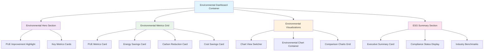

# Environmental UI Component Architecture

## Executive Summary

This document defines the UI component architecture for the enhanced environmental display system, detailing how environmental metrics components integrate into the single-file TCO Calculator while providing professional, accessible, and visually compelling environmental impact visualizations.

## Component Hierarchy Overview



## Component Specifications

### 1. Environmental Dashboard Container

**Purpose**: Main container orchestrating all environmental display components
**Responsibility**: Layout management, data distribution, responsive behavior

```javascript
class EnvironmentalDashboard {
  constructor(containerId, options = {}) {
    this.container = document.getElementById(containerId);
    this.options = {
      theme: options.theme || 'professional',
      animation: options.animation !== false,
      accessibility: options.accessibility !== false,
      ...options
    };
    this.components = new Map();
    this.data = null;
    this.isVisible = false;
  }
  
  render(environmentalData) {
    this.data = environmentalData;
    this.createStructure();
    this.initializeComponents();
    this.bindEvents();
    
    if (this.options.animation) {
      this.animateIn();
    }
  }
  
  createStructure() {
    this.container.innerHTML = `
      <div class="environmental-dashboard" data-theme="${this.options.theme}">
        <!-- Hero Section -->
        <section class="env-hero" id="envHero">
          <div class="pue-improvement-hero" id="pueHero"></div>
          <div class="key-metrics-overview" id="keyMetrics"></div>
        </section>
        
        <!-- Detailed Metrics Grid -->
        <section class="env-metrics-grid" id="envMetricsGrid">
          <div class="metric-card-container" id="pueMetricsCard"></div>
          <div class="metric-card-container" id="energySavingsCard"></div>
          <div class="metric-card-container" id="carbonReductionCard"></div>
          <div class="metric-card-container" id="costSavingsCard"></div>
        </section>
        
        <!-- Visualizations Section -->
        <section class="env-visualizations" id="envVisualizations">
          <div class="chart-controls" id="chartControls"></div>
          <div class="chart-display-area" id="chartDisplayArea"></div>
        </section>
        
        <!-- ESG Summary -->
        <section class="esg-summary" id="esgSummary">
          <div class="executive-summary" id="executiveSummary"></div>
          <div class="compliance-dashboard" id="complianceDashboard"></div>
        </section>
      </div>
    `;
  }
  
  initializeComponents() {
    // Initialize all child components
    this.components.set('pueHero', new PUEImprovementHero('pueHero', this.data));
    this.components.set('keyMetrics', new KeyMetricsOverview('keyMetrics', this.data));
    this.components.set('pueCard', new PUEMetricsCard('pueMetricsCard', this.data));
    this.components.set('energyCard', new EnergySavingsCard('energySavingsCard', this.data));
    this.components.set('carbonCard', new CarbonReductionCard('carbonReductionCard', this.data));
    this.components.set('costCard', new CostSavingsCard('costSavingsCard', this.data));
    this.components.set('chartControls', new ChartControls('chartControls', this.data));
    this.components.set('chartDisplay', new EnvironmentalChartDisplay('chartDisplayArea', this.data));
    this.components.set('executiveSummary', new ExecutiveSummary('executiveSummary', this.data));
    this.components.set('compliance', new ComplianceDashboard('complianceDashboard', this.data));
    
    // Render all components
    this.components.forEach(component => component.render());
  }
  
  updateData(newData) {
    this.data = newData;
    this.components.forEach(component => component.update(newData));
  }
}
```

### 2. PUE Improvement Hero Component

**Purpose**: Prominently display the 38.9% PUE improvement as the main environmental highlight
**Visual Design**: Large, animated gauge or progress indicator with contextual information

```javascript
class PUEImprovementHero {
  constructor(containerId, data) {
    this.container = document.getElementById(containerId);
    this.data = data;
    this.animationConfig = {
      duration: 2000,
      easing: 'easeOutQuart'
    };
  }
  
  render() {
    const { pueAnalysis } = this.data.core;
    
    this.container.innerHTML = `
      <div class="pue-hero-container">
        <div class="pue-improvement-display">
          <div class="improvement-gauge" id="pueGauge">
            <canvas width="200" height="200"></canvas>
            <div class="gauge-center">
              <div class="improvement-value">${pueAnalysis.improvementPercent}%</div>
              <div class="improvement-label">PUE Improvement</div>
            </div>
          </div>
          
          <div class="pue-details">
            <h2 class="pue-title">Power Usage Effectiveness Enhancement</h2>
            <div class="pue-comparison">
              <div class="pue-before">
                <span class="pue-label">Air Cooling</span>
                <span class="pue-value">${pueAnalysis.airPUE}</span>
              </div>
              <div class="pue-arrow">→</div>
              <div class="pue-after">
                <span class="pue-label">Immersion Cooling</span>
                <span class="pue-value">${pueAnalysis.immersionPUE}</span>
              </div>
            </div>
            <div class="efficiency-rating">
              <span class="rating-label">Efficiency Rating:</span>
              <span class="rating-value ${pueAnalysis.efficiencyRating.toLowerCase()}">
                ${pueAnalysis.efficiencyRating}
              </span>
            </div>
          </div>
        </div>
        
        <div class="industry-context">
          <div class="benchmark-comparison">
            <span class="benchmark-label">Industry Benchmark</span>
            <span class="benchmark-value">${pueAnalysis.industryBenchmark}</span>
          </div>
          <div class="percentile-ranking">
            Top ${this.data.industryContext.percentilePUEImprovement}% Performance
          </div>
        </div>
      </div>
    `;
    
    this.initializeGauge();
  }
  
  initializeGauge() {
    const canvas = this.container.querySelector('#pueGauge canvas');
    const ctx = canvas.getContext('2d');
    const centerX = canvas.width / 2;
    const centerY = canvas.height / 2;
    const radius = 80;
    
    // Create animated gauge
    this.animateGauge(ctx, centerX, centerY, radius);
  }
  
  animateGauge(ctx, x, y, radius) {
    const { improvementPercent } = this.data.core.pueAnalysis;
    const targetAngle = (improvementPercent / 100) * Math.PI * 1.5; // 270 degrees max
    let currentAngle = 0;
    const startTime = Date.now();
    
    const animate = () => {
      const elapsed = Date.now() - startTime;
      const progress = Math.min(elapsed / this.animationConfig.duration, 1);
      
      // Easing function
      const easeOutQuart = 1 - Math.pow(1 - progress, 4);
      currentAngle = targetAngle * easeOutQuart;
      
      // Clear canvas
      ctx.clearRect(0, 0, ctx.canvas.width, ctx.canvas.height);
      
      // Draw background arc
      ctx.beginPath();
      ctx.arc(x, y, radius, -Math.PI * 0.75, Math.PI * 0.75);
      ctx.strokeStyle = '#e0e0e0';
      ctx.lineWidth = 12;
      ctx.stroke();
      
      // Draw progress arc
      if (currentAngle > 0) {
        const gradient = ctx.createLinearGradient(0, 0, ctx.canvas.width, 0);
        gradient.addColorStop(0, '#4CAF50');
        gradient.addColorStop(1, '#2E7D32');
        
        ctx.beginPath();
        ctx.arc(x, y, radius, -Math.PI * 0.75, -Math.PI * 0.75 + currentAngle);
        ctx.strokeStyle = gradient;
        ctx.lineWidth = 12;
        ctx.lineCap = 'round';
        ctx.stroke();
      }
      
      if (progress < 1) {
        requestAnimationFrame(animate);
      }
    };
    
    animate();
  }
}
```

### 3. Energy Savings Card Component

**Purpose**: Display energy savings (1159 MWh/year) with contextual comparisons
**Features**: Animated counters, contextual equivalents, monetary value display

```javascript
class EnergySavingsCard {
  constructor(containerId, data) {
    this.container = document.getElementById(containerId);
    this.data = data;
    this.countupAnimations = new Map();
  }
  
  render() {
    const { energyImpact } = this.data.core;
    const { energyEquivalents } = this.data.comparisons;
    const heroMetrics = this.data.formatted.heroMetrics.energySavingsAnnual;
    
    this.container.innerHTML = `
      <div class="metric-card energy-savings">
        <div class="card-header">
          <div class="card-icon">⚡</div>
          <h3 class="card-title">Energy Savings</h3>
          <div class="card-trend trend-up">↗️</div>
        </div>
        
        <div class="card-content">
          <div class="primary-metric">
            <div class="metric-value" data-countup="${energyImpact.annualSavingsMWh}">
              0
            </div>
            <div class="metric-unit">MWh/year</div>
          </div>
          
          <div class="secondary-metrics">
            <div class="secondary-metric">
              <span class="sec-value" data-countup="${energyImpact.annualSavingsKWh}">0</span>
              <span class="sec-unit">kWh/year</span>
            </div>
            <div class="secondary-metric">
              <span class="sec-value">${heroMetrics.monetaryValue}</span>
              <span class="sec-unit">annual savings</span>
            </div>
          </div>
          
          <div class="contextual-comparisons">
            <div class="comparison-item">
              <div class="comparison-icon">🏠</div>
              <div class="comparison-text">
                Powers <strong>${energyEquivalents.homesPerYear}</strong> homes annually
              </div>
            </div>
            <div class="comparison-item">
              <div class="comparison-icon">🚗</div>
              <div class="comparison-text">
                <strong>${energyEquivalents.electricVehicleMiles.toLocaleString()}</strong> 
                electric vehicle miles
              </div>
            </div>
            <div class="comparison-item">
              <div class="comparison-icon">📱</div>
              <div class="comparison-text">
                <strong>${energyEquivalents.smartphoneCharges.toLocaleString()}</strong> 
                smartphone charges
              </div>
            </div>
          </div>
        </div>
        
        <div class="card-footer">
          <div class="lifetime-projection">
            <span class="projection-label">5-year total:</span>
            <span class="projection-value">
              ${(energyImpact.annualSavingsMWh * 5).toLocaleString()} MWh
            </span>
          </div>
        </div>
      </div>
    `;
    
    this.initializeAnimations();
  }
  
  initializeAnimations() {
    // Initialize countup animations for numeric values
    const countupElements = this.container.querySelectorAll('[data-countup]');
    
    const observer = new IntersectionObserver((entries) => {
      entries.forEach(entry => {
        if (entry.isIntersecting) {
          this.animateCountup(entry.target);
          observer.unobserve(entry.target);
        }
      });
    }, { threshold: 0.3 });
    
    countupElements.forEach(el => observer.observe(el));
  }
  
  animateCountup(element) {
    const target = parseFloat(element.dataset.countup);
    const duration = 2000;
    const startTime = Date.now();
    const startValue = 0;
    
    const animate = () => {
      const elapsed = Date.now() - startTime;
      const progress = Math.min(elapsed / duration, 1);
      
      // Easing function
      const easeOutExpo = progress === 1 ? 1 : 1 - Math.pow(2, -10 * progress);
      const currentValue = startValue + (target - startValue) * easeOutExpo;
      
      element.textContent = Math.floor(currentValue).toLocaleString();
      
      if (progress < 1) {
        requestAnimationFrame(animate);
      } else {
        element.textContent = target.toLocaleString();
      }
    };
    
    animate();
  }
}
```

### 4. Carbon Reduction Card Component

**Purpose**: Display CO₂ reduction (464 tons/year) with environmental equivalents
**Features**: Visual CO₂ reduction indicators, environmental equivalent comparisons

```javascript
class CarbonReductionCard {
  constructor(containerId, data) {
    this.container = document.getElementById(containerId);
    this.data = data;
  }
  
  render() {
    const { carbonFootprint } = this.data.core;
    const { carbonEquivalents } = this.data.comparisons;
    
    this.container.innerHTML = `
      <div class="metric-card carbon-reduction">
        <div class="card-header">
          <div class="card-icon">🌱</div>
          <h3 class="card-title">Carbon Footprint Reduction</h3>
          <div class="reduction-percentage">
            -${carbonFootprint.reductionPercent}%
          </div>
        </div>
        
        <div class="card-content">
          <div class="primary-metric">
            <div class="metric-value" data-countup="${carbonFootprint.annualReductionTons}">
              0
            </div>
            <div class="metric-unit">tons CO₂/year</div>
          </div>
          
          <div class="carbon-visualization">
            <div class="carbon-bars">
              <div class="carbon-bar before">
                <div class="bar-fill" style="width: 100%;"></div>
                <span class="bar-label">Before</span>
              </div>
              <div class="carbon-bar after">
                <div class="bar-fill" style="width: ${100 - carbonFootprint.reductionPercent}%;"></div>
                <span class="bar-label">After</span>
              </div>
            </div>
            <div class="reduction-arrow">
              <span class="reduction-label">
                ${carbonFootprint.reductionPercent}% Reduction
              </span>
            </div>
          </div>
          
          <div class="environmental-equivalents">
            <div class="equivalent-item highlight">
              <div class="equiv-icon">🚗</div>
              <div class="equiv-content">
                <div class="equiv-value">${carbonEquivalents.carsRemovedFromRoad}</div>
                <div class="equiv-label">cars removed from roads</div>
              </div>
            </div>
            
            <div class="equivalent-item">
              <div class="equiv-icon">🌳</div>
              <div class="equiv-content">
                <div class="equiv-value">${carbonEquivalents.treesPlantedEquivalent}</div>
                <div class="equiv-label">trees planted equivalent</div>
              </div>
            </div>
            
            <div class="equivalent-item">
              <div class="equiv-icon">⛽</div>
              <div class="equiv-content">
                <div class="equiv-value">${carbonEquivalents.gasolineGallonsAvoided.toLocaleString()}</div>
                <div class="equiv-label">gallons of gasoline avoided</div>
              </div>
            </div>
          </div>
        </div>
        
        <div class="card-footer">
          <div class="lifetime-impact">
            <span class="impact-label">Lifetime CO₂ reduction:</span>
            <span class="impact-value">
              ${carbonFootprint.lifetimeReductionTons.toLocaleString()} tons
            </span>
          </div>
        </div>
      </div>
    `;
    
    this.animateCarbonBars();
  }
  
  animateCarbonBars() {
    const bars = this.container.querySelectorAll('.bar-fill');
    const reductionPercent = this.data.core.carbonFootprint.reductionPercent;
    
    // Animate bars with delay
    setTimeout(() => {
      bars[1].style.transition = 'width 1.5s ease-out';
      bars[1].style.width = `${100 - reductionPercent}%`;
    }, 500);
    
    // Animate reduction arrow
    setTimeout(() => {
      const arrow = this.container.querySelector('.reduction-arrow');
      arrow.style.opacity = '1';
      arrow.style.transform = 'translateY(0)';
    }, 1000);
  }
}
```

### 5. Environmental Chart Display Component

**Purpose**: Manage and display various environmental visualization charts
**Features**: Chart type switching, responsive layouts, professional styling

```javascript
class EnvironmentalChartDisplay {
  constructor(containerId, data) {
    this.container = document.getElementById(containerId);
    this.data = data;
    this.activeChart = null;
    this.chartTypes = {
      'pue-gauge': 'PUE Efficiency Gauge',
      'energy-timeline': 'Energy Savings Timeline',
      'carbon-comparison': 'Carbon Impact Comparison',
      'esg-dashboard': 'ESG Overview Dashboard'
    };
    this.currentChartType = 'pue-gauge';
  }
  
  render() {
    this.container.innerHTML = `
      <div class="chart-display-container">
        <div class="chart-header">
          <h3 class="chart-title" id="chartTitle">
            ${this.chartTypes[this.currentChartType]}
          </h3>
          <div class="chart-actions">
            <button class="chart-action" id="fullscreenBtn" title="Fullscreen">
              <span class="icon">⛶</span>
            </button>
            <button class="chart-action" id="downloadBtn" title="Download">
              <span class="icon">📥</span>
            </button>
          </div>
        </div>
        
        <div class="chart-canvas-container">
          <canvas id="environmentalChart" class="environmental-chart"></canvas>
          
          <!-- Loading state -->
          <div class="chart-loading" id="chartLoading">
            <div class="loading-spinner"></div>
            <div class="loading-text">Generating visualization...</div>
          </div>
          
          <!-- Error state -->
          <div class="chart-error" id="chartError" style="display: none;">
            <div class="error-icon">⚠️</div>
            <div class="error-message">Failed to load chart</div>
            <button class="error-retry" id="retryChart">Retry</button>
          </div>
        </div>
        
        <div class="chart-insights">
          <div class="insight-item">
            <strong>Key Insight:</strong>
            <span id="chartInsight">Loading insights...</span>
          </div>
        </div>
      </div>
    `;
    
    this.bindEvents();
    this.loadChart(this.currentChartType);
  }
  
  bindEvents() {
    // Chart action buttons
    const fullscreenBtn = this.container.querySelector('#fullscreenBtn');
    const downloadBtn = this.container.querySelector('#downloadBtn');
    const retryBtn = this.container.querySelector('#retryChart');
    
    fullscreenBtn.addEventListener('click', () => this.toggleFullscreen());
    downloadBtn.addEventListener('click', () => this.downloadChart());
    retryBtn.addEventListener('click', () => this.loadChart(this.currentChartType));
  }
  
  switchChart(chartType) {
    if (this.chartTypes[chartType]) {
      this.currentChartType = chartType;
      this.container.querySelector('#chartTitle').textContent = this.chartTypes[chartType];
      this.loadChart(chartType);
    }
  }
  
  async loadChart(type) {
    const canvas = this.container.querySelector('#environmentalChart');
    const loading = this.container.querySelector('#chartLoading');
    const error = this.container.querySelector('#chartError');
    
    // Show loading state
    loading.style.display = 'flex';
    error.style.display = 'none';
    canvas.style.opacity = '0.3';
    
    try {
      // Destroy existing chart
      if (this.activeChart) {
        this.activeChart.destroy();
      }
      
      // Create new chart based on type
      await this.createChart(type, canvas);
      
      // Hide loading, show chart
      loading.style.display = 'none';
      canvas.style.opacity = '1';
      
      // Update insights
      this.updateChartInsights(type);
      
    } catch (err) {
      console.error('Chart loading error:', err);
      loading.style.display = 'none';
      error.style.display = 'flex';
      canvas.style.opacity = '0.3';
    }
  }
  
  async createChart(type, canvas) {
    const ctx = canvas.getContext('2d');
    const chartFactory = new EnvironmentalChartFactory();
    
    switch (type) {
      case 'pue-gauge':
        this.activeChart = chartFactory.createPUEGaugeChart(ctx, this.data);
        break;
      case 'energy-timeline':
        this.activeChart = chartFactory.createEnergyTimelineChart(ctx, this.data);
        break;
      case 'carbon-comparison':
        this.activeChart = chartFactory.createCarbonComparisonChart(ctx, this.data);
        break;
      case 'esg-dashboard':
        this.activeChart = chartFactory.createESGDashboardChart(ctx, this.data);
        break;
      default:
        throw new Error(`Unknown chart type: ${type}`);
    }
    
    return new Promise(resolve => {
      // Wait for chart animation to complete
      setTimeout(resolve, 500);
    });
  }
  
  updateChartInsights(type) {
    const insightElement = this.container.querySelector('#chartInsight');
    const insights = this.generateInsights(type);
    
    insightElement.textContent = insights;
  }
  
  generateInsights(type) {
    const { core, comparisons } = this.data;
    
    switch (type) {
      case 'pue-gauge':
        return `Immersion cooling achieves ${core.pueAnalysis.efficiencyRating.toLowerCase()} efficiency, outperforming industry average by ${(core.pueAnalysis.industryBenchmark - core.pueAnalysis.immersionPUE).toFixed(1)} points.`;
        
      case 'energy-timeline':
        const firstYear = this.data.projections.fiveYearEnergyTrend[0];
        const lastYear = this.data.projections.fiveYearEnergyTrend[4];
        const growth = ((lastYear - firstYear) / firstYear * 100).toFixed(1);
        return `Energy savings compound over time, growing ${growth}% by year 5 due to efficiency improvements.`;
        
      case 'carbon-comparison':
        return `Annual carbon reduction of ${core.carbonFootprint.annualReductionTons} tons equals removing ${comparisons.carbonEquivalents.carsRemovedFromRoad} cars from roads permanently.`;
        
      case 'esg-dashboard':
        const complianceCount = Object.values(this.data.industryContext.complianceStatus).filter(Boolean).length;
        return `Meets ${complianceCount}/3 major ESG compliance standards, positioning organization as sustainability leader.`;
        
      default:
        return 'Environmental impact metrics demonstrate significant sustainability improvements.';
    }
  }
}
```

## Component Styling Architecture

### CSS Custom Properties (Design Tokens)

```css
/* Environmental Display Design Tokens */
:root {
  /* Environmental Color Palette */
  --env-primary-green: #4CAF50;
  --env-secondary-green: #81C784;
  --env-accent-blue: #2196F3;
  --env-warning-orange: #FF9800;
  --env-error-red: #F44336;
  
  /* Environmental Gradients */
  --env-success-gradient: linear-gradient(135deg, #4CAF50 0%, #2E7D32 100%);
  --env-efficiency-gradient: linear-gradient(135deg, #00BCD4 0%, #0097A7 100%);
  --env-carbon-gradient: linear-gradient(135deg, #4CAF50 0%, #1B5E20 100%);
  --env-energy-gradient: linear-gradient(135deg, #2196F3 0%, #1565C0 100%);
  
  /* Typography Scale */
  --env-text-hero: 3rem;
  --env-text-title: 1.5rem;
  --env-text-subtitle: 1.125rem;
  --env-text-body: 1rem;
  --env-text-caption: 0.875rem;
  
  /* Spacing Scale */
  --env-spacing-xs: 0.25rem;
  --env-spacing-sm: 0.5rem;
  --env-spacing-md: 1rem;
  --env-spacing-lg: 1.5rem;
  --env-spacing-xl: 2rem;
  --env-spacing-2xl: 3rem;
  
  /* Border Radius */
  --env-radius-sm: 0.25rem;
  --env-radius-md: 0.5rem;
  --env-radius-lg: 1rem;
  --env-radius-full: 9999px;
  
  /* Shadow Definitions */
  --env-shadow-sm: 0 2px 4px rgba(0, 0, 0, 0.1);
  --env-shadow-md: 0 4px 12px rgba(0, 0, 0, 0.15);
  --env-shadow-lg: 0 8px 24px rgba(0, 0, 0, 0.2);
  
  /* Animation Timings */
  --env-duration-fast: 0.2s;
  --env-duration-normal: 0.3s;
  --env-duration-slow: 0.5s;
  --env-duration-chart: 2s;
}
```

### Component Base Styles

```css
/* Environmental Dashboard Base Styles */
.environmental-dashboard {
  display: grid;
  gap: var(--env-spacing-xl);
  padding: var(--env-spacing-lg);
  background: linear-gradient(135deg, #f8f9fa 0%, #e9ecef 100%);
  border-radius: var(--env-radius-lg);
  box-shadow: var(--env-shadow-md);
}

/* Hero Section Styles */
.env-hero {
  display: grid;
  grid-template-columns: 1fr 1fr;
  gap: var(--env-spacing-xl);
  padding: var(--env-spacing-xl);
  background: var(--env-success-gradient);
  color: white;
  border-radius: var(--env-radius-lg);
  position: relative;
  overflow: hidden;
}

.env-hero::before {
  content: '';
  position: absolute;
  top: 0;
  right: 0;
  width: 200px;
  height: 200px;
  background: radial-gradient(circle, rgba(255,255,255,0.1) 0%, transparent 70%);
  border-radius: 50%;
  transform: translate(50%, -50%);
}

/* Metric Cards Grid */
.env-metrics-grid {
  display: grid;
  grid-template-columns: repeat(auto-fit, minmax(300px, 1fr));
  gap: var(--env-spacing-lg);
}

.metric-card {
  background: white;
  border-radius: var(--env-radius-lg);
  padding: var(--env-spacing-lg);
  box-shadow: var(--env-shadow-sm);
  transition: all var(--env-duration-normal);
  position: relative;
  overflow: hidden;
}

.metric-card:hover {
  transform: translateY(-2px);
  box-shadow: var(--env-shadow-md);
}

.metric-card::before {
  content: '';
  position: absolute;
  top: 0;
  left: 0;
  width: 4px;
  height: 100%;
  background: var(--env-primary-green);
}

/* PUE Improvement Hero Styles */
.pue-hero-container {
  display: flex;
  align-items: center;
  gap: var(--env-spacing-xl);
}

.improvement-gauge {
  position: relative;
  width: 200px;
  height: 200px;
}

.gauge-center {
  position: absolute;
  top: 50%;
  left: 50%;
  transform: translate(-50%, -50%);
  text-align: center;
}

.improvement-value {
  font-size: var(--env-text-hero);
  font-weight: 800;
  line-height: 1;
  text-shadow: 2px 2px 4px rgba(0,0,0,0.3);
}

.improvement-label {
  font-size: var(--env-text-caption);
  opacity: 0.9;
  margin-top: var(--env-spacing-xs);
}

/* Responsive Design */
@media (max-width: 768px) {
  .environmental-dashboard {
    gap: var(--env-spacing-lg);
    padding: var(--env-spacing-md);
  }
  
  .env-hero {
    grid-template-columns: 1fr;
    text-align: center;
  }
  
  .env-metrics-grid {
    grid-template-columns: 1fr;
  }
  
  .pue-hero-container {
    flex-direction: column;
  }
  
  .improvement-gauge {
    width: 150px;
    height: 150px;
  }
  
  .improvement-value {
    font-size: 2rem;
  }
}

/* Accessibility Enhancements */
@media (prefers-reduced-motion: reduce) {
  .metric-card {
    transition: none;
  }
  
  .improvement-gauge canvas {
    animation: none;
  }
  
  *[data-countup] {
    animation: none;
  }
}

/* High Contrast Mode */
@media (prefers-contrast: high) {
  .metric-card {
    border: 2px solid var(--env-primary-green);
  }
  
  .improvement-value {
    text-shadow: none;
    font-weight: 900;
  }
}

/* Print Styles */
@media print {
  .environmental-dashboard {
    background: white;
    box-shadow: none;
    display: block;
  }
  
  .chart-actions {
    display: none;
  }
  
  .metric-card {
    break-inside: avoid;
    margin-bottom: var(--env-spacing-lg);
  }
}
```

## Accessibility Implementation

### Screen Reader Support

```javascript
class EnvironmentalAccessibility {
  constructor(dashboard) {
    this.dashboard = dashboard;
    this.announcer = this.createLiveAnnouncer();
  }
  
  createLiveAnnouncer() {
    const announcer = document.createElement('div');
    announcer.setAttribute('aria-live', 'polite');
    announcer.setAttribute('aria-atomic', 'true');
    announcer.className = 'sr-only';
    announcer.style.cssText = `
      position: absolute;
      width: 1px;
      height: 1px;
      padding: 0;
      margin: -1px;
      overflow: hidden;
      clip: rect(0, 0, 0, 0);
      white-space: nowrap;
      border: 0;
    `;
    document.body.appendChild(announcer);
    return announcer;
  }
  
  announceMetricUpdate(metricName, value, context) {
    const announcement = `${metricName} updated to ${value}. ${context}`;
    this.announcer.textContent = announcement;
  }
  
  addARIALabels() {
    // Add comprehensive ARIA labels to all interactive elements
    const cards = this.dashboard.container.querySelectorAll('.metric-card');
    
    cards.forEach((card, index) => {
      const title = card.querySelector('h3').textContent;
      const value = card.querySelector('.metric-value').textContent;
      const unit = card.querySelector('.metric-unit').textContent;
      
      card.setAttribute('role', 'article');
      card.setAttribute('aria-label', `${title}: ${value} ${unit}`);
      card.setAttribute('tabindex', '0');
    });
  }
  
  setupKeyboardNavigation() {
    const focusableElements = this.dashboard.container.querySelectorAll(
      'button, [tabindex="0"], canvas, .metric-card'
    );
    
    focusableElements.forEach((element, index) => {
      element.addEventListener('keydown', (e) => {
        if (e.key === 'ArrowDown' || e.key === 'ArrowRight') {
          e.preventDefault();
          const nextIndex = (index + 1) % focusableElements.length;
          focusableElements[nextIndex].focus();
        } else if (e.key === 'ArrowUp' || e.key === 'ArrowLeft') {
          e.preventDefault();
          const prevIndex = (index - 1 + focusableElements.length) % focusableElements.length;
          focusableElements[prevIndex].focus();
        }
      });
    });
  }
}
```

This comprehensive UI component architecture provides a solid foundation for implementing professional, accessible, and visually compelling environmental impact displays within the single-file TCO Calculator architecture.