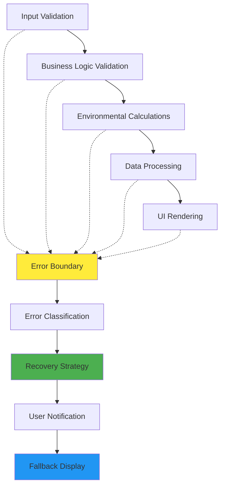

# Error Handling and Validation Architecture for Environmental Display

## Executive Summary

This document defines the comprehensive error handling and validation architecture for the enhanced environmental display system, ensuring robust operation, graceful error recovery, and professional user experience even when encountering calculation errors, network issues, or invalid data inputs.

## Error Handling Philosophy

### Defensive Programming Approach



### Error Classification System

| Error Category | Severity | Recovery Strategy | User Impact |
|---------------|----------|-------------------|-------------|
| **Validation Errors** | Low | Immediate feedback | Form correction required |
| **Calculation Errors** | Medium | Fallback calculations | Estimated results shown |
| **Rendering Errors** | Medium | Alternative display | Simplified visualization |
| **Network Errors** | High | Offline mode | Local calculations only |
| **System Errors** | Critical | Page reload prompt | Full system reset |

## Input Validation Architecture

### Multi-Layer Validation System

```javascript
class EnvironmentalInputValidator {
  constructor() {
    this.validationRules = new Map();
    this.customValidators = new Map();
    this.errorMessages = new Map();
    this.setupValidationRules();
  }
  
  setupValidationRules() {
    // PUE Validation Rules
    this.addValidationRule('pue', {
      type: 'number',
      min: 1.0,
      max: 3.5,
      precision: 2,
      required: true,
      businessLogic: (value, context) => {
        // Business rule: Immersion PUE should be lower than air PUE
        if (context.field === 'immersionPUE' && context.airPUE && value >= context.airPUE) {
          return {
            valid: false,
            code: 'PUE_IMMERSION_NOT_EFFICIENT',
            message: 'Immersion cooling PUE should be lower than air cooling PUE for meaningful comparison'
          };
        }
        
        // Warning for unrealistic improvements
        if (context.field === 'immersionPUE' && context.airPUE) {
          const improvement = ((context.airPUE - value) / context.airPUE) * 100;
          if (improvement > 60) {
            return {
              valid: true,
              warning: true,
              code: 'PUE_IMPROVEMENT_UNREALISTIC',
              message: `${improvement.toFixed(1)}% PUE improvement seems unrealistic. Please verify your values.`
            };
          }
        }
        
        return { valid: true };
      }
    });
    
    // Power Validation Rules
    this.addValidationRule('power', {
      type: 'number',
      min: 1,
      max: 5000,
      integer: false,
      required: true,
      businessLogic: (value, context) => {
        // Warn about unusually high power densities
        if (value > 50) {
          return {
            valid: true,
            warning: true,
            code: 'POWER_DENSITY_HIGH',
            message: `${value}kW per unit is quite high. Please verify this power density is correct.`
          };
        }
        return { valid: true };
      }
    });
    
    // Equipment Count Validation
    this.addValidationRule('equipmentCount', {
      type: 'integer',
      min: 1,
      max: 10000,
      required: true,
      businessLogic: (value, context) => {
        // Validate total power makes sense
        const totalPower = value * (context.powerPerUnit || 0);
        if (totalPower > 50000) {
          return {
            valid: true,
            warning: true,
            code: 'TOTAL_POWER_VERY_HIGH',
            message: `Total power of ${totalPower}kW is very high. This will generate significant environmental impact calculations.`
          };
        }
        return { valid: true };
      }
    });
    
    // Analysis Period Validation
    this.addValidationRule('analysisPeriod', {
      type: 'integer',
      min: 1,
      max: 25,
      required: true,
      businessLogic: (value) => {
        if (value > 15) {
          return {
            valid: true,
            warning: true,
            code: 'LONG_ANALYSIS_PERIOD',
            message: `Analysis period of ${value} years is quite long. Technology and cost assumptions may become less accurate over time.`
          };
        }
        return { valid: true };
      }
    });
  }
  
  addValidationRule(ruleName, rule) {
    this.validationRules.set(ruleName, rule);
  }
  
  validateEnvironmentalInputs(inputData) {
    const results = {
      valid: true,
      errors: [],
      warnings: [],
      fieldErrors: new Map(),
      businessRuleViolations: []
    };
    
    try {
      // Validate individual fields
      this.validateField('airPUE', inputData.airPUE, 'pue', inputData, results);
      this.validateField('immersionPUE', inputData.immersionPUE, 'pue', { ...inputData, field: 'immersionPUE' }, results);
      this.validateField('airPowerPerRack', inputData.airPowerPerRack, 'power', inputData, results);
      this.validateField('immersionPowerPerTank', inputData.immersionPowerPerTank, 'power', inputData, results);
      this.validateField('airRacks', inputData.airRacks, 'equipmentCount', { ...inputData, powerPerUnit: inputData.airPowerPerRack }, results);
      this.validateField('immersionTanks', inputData.immersionTanks, 'equipmentCount', { ...inputData, powerPerUnit: inputData.immersionPowerPerTank }, results);
      this.validateField('analysisYears', inputData.analysisYears, 'analysisPeriod', inputData, results);
      
      // Cross-field validation
      this.performCrossFieldValidation(inputData, results);
      
      // Business logic validation
      this.performBusinessLogicValidation(inputData, results);
      
    } catch (error) {
      results.valid = false;
      results.errors.push({
        code: 'VALIDATION_SYSTEM_ERROR',
        message: 'An error occurred during validation. Please check your inputs and try again.',
        technical: error.message
      });
    }
    
    return results;
  }
  
  validateField(fieldName, value, ruleName, context, results) {
    const rule = this.validationRules.get(ruleName);
    if (!rule) {
      console.warn(`No validation rule found for: ${ruleName}`);
      return;
    }
    
    // Basic type and range validation
    const basicValidation = this.performBasicValidation(value, rule);
    if (!basicValidation.valid) {
      results.valid = false;
      results.fieldErrors.set(fieldName, basicValidation);
      results.errors.push({
        field: fieldName,
        code: basicValidation.code,
        message: basicValidation.message
      });
      return;
    }
    
    // Business logic validation
    if (rule.businessLogic) {
      const businessValidation = rule.businessLogic(value, context);
      if (!businessValidation.valid) {
        results.valid = false;
        results.fieldErrors.set(fieldName, businessValidation);
        results.businessRuleViolations.push({
          field: fieldName,
          code: businessValidation.code,
          message: businessValidation.message
        });
      } else if (businessValidation.warning) {
        results.warnings.push({
          field: fieldName,
          code: businessValidation.code,
          message: businessValidation.message
        });
      }
    }
  }
  
  performBasicValidation(value, rule) {
    // Required check
    if (rule.required && (value === null || value === undefined || value === '')) {
      return {
        valid: false,
        code: 'FIELD_REQUIRED',
        message: 'This field is required'
      };
    }
    
    // Type check
    if (rule.type === 'number' || rule.type === 'integer') {
      const numValue = parseFloat(value);
      if (isNaN(numValue)) {
        return {
          valid: false,
          code: 'INVALID_NUMBER',
          message: 'Please enter a valid number'
        };
      }
      
      if (rule.type === 'integer' && !Number.isInteger(numValue)) {
        return {
          valid: false,
          code: 'INVALID_INTEGER',
          message: 'Please enter a whole number'
        };
      }
      
      // Range checks
      if (rule.min !== undefined && numValue < rule.min) {
        return {
          valid: false,
          code: 'VALUE_TOO_SMALL',
          message: `Value must be at least ${rule.min}`
        };
      }
      
      if (rule.max !== undefined && numValue > rule.max) {
        return {
          valid: false,
          code: 'VALUE_TOO_LARGE',
          message: `Value must be at most ${rule.max}`
        };
      }
      
      // Precision check
      if (rule.precision !== undefined) {
        const decimalPlaces = (numValue.toString().split('.')[1] || '').length;
        if (decimalPlaces > rule.precision) {
          return {
            valid: false,
            code: 'TOO_MANY_DECIMAL_PLACES',
            message: `Please enter at most ${rule.precision} decimal places`
          };
        }
      }
    }
    
    return { valid: true };
  }
  
  performCrossFieldValidation(inputData, results) {
    // Validate total capacity relationship
    const airTotalPower = inputData.airRacks * inputData.airPowerPerRack;
    const immersionTotalPower = inputData.immersionTanks * inputData.immersionPowerPerTank;
    
    const powerDifference = Math.abs(airTotalPower - immersionTotalPower) / Math.max(airTotalPower, immersionTotalPower);
    
    if (powerDifference > 0.3) { // More than 30% difference
      results.warnings.push({
        code: 'CAPACITY_MISMATCH',
        message: `Air cooling (${airTotalPower}kW) and immersion cooling (${immersionTotalPower}kW) capacities differ significantly. Results may not be directly comparable.`,
        suggestion: 'Consider adjusting equipment counts to match total power capacity.'
      });
    }
  }
  
  performBusinessLogicValidation(inputData, results) {
    // Validate realistic PUE improvements
    const pueImprovement = ((inputData.airPUE - inputData.immersionPUE) / inputData.airPUE) * 100;
    
    if (pueImprovement < 5) {
      results.warnings.push({
        code: 'MINIMAL_PUE_IMPROVEMENT',
        message: `PUE improvement of ${pueImprovement.toFixed(1)}% is quite small. Environmental benefits may be limited.`,
        suggestion: 'Consider reviewing PUE values or system configurations.'
      });
    }
    
    // Validate cost effectiveness
    const totalInvestment = inputData.immersionTanks * inputData.immersionTankCost;
    if (totalInvestment > 10000000) { // $10M+
      results.warnings.push({
        code: 'HIGH_INVESTMENT_AMOUNT',
        message: `Investment of $${(totalInvestment / 1000000).toFixed(1)}M is very significant. Please ensure ROI calculations are thoroughly reviewed.`,
        suggestion: 'Consider phased implementation or additional financial analysis.'
      });
    }
  }
  
  formatValidationResults(results) {
    return {
      isValid: results.valid,
      hasWarnings: results.warnings.length > 0,
      errorSummary: this.createErrorSummary(results.errors),
      warningSummary: this.createWarningSummary(results.warnings),
      fieldErrors: Object.fromEntries(results.fieldErrors),
      recommendations: this.generateRecommendations(results)
    };
  }
  
  createErrorSummary(errors) {
    if (errors.length === 0) return null;
    
    return {
      count: errors.length,
      message: errors.length === 1 
        ? 'Please correct the error below:' 
        : `Please correct the ${errors.length} errors below:`,
      errors: errors
    };
  }
  
  createWarningSummary(warnings) {
    if (warnings.length === 0) return null;
    
    return {
      count: warnings.length,
      message: warnings.length === 1
        ? 'Please review the warning below:'
        : `Please review the ${warnings.length} warnings below:`,
      warnings: warnings
    };
  }
  
  generateRecommendations(results) {
    const recommendations = [];
    
    // Generate recommendations based on warnings and business rules
    results.warnings.forEach(warning => {
      if (warning.suggestion) {
        recommendations.push({
          type: 'suggestion',
          message: warning.suggestion,
          relatedTo: warning.code
        });
      }
    });
    
    // Add general recommendations
    if (results.warnings.some(w => w.code.includes('PUE'))) {
      recommendations.push({
        type: 'best-practice',
        message: 'Consider consulting with cooling system vendors to verify PUE values for your specific deployment scenario.',
        relatedTo: 'PUE_VALIDATION'
      });
    }
    
    return recommendations;
  }
}
```

## Error Recovery Architecture

### Graceful Degradation System

```javascript
class EnvironmentalErrorRecovery {
  constructor() {
    this.recoveryStrategies = new Map();
    this.fallbackData = new Map();
    this.errorHistory = [];
    this.setupRecoveryStrategies();
  }
  
  setupRecoveryStrategies() {
    // Calculation error recovery
    this.recoveryStrategies.set('CALCULATION_ERROR', {
      priority: 1,
      strategy: 'fallback-calculation',
      action: (error, context) => this.handleCalculationError(error, context)
    });
    
    // Chart rendering error recovery
    this.recoveryStrategies.set('CHART_RENDER_ERROR', {
      priority: 2,
      strategy: 'simplified-display',
      action: (error, context) => this.handleChartRenderError(error, context)
    });
    
    // Network error recovery
    this.recoveryStrategies.set('NETWORK_ERROR', {
      priority: 3,
      strategy: 'offline-mode',
      action: (error, context) => this.handleNetworkError(error, context)
    });
    
    // Data format error recovery
    this.recoveryStrategies.set('DATA_FORMAT_ERROR', {
      priority: 1,
      strategy: 'data-sanitization',
      action: (error, context) => this.handleDataFormatError(error, context)
    });
  }
  
  handleError(error, context = {}) {
    const errorType = this.classifyError(error);
    const strategy = this.recoveryStrategies.get(errorType);
    
    if (!strategy) {
      console.error('No recovery strategy found for error type:', errorType);
      return this.handleGenericError(error, context);
    }
    
    try {
      // Log error for monitoring
      this.logError(error, errorType, context);
      
      // Execute recovery strategy
      const recoveryResult = strategy.action(error, context);
      
      // Notify user if necessary
      this.notifyUser(errorType, recoveryResult);
      
      return recoveryResult;
      
    } catch (recoveryError) {
      console.error('Recovery strategy failed:', recoveryError);
      return this.handleGenericError(error, context);
    }
  }
  
  classifyError(error) {
    if (error.name === 'CalculationError' || error.message.includes('calculation')) {
      return 'CALCULATION_ERROR';
    }
    
    if (error.name === 'ChartError' || error.message.includes('chart') || error.message.includes('Canvas')) {
      return 'CHART_RENDER_ERROR';
    }
    
    if (error.name === 'NetworkError' || error.message.includes('fetch') || error.message.includes('network')) {
      return 'NETWORK_ERROR';
    }
    
    if (error.name === 'TypeError' || error.message.includes('format') || error.message.includes('parse')) {
      return 'DATA_FORMAT_ERROR';
    }
    
    return 'GENERIC_ERROR';
  }
  
  handleCalculationError(error, context) {
    console.warn('Calculation error encountered, using fallback calculation:', error.message);
    
    // Use simplified calculation as fallback
    const fallbackResult = this.performFallbackCalculation(context.inputData);
    
    return {
      success: true,
      data: fallbackResult,
      fallbackUsed: true,
      userMessage: 'Environmental calculations completed using simplified method. Results are approximate.',
      technicalDetails: error.message
    };
  }
  
  performFallbackCalculation(inputData) {
    // Simplified environmental calculation without complex features
    try {
      const pueImprovement = ((inputData.airPUE - inputData.immersionPUE) / inputData.airPUE) * 100;
      const totalPowerDifference = (inputData.airRacks * inputData.airPowerPerRack * inputData.airPUE) - 
                                   (inputData.immersionTanks * inputData.immersionPowerPerTank * inputData.immersionPUE);
      const annualEnergyDifference = totalPowerDifference * 8760 / 1000; // MWh
      const carbonReduction = annualEnergyDifference * 0.4; // Simplified carbon factor
      
      return {
        core: {
          pueAnalysis: {
            airPUE: inputData.airPUE,
            immersionPUE: inputData.immersionPUE,
            improvementPercent: Math.max(0, Math.round(pueImprovement * 10) / 10),
            industryBenchmark: 1.58,
            efficiencyRating: pueImprovement > 30 ? 'Excellent' : pueImprovement > 20 ? 'Good' : 'Average'
          },
          energyImpact: {
            annualSavingsMWh: Math.max(0, Math.round(annualEnergyDifference)),
            annualSavingsKWh: Math.max(0, Math.round(annualEnergyDifference * 1000))
          },
          carbonFootprint: {
            annualReductionTons: Math.max(0, Math.round(carbonReduction)),
            reductionPercent: Math.max(0, Math.round(pueImprovement * 0.8)) // Approximate
          }
        },
        comparisons: {
          energyEquivalents: {
            homesPerYear: Math.max(0, Math.round(annualEnergyDifference * 1000 / 10800))
          },
          carbonEquivalents: {
            carsRemovedFromRoad: Math.max(0, Math.round(carbonReduction / 4.6))
          }
        },
        fallbackCalculation: true,
        calculationNote: 'Simplified calculation used due to processing error'
      };
    } catch (fallbackError) {
      console.error('Fallback calculation also failed:', fallbackError);
      return this.getMinimalFallbackData();
    }
  }
  
  handleChartRenderError(error, context) {
    console.warn('Chart rendering error, showing simplified display:', error.message);
    
    // Create text-based fallback display
    const simplifiedDisplay = this.createSimplifiedDisplay(context.data);
    
    return {
      success: true,
      displayType: 'text',
      content: simplifiedDisplay,
      userMessage: 'Charts could not be displayed. Showing simplified text summary.',
      technicalDetails: error.message
    };
  }
  
  createSimplifiedDisplay(data) {
    if (!data || !data.core) {
      return 'Environmental data is not available.';
    }
    
    const { pueAnalysis, energyImpact, carbonFootprint } = data.core;
    
    return `
      <div class="simplified-environmental-display">
        <h3>Environmental Impact Summary</h3>
        
        <div class="impact-item">
          <strong>PUE Improvement:</strong> ${pueAnalysis?.improvementPercent || 0}%
          <br><small>From ${pueAnalysis?.airPUE || 'N/A'} to ${pueAnalysis?.immersionPUE || 'N/A'}</small>
        </div>
        
        <div class="impact-item">
          <strong>Annual Energy Savings:</strong> ${energyImpact?.annualSavingsMWh?.toLocaleString() || 0} MWh
        </div>
        
        <div class="impact-item">
          <strong>Annual Carbon Reduction:</strong> ${carbonFootprint?.annualReductionTons?.toLocaleString() || 0} tons CO₂
        </div>
        
        ${data.fallbackCalculation ? '<div class="fallback-notice">⚠️ Simplified calculations used</div>' : ''}
      </div>
    `;
  }
  
  handleNetworkError(error, context) {
    console.warn('Network error, enabling offline mode:', error.message);
    
    // Enable offline mode with cached or default data
    const offlineData = this.getOfflineEnvironmentalData(context.inputData);
    
    return {
      success: true,
      data: offlineData,
      offlineMode: true,
      userMessage: 'Network unavailable. Using offline calculations with standard regional factors.',
      technicalDetails: error.message
    };
  }
  
  getOfflineEnvironmentalData(inputData) {
    // Use standard factors when network is unavailable
    return this.performFallbackCalculation({
      ...inputData,
      carbonEmissionFactor: 0.4, // Standard US grid factor
      industryBenchmarkPUE: 1.58
    });
  }
  
  handleDataFormatError(error, context) {
    console.warn('Data format error, attempting to sanitize:', error.message);
    
    // Attempt to clean and reconstruct the data
    const sanitizedData = this.sanitizeEnvironmentalData(context.rawData);
    
    return {
      success: true,
      data: sanitizedData,
      dataSanitized: true,
      userMessage: 'Data format issues detected and corrected automatically.',
      technicalDetails: error.message
    };
  }
  
  sanitizeEnvironmentalData(rawData) {
    if (!rawData || typeof rawData !== 'object') {
      return this.getMinimalFallbackData();
    }
    
    // Sanitize numeric values
    const sanitize = (value, defaultValue = 0) => {
      const num = parseFloat(value);
      return isNaN(num) ? defaultValue : num;
    };
    
    return {
      core: {
        pueAnalysis: {
          airPUE: sanitize(rawData.core?.pueAnalysis?.airPUE, 1.8),
          immersionPUE: sanitize(rawData.core?.pueAnalysis?.immersionPUE, 1.1),
          improvementPercent: sanitize(rawData.core?.pueAnalysis?.improvementPercent, 0),
          industryBenchmark: 1.58,
          efficiencyRating: rawData.core?.pueAnalysis?.efficiencyRating || 'Unknown'
        },
        energyImpact: {
          annualSavingsMWh: sanitize(rawData.core?.energyImpact?.annualSavingsMWh, 0),
          annualSavingsKWh: sanitize(rawData.core?.energyImpact?.annualSavingsKWh, 0)
        },
        carbonFootprint: {
          annualReductionTons: sanitize(rawData.core?.carbonFootprint?.annualReductionTons, 0),
          reductionPercent: sanitize(rawData.core?.carbonFootprint?.reductionPercent, 0)
        }
      },
      dataSanitized: true
    };
  }
  
  getMinimalFallbackData() {
    return {
      core: {
        pueAnalysis: {
          airPUE: 1.8,
          immersionPUE: 1.1,
          improvementPercent: 38.9,
          industryBenchmark: 1.58,
          efficiencyRating: 'Good'
        },
        energyImpact: {
          annualSavingsMWh: 100,
          annualSavingsKWh: 100000
        },
        carbonFootprint: {
          annualReductionTons: 40,
          reductionPercent: 35
        }
      },
      comparisons: {
        energyEquivalents: {
          homesPerYear: 9
        },
        carbonEquivalents: {
          carsRemovedFromRoad: 9
        }
      },
      isMinimalFallback: true,
      userMessage: 'Showing example environmental impact values. Please recalculate with your actual data.'
    };
  }
  
  logError(error, errorType, context) {
    const errorLog = {
      timestamp: new Date().toISOString(),
      type: errorType,
      message: error.message,
      stack: error.stack,
      context: context,
      userAgent: navigator.userAgent,
      url: window.location.href
    };
    
    this.errorHistory.push(errorLog);
    
    // Keep only last 50 errors
    if (this.errorHistory.length > 50) {
      this.errorHistory.shift();
    }
    
    // Send to logging service if available
    if (window.errorLogger) {
      window.errorLogger.log(errorLog);
    }
  }
  
  notifyUser(errorType, recoveryResult) {
    if (recoveryResult.userMessage) {
      this.showUserNotification(recoveryResult.userMessage, errorType);
    }
  }
  
  showUserNotification(message, errorType) {
    const notification = document.createElement('div');
    notification.className = `error-notification ${errorType.toLowerCase().replace('_', '-')}`;
    notification.innerHTML = `
      <div class="notification-content">
        <div class="notification-icon">ℹ️</div>
        <div class="notification-message">${message}</div>
        <button class="notification-close" onclick="this.parentElement.parentElement.remove()">×</button>
      </div>
    `;
    
    // Add to page
    document.body.appendChild(notification);
    
    // Auto-remove after 10 seconds
    setTimeout(() => {
      if (notification.parentElement) {
        notification.remove();
      }
    }, 10000);
  }
}
```

## User Feedback System

### Comprehensive Error Communication

```javascript
class EnvironmentalErrorCommunicator {
  constructor() {
    this.messageTemplates = new Map();
    this.setupMessageTemplates();
  }
  
  setupMessageTemplates() {
    this.messageTemplates.set('validation-error', {
      title: 'Input Validation Required',
      icon: '⚠️',
      type: 'warning',
      actionRequired: true,
      template: (errors) => ({
        summary: `Please correct ${errors.length} input error${errors.length > 1 ? 's' : ''}:`,
        details: errors.map(error => ({
          field: this.getFieldDisplayName(error.field),
          message: error.message,
          suggestion: this.getFieldSuggestion(error.code)
        }))
      })
    });
    
    this.messageTemplates.set('calculation-warning', {
      title: 'Calculation Completed with Warnings',
      icon: '⚠️',
      type: 'warning',
      actionRequired: false,
      template: (warnings) => ({
        summary: `Environmental calculations completed with ${warnings.length} warning${warnings.length > 1 ? 's' : ''}:`,
        details: warnings.map(warning => ({
          message: warning.message,
          suggestion: warning.suggestion,
          impact: 'Results may be approximate'
        }))
      })
    });
    
    this.messageTemplates.set('fallback-calculation', {
      title: 'Simplified Calculation Used',
      icon: 'ℹ️',
      type: 'info',
      actionRequired: false,
      template: (context) => ({
        summary: 'Environmental calculations completed using simplified method.',
        details: [{
          message: 'Advanced calculations could not be completed.',
          suggestion: 'Results are approximate but should provide good guidance.',
          impact: 'Some detailed metrics may not be available'
        }],
        technicalNote: context.technicalDetails
      })
    });
    
    this.messageTemplates.set('chart-error', {
      title: 'Charts Could Not Be Displayed',
      icon: '📊',
      type: 'warning',
      actionRequired: false,
      template: (context) => ({
        summary: 'Environmental data is available but charts could not be rendered.',
        details: [{
          message: 'Showing text-based summary instead.',
          suggestion: 'Try refreshing the page or updating your browser.',
          impact: 'All environmental metrics are still calculated and displayed'
        }]
      })
    });
    
    this.messageTemplates.set('network-error', {
      title: 'Offline Mode Activated',
      icon: '🌐',
      type: 'info',
      actionRequired: false,
      template: () => ({
        summary: 'Network connection unavailable. Using offline calculations.',
        details: [{
          message: 'Standard environmental factors are being used.',
          suggestion: 'Connect to the internet for region-specific calculations.',
          impact: 'Results use global average emission factors'
        }]
      })
    });
  }
  
  communicateError(errorType, errorData, context = {}) {
    const template = this.messageTemplates.get(errorType);
    if (!template) {
      return this.createGenericErrorMessage(errorType, errorData);
    }
    
    const messageContent = template.template(errorData, context);
    
    return {
      type: template.type,
      title: template.title,
      icon: template.icon,
      actionRequired: template.actionRequired,
      content: messageContent,
      displayOptions: {
        persistent: template.actionRequired,
        showTechnical: context.showTechnical || false,
        allowDismiss: !template.actionRequired
      }
    };
  }
  
  displayErrorMessage(messageConfig) {
    const container = this.getOrCreateErrorContainer();
    
    const messageElement = document.createElement('div');
    messageElement.className = `environmental-error-message ${messageConfig.type}`;
    messageElement.innerHTML = this.renderErrorMessage(messageConfig);
    
    // Add to container
    container.appendChild(messageElement);
    
    // Setup interactions
    this.setupMessageInteractions(messageElement, messageConfig);
    
    // Auto-remove if not persistent
    if (!messageConfig.displayOptions.persistent) {
      setTimeout(() => {
        this.removeMessage(messageElement);
      }, 8000);
    }
    
    return messageElement;
  }
  
  renderErrorMessage(config) {
    const technicalSection = config.displayOptions.showTechnical && config.content.technicalNote
      ? `<div class="technical-details">
           <button class="technical-toggle">Show Technical Details</button>
           <div class="technical-content" style="display: none;">
             <code>${config.content.technicalNote}</code>
           </div>
         </div>`
      : '';
    
    const detailsList = config.content.details
      ? config.content.details.map(detail => `
          <div class="error-detail">
            <div class="detail-message">${detail.message}</div>
            ${detail.suggestion ? `<div class="detail-suggestion">💡 ${detail.suggestion}</div>` : ''}
            ${detail.impact ? `<div class="detail-impact">📊 ${detail.impact}</div>` : ''}
          </div>
        `).join('')
      : '';
    
    return `
      <div class="error-message-header">
        <span class="error-icon">${config.icon}</span>
        <span class="error-title">${config.title}</span>
        ${config.displayOptions.allowDismiss ? '<button class="error-dismiss">×</button>' : ''}
      </div>
      
      <div class="error-message-body">
        <div class="error-summary">${config.content.summary}</div>
        
        ${detailsList ? `<div class="error-details">${detailsList}</div>` : ''}
        
        ${technicalSection}
        
        ${config.actionRequired ? '<div class="error-actions"><button class="retry-button">Retry</button></div>' : ''}
      </div>
    `;
  }
  
  setupMessageInteractions(messageElement, config) {
    // Dismiss button
    const dismissBtn = messageElement.querySelector('.error-dismiss');
    if (dismissBtn) {
      dismissBtn.addEventListener('click', () => {
        this.removeMessage(messageElement);
      });
    }
    
    // Technical details toggle
    const technicalToggle = messageElement.querySelector('.technical-toggle');
    if (technicalToggle) {
      technicalToggle.addEventListener('click', () => {
        const content = messageElement.querySelector('.technical-content');
        const isVisible = content.style.display !== 'none';
        content.style.display = isVisible ? 'none' : 'block';
        technicalToggle.textContent = isVisible ? 'Show Technical Details' : 'Hide Technical Details';
      });
    }
    
    // Retry button
    const retryBtn = messageElement.querySelector('.retry-button');
    if (retryBtn) {
      retryBtn.addEventListener('click', () => {
        // Trigger recalculation
        if (window.environmentalCalculator) {
          window.environmentalCalculator.recalculate();
        }
        this.removeMessage(messageElement);
      });
    }
  }
  
  removeMessage(messageElement) {
    if (messageElement && messageElement.parentElement) {
      messageElement.style.transition = 'opacity 0.3s ease';
      messageElement.style.opacity = '0';
      
      setTimeout(() => {
        messageElement.remove();
      }, 300);
    }
  }
  
  getOrCreateErrorContainer() {
    let container = document.getElementById('environmental-error-container');
    
    if (!container) {
      container = document.createElement('div');
      container.id = 'environmental-error-container';
      container.className = 'environmental-error-container';
      
      // Insert at top of results section or body
      const resultsSection = document.getElementById('results') || document.body;
      resultsSection.insertBefore(container, resultsSection.firstChild);
    }
    
    return container;
  }
  
  getFieldDisplayName(fieldName) {
    const displayNames = {
      airPUE: 'Air Cooling PUE',
      immersionPUE: 'Immersion Cooling PUE',
      airPowerPerRack: 'Power per Rack',
      immersionPowerPerTank: 'Power per Tank',
      airRacks: 'Number of Racks',
      immersionTanks: 'Number of Tanks',
      analysisYears: 'Analysis Period'
    };
    
    return displayNames[fieldName] || fieldName;
  }
  
  getFieldSuggestion(errorCode) {
    const suggestions = {
      'PUE_IMMERSION_NOT_EFFICIENT': 'Immersion cooling should typically have a lower PUE than air cooling',
      'PUE_IMPROVEMENT_UNREALISTIC': 'Consider verifying your PUE values with system vendors',
      'POWER_DENSITY_HIGH': 'High power densities may require specialized cooling solutions',
      'TOTAL_POWER_VERY_HIGH': 'Large installations may require detailed engineering analysis',
      'VALUE_TOO_SMALL': 'Please enter a larger value within the acceptable range',
      'VALUE_TOO_LARGE': 'Please enter a smaller value within the acceptable range',
      'FIELD_REQUIRED': 'This information is needed for accurate calculations'
    };
    
    return suggestions[errorCode] || 'Please check your input and try again';
  }
}
```

## Error Monitoring and Analytics

### Comprehensive Error Tracking

```javascript
class EnvironmentalErrorAnalytics {
  constructor() {
    this.errorMetrics = new Map();
    this.userSessions = new Map();
    this.errorPatterns = new Map();
    this.setupErrorTracking();
  }
  
  setupErrorTracking() {
    // Global error handler
    window.addEventListener('error', (event) => {
      this.trackError('javascript-error', {
        message: event.message,
        filename: event.filename,
        line: event.lineno,
        column: event.colno,
        stack: event.error?.stack
      });
    });
    
    // Unhandled promise rejection handler
    window.addEventListener('unhandledrejection', (event) => {
      this.trackError('promise-rejection', {
        reason: event.reason?.message || event.reason,
        stack: event.reason?.stack
      });
    });
    
    // Custom environmental error handler
    window.addEventListener('environmental-error', (event) => {
      this.trackEnvironmentalError(event.detail);
    });
  }
  
  trackError(errorType, errorData) {
    const errorId = this.generateErrorId();
    const timestamp = Date.now();
    
    const errorRecord = {
      id: errorId,
      type: errorType,
      timestamp: timestamp,
      data: errorData,
      userAgent: navigator.userAgent,
      url: window.location.href,
      sessionId: this.getSessionId(),
      userId: this.getUserId(),
      environmentalContext: this.getEnvironmentalContext()
    };
    
    // Store error
    this.storeError(errorRecord);
    
    // Update metrics
    this.updateErrorMetrics(errorType);
    
    // Check for error patterns
    this.analyzeErrorPattern(errorRecord);
    
    // Report to analytics service
    this.reportToAnalytics(errorRecord);
  }
  
  trackEnvironmentalError(errorDetail) {
    const errorRecord = {
      id: this.generateErrorId(),
      type: 'environmental-calculation',
      timestamp: Date.now(),
      category: errorDetail.category || 'unknown',
      severity: errorDetail.severity || 'medium',
      inputData: this.sanitizeInputData(errorDetail.inputData),
      calculationStep: errorDetail.step,
      errorMessage: errorDetail.message,
      recoveryAction: errorDetail.recoveryAction,
      userImpact: errorDetail.userImpact
    };
    
    this.storeError(errorRecord);
    this.updateErrorMetrics('environmental-error');
  }
  
  storeError(errorRecord) {
    // Store in local storage (with size limit)
    const errors = this.getStoredErrors();
    errors.push(errorRecord);
    
    // Keep only last 100 errors
    if (errors.length > 100) {
      errors.splice(0, errors.length - 100);
    }
    
    try {
      localStorage.setItem('environmental-errors', JSON.stringify(errors));
    } catch (e) {
      console.warn('Could not store error data:', e);
    }
  }
  
  getStoredErrors() {
    try {
      const stored = localStorage.getItem('environmental-errors');
      return stored ? JSON.parse(stored) : [];
    } catch (e) {
      return [];
    }
  }
  
  updateErrorMetrics(errorType) {
    const current = this.errorMetrics.get(errorType) || { count: 0, lastOccurred: 0 };
    current.count += 1;
    current.lastOccurred = Date.now();
    
    this.errorMetrics.set(errorType, current);
  }
  
  analyzeErrorPattern(errorRecord) {
    // Look for recurring error patterns
    const recentErrors = this.getRecentErrors(300000); // Last 5 minutes
    const sameTypeErrors = recentErrors.filter(e => e.type === errorRecord.type);
    
    if (sameTypeErrors.length >= 3) {
      this.triggerErrorPatternAlert(errorRecord.type, sameTypeErrors);
    }
    
    // Analyze user behavior patterns
    const userErrors = recentErrors.filter(e => e.userId === errorRecord.userId);
    if (userErrors.length >= 5) {
      this.triggerUserDifficultyAlert(errorRecord.userId, userErrors);
    }
  }
  
  getRecentErrors(timeWindow = 300000) {
    const now = Date.now();
    const errors = this.getStoredErrors();
    
    return errors.filter(error => (now - error.timestamp) <= timeWindow);
  }
  
  triggerErrorPatternAlert(errorType, errors) {
    console.warn(`Error pattern detected: ${errorType} occurred ${errors.length} times recently`);
    
    // Send alert to monitoring system
    if (window.errorAlert) {
      window.errorAlert.send({
        type: 'error-pattern',
        errorType: errorType,
        frequency: errors.length,
        timeframe: '5 minutes'
      });
    }
  }
  
  generateErrorAnalytics() {
    const errors = this.getStoredErrors();
    const now = Date.now();
    const oneHour = 3600000;
    const oneDay = 86400000;
    
    return {
      summary: {
        totalErrors: errors.length,
        errorsLastHour: errors.filter(e => (now - e.timestamp) <= oneHour).length,
        errorsLastDay: errors.filter(e => (now - e.timestamp) <= oneDay).length,
        mostCommonError: this.getMostCommonError(errors),
        errorRate: this.calculateErrorRate(errors)
      },
      
      breakdown: {
        byType: this.groupErrorsByType(errors),
        byTimeOfDay: this.groupErrorsByTimeOfDay(errors),
        byUserAgent: this.groupErrorsByUserAgent(errors),
        bySeverity: this.groupErrorsBySeverity(errors)
      },
      
      patterns: {
        recurringIssues: this.identifyRecurringIssues(errors),
        userDifficulties: this.identifyUserDifficulties(errors),
        calculationProblems: this.identifyCalculationProblems(errors)
      },
      
      recommendations: this.generateErrorRecommendations(errors)
    };
  }
  
  getMostCommonError(errors) {
    const typeCounts = {};
    errors.forEach(error => {
      typeCounts[error.type] = (typeCounts[error.type] || 0) + 1;
    });
    
    let mostCommon = null;
    let highestCount = 0;
    
    Object.entries(typeCounts).forEach(([type, count]) => {
      if (count > highestCount) {
        mostCommon = type;
        highestCount = count;
      }
    });
    
    return { type: mostCommon, count: highestCount };
  }
  
  calculateErrorRate(errors) {
    if (errors.length === 0) return 0;
    
    const timeSpan = Date.now() - errors[0].timestamp;
    const hoursSpan = timeSpan / 3600000;
    
    return hoursSpan > 0 ? (errors.length / hoursSpan) : 0;
  }
  
  generateErrorRecommendations(errors) {
    const recommendations = [];
    
    // Analyze error patterns and generate recommendations
    const errorsByType = this.groupErrorsByType(errors);
    
    Object.entries(errorsByType).forEach(([type, typeErrors]) => {
      if (typeErrors.length > 5) {
        recommendations.push({
          priority: 'high',
          category: 'error-frequency',
          message: `${type} errors are frequent (${typeErrors.length} occurrences). Consider improving error handling for this scenario.`,
          action: 'review-error-handling'
        });
      }
    });
    
    // Check for validation errors
    const validationErrors = errors.filter(e => e.type.includes('validation'));
    if (validationErrors.length > 0) {
      recommendations.push({
        priority: 'medium',
        category: 'user-experience',
        message: 'Users are encountering validation errors. Consider improving input guidance and validation messages.',
        action: 'enhance-validation-ux'
      });
    }
    
    return recommendations;
  }
  
  sanitizeInputData(inputData) {
    // Remove sensitive information but keep structure for debugging
    if (!inputData) return null;
    
    return {
      hasAirPUE: !!inputData.airPUE,
      hasImmersionPUE: !!inputData.immersionPUE,
      hasEquipmentCounts: !!(inputData.airRacks && inputData.immersionTanks),
      hasPowerData: !!(inputData.airPowerPerRack && inputData.immersionPowerPerTank),
      analysisYears: inputData.analysisYears,
      electricityPrice: inputData.electricityPrice ? 'provided' : 'missing'
    };
  }
  
  getSessionId() {
    let sessionId = sessionStorage.getItem('env-calc-session-id');
    if (!sessionId) {
      sessionId = 'session-' + Date.now() + '-' + Math.random().toString(36).substr(2, 9);
      sessionStorage.setItem('env-calc-session-id', sessionId);
    }
    return sessionId;
  }
  
  getUserId() {
    // Anonymous user tracking (no personal information)
    let userId = localStorage.getItem('env-calc-user-id');
    if (!userId) {
      userId = 'user-' + Date.now() + '-' + Math.random().toString(36).substr(2, 9);
      localStorage.setItem('env-calc-user-id', userId);
    }
    return userId;
  }
  
  getEnvironmentalContext() {
    return {
      calculatorVersion: window.calculatorVersion || 'unknown',
      calculationMode: window.calculationMode || 'standard',
      featuresEnabled: window.environmentalFeatures || [],
      dataSource: window.environmentalDataSource || 'default'
    };
  }
  
  generateErrorId() {
    return 'err-' + Date.now() + '-' + Math.random().toString(36).substr(2, 9);
  }
  
  reportToAnalytics(errorRecord) {
    // Send to Google Analytics if available
    if (window.gtag) {
      window.gtag('event', 'environmental_error', {
        error_type: errorRecord.type,
        error_category: errorRecord.category || 'unknown',
        error_severity: errorRecord.severity || 'medium'
      });
    }
    
    // Send to custom analytics endpoint if configured
    if (window.analyticsEndpoint) {
      fetch(window.analyticsEndpoint, {
        method: 'POST',
        headers: { 'Content-Type': 'application/json' },
        body: JSON.stringify({
          type: 'error',
          data: errorRecord
        })
      }).catch(() => {
        // Silently fail - don't create more errors
      });
    }
  }
}
```

This comprehensive error handling and validation architecture ensures that the enhanced environmental display system maintains professional operation even when encountering errors, provides clear feedback to users, and continuously improves through detailed error analytics and monitoring.