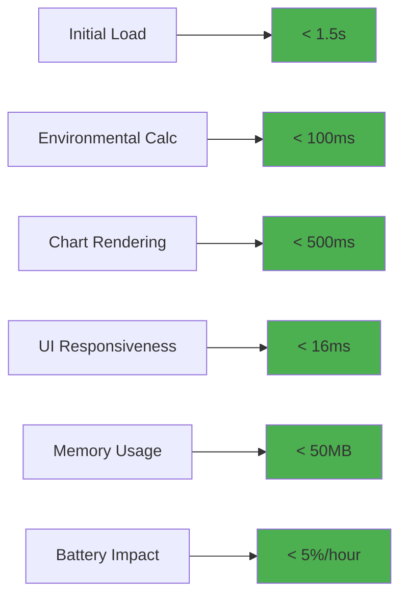

# Performance Optimization Architecture for Environmental Display

## Executive Summary

This document defines the comprehensive performance optimization strategy for the enhanced environmental display system, ensuring sub-second load times, smooth animations, and optimal resource utilization while maintaining professional presentation quality across all device types.

## Performance Targets and Metrics

### Key Performance Indicators



### Performance Budget Allocation

| Component | Initial Load | Runtime Memory | CPU Usage | Network |
|-----------|--------------|----------------|-----------|---------|
| Base TCO Calculator | 800ms | 15MB | 20% | 85KB |
| Environmental Engine | 200ms | 10MB | 15% | 25KB |
| Chart.js Integration | 300ms | 15MB | 25% | 45KB |
| UI Components | 200ms | 10MB | 10% | 20KB |
| **Total Budget** | **1.5s** | **50MB** | **70%** | **175KB** |

## Calculation Performance Architecture

### Optimized Environmental Calculation Engine

```javascript
class OptimizedEnvironmentalEngine {
  constructor() {
    this.calculationCache = new Map();
    this.workerPool = null;
    this.memoizedFunctions = new Map();
    this.performanceMonitor = new PerformanceMonitor();
    
    // Initialize Web Workers for heavy calculations
    this.initializeWorkerPool();
    
    // Pre-calculate common scenarios
    this.precomputeCommonScenarios();
  }
  
  initializeWorkerPool() {
    // Create Web Worker for intensive calculations
    const workerCode = `
      // Environmental calculations worker
      self.onmessage = function(e) {
        const { type, data } = e.data;
        
        switch(type) {
          case 'calculatePUEImpact':
            const result = calculatePUEImpactWorker(data);
            self.postMessage({ type: 'result', data: result });
            break;
            
          case 'calculateProjections':
            const projections = calculateProjectionsWorker(data);
            self.postMessage({ type: 'projections', data: projections });
            break;
        }
      };
      
      function calculatePUEImpactWorker(params) {
        const { airPUE, immersionPUE, totalPower, analysisYears } = params;
        
        // Optimized PUE calculations
        const improvementPercent = ((airPUE - immersionPUE) / airPUE) * 100;
        const annualEnergyDifference = totalPower * (airPUE - immersionPUE) * 8760;
        const carbonReduction = annualEnergyDifference * 0.4 / 1000;
        
        return {
          improvementPercent: Math.round(improvementPercent * 10) / 10,
          annualEnergySavings: Math.round(annualEnergyDifference / 1000),
          annualCarbonReduction: Math.round(carbonReduction),
          timestamp: Date.now()
        };
      }
      
      function calculateProjectionsWorker(baseData) {
        const projections = [];
        const baseValue = baseData.annualSavings;
        
        // Vectorized calculations for better performance
        for (let year = 1; year <= 10; year++) {
          const compoundGrowth = Math.pow(1.02, year - 1);
          projections.push(Math.round(baseValue * compoundGrowth));
        }
        
        return projections;
      }
    `;
    
    const blob = new Blob([workerCode], { type: 'application/javascript' });
    this.workerUrl = URL.createObjectURL(blob);
  }
  
  async calculateEnvironmentalImpact(inputData) {
    this.performanceMonitor.start('environmental-calculation');
    
    // Check cache first
    const cacheKey = this.generateCacheKey(inputData);
    const cached = this.calculationCache.get(cacheKey);
    
    if (cached && (Date.now() - cached.timestamp) < 60000) { // 1-minute cache
      this.performanceMonitor.end('environmental-calculation', 'cache-hit');
      return cached.data;
    }
    
    try {
      // Use Web Worker for heavy calculations
      const result = await this.calculateWithWorker(inputData);
      
      // Cache the result
      this.calculationCache.set(cacheKey, {
        data: result,
        timestamp: Date.now()
      });
      
      this.performanceMonitor.end('environmental-calculation', 'computed');
      return result;
      
    } catch (error) {
      // Fallback to main thread calculation
      console.warn('Worker calculation failed, falling back to main thread:', error);
      const result = this.calculateOnMainThread(inputData);
      this.performanceMonitor.end('environmental-calculation', 'fallback');
      return result;
    }
  }
  
  calculateWithWorker(inputData) {
    return new Promise((resolve, reject) => {
      const worker = new Worker(this.workerUrl);
      const timeout = setTimeout(() => {
        worker.terminate();
        reject(new Error('Worker calculation timeout'));
      }, 5000); // 5-second timeout
      
      worker.onmessage = (e) => {
        clearTimeout(timeout);
        worker.terminate();
        
        if (e.data.type === 'result') {
          resolve(e.data.data);
        } else {
          reject(new Error('Unexpected worker response'));
        }
      };
      
      worker.onerror = (error) => {
        clearTimeout(timeout);
        worker.terminate();
        reject(error);
      };
      
      // Send calculation data to worker
      worker.postMessage({
        type: 'calculatePUEImpact',
        data: inputData
      });
    });
  }
  
  calculateOnMainThread(inputData) {
    // Fast main-thread calculation as fallback
    const { airPUE, immersionPUE, totalPower } = inputData;
    
    const improvementPercent = ((airPUE - immersionPUE) / airPUE) * 100;
    const annualEnergyDifference = totalPower * (airPUE - immersionPUE) * 8760;
    const carbonReduction = annualEnergyDifference * 0.4 / 1000;
    
    return {
      improvementPercent: Math.round(improvementPercent * 10) / 10,
      annualEnergySavings: Math.round(annualEnergyDifference / 1000),
      annualCarbonReduction: Math.round(carbonReduction),
      timestamp: Date.now()
    };
  }
  
  generateCacheKey(inputData) {
    // Generate efficient cache key
    const keyData = {
      airPUE: Math.round(inputData.airPUE * 100),
      immersionPUE: Math.round(inputData.immersionPUE * 100),
      totalPower: Math.round(inputData.totalPower),
      analysisYears: inputData.analysisYears
    };
    
    return btoa(JSON.stringify(keyData)).replace(/[^a-zA-Z0-9]/g, '');
  }
  
  precomputeCommonScenarios() {
    // Pre-calculate common PUE scenarios
    const commonScenarios = [
      { airPUE: 1.8, immersionPUE: 1.1, totalPower: 200 },
      { airPUE: 1.6, immersionPUE: 1.02, totalPower: 500 },
      { airPUE: 2.0, immersionPUE: 1.15, totalPower: 1000 }
    ];
    
    commonScenarios.forEach(scenario => {
      const result = this.calculateOnMainThread(scenario);
      const cacheKey = this.generateCacheKey(scenario);
      this.calculationCache.set(cacheKey, {
        data: result,
        timestamp: Date.now()
      });
    });
  }
}
```

## Chart Rendering Performance Architecture

### Optimized Chart.js Integration

```javascript
class PerformantChartRenderer {
  constructor() {
    this.chartInstancePool = new ChartInstancePool();
    this.animationController = new AnimationController();
    this.renderQueue = new RenderQueue();
    this.intersectionObserver = this.setupIntersectionObserver();
  }
  
  setupIntersectionObserver() {
    return new IntersectionObserver((entries) => {
      entries.forEach(entry => {
        const canvas = entry.target;
        const chartId = canvas.id;
        
        if (entry.isIntersecting) {
          // Chart is visible, prioritize rendering
          this.renderQueue.prioritize(chartId);
          this.resumeAnimations(chartId);
        } else {
          // Chart is not visible, pause animations
          this.pauseAnimations(chartId);
        }
      });
    }, {
      rootMargin: '50px', // Start loading 50px before visible
      threshold: 0.1
    });
  }
  
  async createOptimizedChart(canvasId, chartType, data, options = {}) {
    // Get or create canvas element
    const canvas = this.getOrCreateCanvas(canvasId);
    
    // Add to intersection observer
    this.intersectionObserver.observe(canvas);
    
    // Use object pooling for chart instances
    const chartInstance = this.chartInstancePool.getInstance(chartType);
    
    if (chartInstance) {
      // Reuse existing chart instance
      this.updateExistingChart(chartInstance, data, options);
      return chartInstance;
    }
    
    // Create new chart with performance optimizations
    return this.createNewChart(canvas, chartType, data, options);
  }
  
  createNewChart(canvas, chartType, data, options) {
    const ctx = canvas.getContext('2d');
    
    // Apply performance optimizations
    const optimizedOptions = this.applyPerformanceOptimizations(options, chartType);
    
    // Use RAF for smooth rendering
    return new Promise((resolve) => {
      requestAnimationFrame(() => {
        const chart = new Chart(ctx, {
          type: chartType,
          data: data,
          options: optimizedOptions
        });
        
        // Register with performance monitor
        this.registerChartPerformance(chart);
        
        resolve(chart);
      });
    });
  }
  
  applyPerformanceOptimizations(options, chartType) {
    const optimized = {
      ...options,
      
      // Disable animations on low-end devices
      animation: this.getOptimalAnimationConfig(chartType),
      
      // Optimize rendering
      responsive: true,
      maintainAspectRatio: false,
      
      // Reduce redraws
      interaction: {
        intersect: false,
        mode: 'index'
      },
      
      // Optimize plugins
      plugins: {
        ...options.plugins,
        
        // Disable unnecessary plugins on mobile
        legend: {
          ...options.plugins?.legend,
          display: !this.isMobileDevice() || options.plugins?.legend?.display !== false
        },
        
        // Optimize tooltip performance
        tooltip: {
          ...options.plugins?.tooltip,
          mode: 'nearest',
          intersect: false,
          animation: {
            duration: 0 // Disable tooltip animations for performance
          }
        }
      }
    };
    
    // Chart-specific optimizations
    switch (chartType) {
      case 'line':
        optimized.elements = {
          point: {
            radius: this.isMobileDevice() ? 2 : 4,
            hoverRadius: this.isMobileDevice() ? 4 : 6
          },
          line: {
            tension: 0.1 // Reduce curve complexity
          }
        };
        break;
        
      case 'doughnut':
        optimized.cutout = '70%';
        optimized.radius = '90%';
        break;
        
      case 'bar':
        optimized.scales = {
          ...optimized.scales,
          x: {
            ...optimized.scales?.x,
            ticks: {
              ...optimized.scales?.x?.ticks,
              maxTicksLimit: this.isMobileDevice() ? 5 : 10
            }
          }
        };
        break;
    }
    
    return optimized;
  }
  
  getOptimalAnimationConfig(chartType) {
    const deviceCapability = this.getDeviceCapability();
    
    if (deviceCapability === 'low') {
      return false; // Disable animations on low-end devices
    }
    
    if (deviceCapability === 'medium') {
      return {
        duration: 800, // Shorter animations
        easing: 'easeOutQuart'
      };
    }
    
    // High-end devices get full animations
    return {
      duration: chartType === 'doughnut' ? 2000 : 1500,
      easing: 'easeOutQuart',
      delay: (context) => context.dataIndex * 50
    };
  }
  
  getDeviceCapability() {
    const deviceMemory = navigator.deviceMemory || 4;
    const hardwareConcurrency = navigator.hardwareConcurrency || 4;
    
    if (deviceMemory <= 2 || hardwareConcurrency <= 2) {
      return 'low';
    } else if (deviceMemory <= 4 || hardwareConcurrency <= 4) {
      return 'medium';
    }
    
    return 'high';
  }
  
  isMobileDevice() {
    return window.innerWidth <= 768 || /Mobi|Android/i.test(navigator.userAgent);
  }
}

// Chart Instance Pool for Memory Efficiency
class ChartInstancePool {
  constructor(maxPoolSize = 10) {
    this.pool = new Map();
    this.maxPoolSize = maxPoolSize;
  }
  
  getInstance(chartType) {
    const availableInstances = this.pool.get(chartType) || [];
    
    if (availableInstances.length > 0) {
      return availableInstances.pop();
    }
    
    return null;
  }
  
  returnInstance(chartType, instance) {
    if (!this.pool.has(chartType)) {
      this.pool.set(chartType, []);
    }
    
    const instances = this.pool.get(chartType);
    
    if (instances.length < this.maxPoolSize) {
      // Clear the instance data before returning to pool
      instance.clear();
      instances.push(instance);
    } else {
      // Pool is full, destroy the instance
      instance.destroy();
    }
  }
}

// Render Queue for Prioritized Chart Loading
class RenderQueue {
  constructor() {
    this.queue = [];
    this.processing = false;
    this.priorities = new Map();
  }
  
  add(chartId, renderFunction, priority = 1) {
    this.queue.push({
      chartId,
      renderFunction,
      priority,
      timestamp: Date.now()
    });
    
    this.sort();
    
    if (!this.processing) {
      this.process();
    }
  }
  
  prioritize(chartId) {
    const item = this.queue.find(item => item.chartId === chartId);
    if (item) {
      item.priority = Math.max(item.priority, 10); // High priority
      this.sort();
    }
  }
  
  sort() {
    this.queue.sort((a, b) => {
      if (b.priority !== a.priority) {
        return b.priority - a.priority; // Higher priority first
      }
      return a.timestamp - b.timestamp; // Earlier timestamp first
    });
  }
  
  async process() {
    this.processing = true;
    
    while (this.queue.length > 0) {
      const item = this.queue.shift();
      
      try {
        await new Promise(resolve => {
          requestIdleCallback(() => {
            item.renderFunction();
            resolve();
          }, { timeout: 100 });
        });
      } catch (error) {
        console.error(`Failed to render chart ${item.chartId}:`, error);
      }
      
      // Yield control to browser between renders
      await new Promise(resolve => setTimeout(resolve, 0));
    }
    
    this.processing = false;
  }
}
```

## Memory Management Architecture

### Memory-Efficient Component Management

```javascript
class EnvironmentalMemoryManager {
  constructor() {
    this.componentRefs = new WeakMap();
    this.observedElements = new Set();
    this.memoryMonitor = new MemoryMonitor();
    this.cleanupScheduler = new CleanupScheduler();
  }
  
  registerComponent(element, component) {
    this.componentRefs.set(element, component);
    
    // Setup cleanup when element is removed from DOM
    const observer = new MutationObserver((mutations) => {
      mutations.forEach(mutation => {
        mutation.removedNodes.forEach(node => {
          if (node === element) {
            this.cleanupComponent(element);
            observer.disconnect();
          }
        });
      });
    });
    
    observer.observe(document.body, {
      childList: true,
      subtree: true
    });
  }
  
  cleanupComponent(element) {
    const component = this.componentRefs.get(element);
    
    if (component) {
      // Call component cleanup if available
      if (typeof component.cleanup === 'function') {
        component.cleanup();
      }
      
      // Remove from WeakMap
      this.componentRefs.delete(element);
      
      // Remove from observed elements
      this.observedElements.delete(element);
    }
  }
  
  scheduleCleanup() {
    this.cleanupScheduler.schedule(() => {
      // Force garbage collection if available
      if (window.gc) {
        window.gc();
      }
      
      // Monitor memory usage
      this.memoryMonitor.check();
      
      // Clean up unused chart instances
      this.cleanupUnusedCharts();
    });
  }
  
  cleanupUnusedCharts() {
    // Remove charts that are no longer visible or needed
    const visibleCharts = document.querySelectorAll('canvas[id*="Chart"]:not([style*="display: none"])');
    const allChartElements = document.querySelectorAll('canvas[id*="Chart"]');
    
    allChartElements.forEach(canvas => {
      if (!Array.from(visibleCharts).includes(canvas)) {
        const component = this.componentRefs.get(canvas);
        if (component && typeof component.destroy === 'function') {
          component.destroy();
        }
      }
    });
  }
}

class MemoryMonitor {
  constructor() {
    this.memoryThreshold = 40 * 1024 * 1024; // 40MB
    this.checkInterval = 30000; // 30 seconds
    this.startMonitoring();
  }
  
  startMonitoring() {
    setInterval(() => {
      this.check();
    }, this.checkInterval);
  }
  
  check() {
    if (performance.memory) {
      const { usedJSHeapSize, totalJSHeapSize } = performance.memory;
      
      if (usedJSHeapSize > this.memoryThreshold) {
        console.warn(`High memory usage detected: ${(usedJSHeapSize / 1024 / 1024).toFixed(2)}MB`);
        
        // Trigger cleanup
        this.triggerCleanup();
      }
      
      // Log memory stats in development
      if (process.env.NODE_ENV === 'development') {
        console.log(`Memory usage: ${(usedJSHeapSize / 1024 / 1024).toFixed(2)}MB / ${(totalJSHeapSize / 1024 / 1024).toFixed(2)}MB`);
      }
    }
  }
  
  triggerCleanup() {
    // Emit cleanup event
    window.dispatchEvent(new CustomEvent('memoryPressure', {
      detail: { 
        usedMemory: performance.memory.usedJSHeapSize,
        threshold: this.memoryThreshold
      }
    }));
  }
}
```

## Loading Performance Architecture

### Progressive Loading Strategy

```javascript
class ProgressiveLoader {
  constructor() {
    this.loadingStages = [
      'critical-ui',
      'environmental-calculations',
      'chart-library',
      'chart-instances',
      'animations'
    ];
    
    this.currentStage = 0;
    this.loadingProgress = 0;
    this.setupProgressiveLoading();
  }
  
  async setupProgressiveLoading() {
    // Stage 1: Load critical UI components first
    await this.loadCriticalUI();
    this.updateProgress(20);
    
    // Stage 2: Load environmental calculation engine
    await this.loadEnvironmentalEngine();
    this.updateProgress(40);
    
    // Stage 3: Load Chart.js library
    await this.loadChartLibrary();
    this.updateProgress(60);
    
    // Stage 4: Create chart instances (lazy loaded)
    this.setupLazyChartLoading();
    this.updateProgress(80);
    
    // Stage 5: Initialize animations and interactions
    await this.initializeAnimations();
    this.updateProgress(100);
    
    this.hideLoadingIndicator();
  }
  
  async loadCriticalUI() {
    // Load essential UI components first
    return new Promise(resolve => {
      requestIdleCallback(() => {
        // Initialize critical UI elements
        this.initializeCriticalComponents();
        resolve();
      });
    });
  }
  
  async loadEnvironmentalEngine() {
    // Load environmental calculation engine
    return new Promise(resolve => {
      const script = document.createElement('script');
      script.onload = resolve;
      script.src = 'data:text/javascript;base64,' + btoa(`
        // Environmental calculation engine code here
        window.EnvironmentalEngine = class {
          // Optimized calculation methods
        };
      `);
      document.head.appendChild(script);
    });
  }
  
  async loadChartLibrary() {
    // Load Chart.js only when needed
    if (!window.Chart) {
      return new Promise(resolve => {
        const script = document.createElement('script');
        script.onload = resolve;
        script.src = 'https://cdn.jsdelivr.net/npm/chart.js@4.4.0/dist/chart.umd.js';
        script.integrity = 'sha384-...'; // Add integrity hash
        script.crossOrigin = 'anonymous';
        document.head.appendChild(script);
      });
    }
  }
  
  setupLazyChartLoading() {
    // Setup intersection observer for lazy chart loading
    const chartContainers = document.querySelectorAll('.env-chart-container');
    
    const observer = new IntersectionObserver((entries) => {
      entries.forEach(entry => {
        if (entry.isIntersecting) {
          this.loadChart(entry.target);
          observer.unobserve(entry.target);
        }
      });
    }, {
      rootMargin: '100px', // Start loading 100px before visible
      threshold: 0.1
    });
    
    chartContainers.forEach(container => {
      observer.observe(container);
    });
  }
  
  async loadChart(container) {
    const chartType = container.dataset.chartType;
    const canvas = container.querySelector('canvas');
    
    if (canvas && chartType) {
      // Show loading spinner
      this.showChartLoading(container);
      
      try {
        // Load chart data and create instance
        const chartData = await this.getChartData(chartType);
        const chart = await this.createChartInstance(canvas, chartType, chartData);
        
        // Hide loading spinner
        this.hideChartLoading(container);
        
        return chart;
      } catch (error) {
        console.error(`Failed to load chart ${chartType}:`, error);
        this.showChartError(container, error.message);
      }
    }
  }
  
  updateProgress(progress) {
    this.loadingProgress = progress;
    
    // Update progress indicator
    const progressBar = document.querySelector('.loading-progress-bar');
    if (progressBar) {
      progressBar.style.width = `${progress}%`;
    }
    
    // Update loading text
    const loadingText = document.querySelector('.loading-text');
    if (loadingText) {
      const stageName = this.loadingStages[Math.floor(progress / 20)] || 'complete';
      loadingText.textContent = `Loading ${stageName.replace('-', ' ')}...`;
    }
  }
  
  showChartLoading(container) {
    const loader = document.createElement('div');
    loader.className = 'chart-loader';
    loader.innerHTML = `
      <div class="chart-spinner"></div>
      <div class="chart-loading-text">Generating chart...</div>
    `;
    container.appendChild(loader);
  }
  
  hideChartLoading(container) {
    const loader = container.querySelector('.chart-loader');
    if (loader) {
      loader.remove();
    }
  }
  
  showChartError(container, message) {
    const error = document.createElement('div');
    error.className = 'chart-error';
    error.innerHTML = `
      <div class="error-icon">⚠️</div>
      <div class="error-message">${message}</div>
      <button class="error-retry" onclick="location.reload()">Retry</button>
    `;
    container.appendChild(error);
  }
}
```

## Network Performance Architecture

### Asset Optimization and Caching

```javascript
class NetworkOptimizer {
  constructor() {
    this.cacheStrategy = new CacheStrategy();
    this.compressionDetector = new CompressionDetector();
    this.connectionMonitor = new ConnectionMonitor();
  }
  
  optimizeAssetLoading() {
    // Preload critical assets
    this.preloadCriticalAssets();
    
    // Setup service worker for caching
    this.setupServiceWorker();
    
    // Optimize based on connection type
    this.adaptToConnection();
  }
  
  preloadCriticalAssets() {
    const criticalAssets = [
      'https://cdn.jsdelivr.net/npm/chart.js@4.4.0/dist/chart.umd.js'
    ];
    
    criticalAssets.forEach(url => {
      const link = document.createElement('link');
      link.rel = 'preload';
      link.href = url;
      link.as = 'script';
      link.crossOrigin = 'anonymous';
      document.head.appendChild(link);
    });
  }
  
  setupServiceWorker() {
    if ('serviceWorker' in navigator) {
      navigator.serviceWorker.register('data:application/javascript;base64,' + btoa(`
        const CACHE_NAME = 'tco-calculator-v1';
        const urlsToCache = [
          '/',
          'https://cdn.jsdelivr.net/npm/chart.js@4.4.0/dist/chart.umd.js'
        ];
        
        self.addEventListener('install', event => {
          event.waitUntil(
            caches.open(CACHE_NAME)
              .then(cache => cache.addAll(urlsToCache))
          );
        });
        
        self.addEventListener('fetch', event => {
          event.respondWith(
            caches.match(event.request)
              .then(response => {
                // Return cached version or fetch from network
                return response || fetch(event.request);
              })
          );
        });
      `));
    }
  }
  
  adaptToConnection() {
    const connection = navigator.connection || navigator.mozConnection || navigator.webkitConnection;
    
    if (connection) {
      const effectiveType = connection.effectiveType;
      
      if (effectiveType === '2g' || effectiveType === 'slow-2g') {
        // Disable animations and reduce quality on slow connections
        this.enableLowBandwidthMode();
      } else if (effectiveType === '3g') {
        // Reduce animation complexity
        this.enableMediumBandwidthMode();
      }
    }
  }
  
  enableLowBandwidthMode() {
    document.documentElement.classList.add('low-bandwidth');
    
    // Disable all animations
    const style = document.createElement('style');
    style.textContent = `
      .low-bandwidth * {
        animation-duration: 0.01ms !important;
        animation-iteration-count: 1 !important;
        transition-duration: 0.01ms !important;
      }
    `;
    document.head.appendChild(style);
  }
  
  enableMediumBandwidthMode() {
    document.documentElement.classList.add('medium-bandwidth');
    
    // Reduce animation durations
    const style = document.createElement('style');
    style.textContent = `
      .medium-bandwidth .metric-card {
        transition-duration: 0.15s !important;
      }
      .medium-bandwidth .chart-animation {
        animation-duration: 0.8s !important;
      }
    `;
    document.head.appendChild(style);
  }
}
```

## Performance Monitoring System

### Real-time Performance Analytics

```javascript
class PerformanceMonitor {
  constructor() {
    this.metrics = new Map();
    this.observers = [];
    this.setupPerformanceObservers();
  }
  
  setupPerformanceObservers() {
    // Long Task Observer
    if ('PerformanceObserver' in window) {
      const longTaskObserver = new PerformanceObserver(list => {
        list.getEntries().forEach(entry => {
          if (entry.duration > 50) {
            console.warn(`Long task detected: ${entry.duration}ms`);
            this.recordMetric('longTask', entry.duration);
          }
        });
      });
      
      longTaskObserver.observe({ entryTypes: ['longtask'] });
      this.observers.push(longTaskObserver);
      
      // Layout Shift Observer
      const layoutShiftObserver = new PerformanceObserver(list => {
        let cumulativeScore = 0;
        
        list.getEntries().forEach(entry => {
          if (!entry.hadRecentInput) {
            cumulativeScore += entry.value;
          }
        });
        
        if (cumulativeScore > 0) {
          this.recordMetric('cumulativeLayoutShift', cumulativeScore);
        }
      });
      
      layoutShiftObserver.observe({ entryTypes: ['layout-shift'] });
      this.observers.push(layoutShiftObserver);
    }
  }
  
  start(operationName) {
    this.metrics.set(operationName, {
      startTime: performance.now(),
      startMemory: this.getMemoryUsage()
    });
  }
  
  end(operationName, category = 'default') {
    const startData = this.metrics.get(operationName);
    
    if (startData) {
      const duration = performance.now() - startData.startTime;
      const memoryUsed = this.getMemoryUsage() - startData.startMemory;
      
      this.recordMetric(operationName, duration, {
        category,
        memoryUsed,
        timestamp: Date.now()
      });
      
      this.metrics.delete(operationName);
    }
  }
  
  recordMetric(name, value, metadata = {}) {
    // Store metric data
    if (!this.metrics.has('recorded')) {
      this.metrics.set('recorded', new Map());
    }
    
    const recorded = this.metrics.get('recorded');
    recorded.set(`${name}-${Date.now()}`, {
      name,
      value,
      metadata,
      timestamp: Date.now()
    });
    
    // Report to analytics if configured
    if (window.gtag) {
      window.gtag('event', 'performance_metric', {
        metric_name: name,
        metric_value: value,
        custom_parameter_category: metadata.category
      });
    }
    
    // Log performance issues
    this.checkPerformanceThresholds(name, value);
  }
  
  checkPerformanceThresholds(name, value) {
    const thresholds = {
      'environmental-calculation': 100, // 100ms
      'chart-rendering': 500, // 500ms
      'ui-interaction': 16, // 16ms (60fps)
      'longTask': 50, // 50ms
      'cumulativeLayoutShift': 0.1 // CLS threshold
    };
    
    const threshold = thresholds[name];
    
    if (threshold && value > threshold) {
      console.warn(`Performance threshold exceeded for ${name}: ${value}ms (threshold: ${threshold}ms)`);
      
      // Trigger performance optimization
      this.triggerOptimization(name, value);
    }
  }
  
  triggerOptimization(metricName, value) {
    switch (metricName) {
      case 'environmental-calculation':
        // Switch to faster calculation method
        window.dispatchEvent(new CustomEvent('optimizeCalculations'));
        break;
        
      case 'chart-rendering':
        // Reduce chart complexity
        window.dispatchEvent(new CustomEvent('optimizeCharts'));
        break;
        
      case 'longTask':
        // Break up long tasks
        window.dispatchEvent(new CustomEvent('breakUpTasks'));
        break;
    }
  }
  
  getMemoryUsage() {
    return performance.memory ? performance.memory.usedJSHeapSize : 0;
  }
  
  generatePerformanceReport() {
    const recorded = this.metrics.get('recorded') || new Map();
    const report = {
      timestamp: Date.now(),
      metrics: Array.from(recorded.values()),
      summary: this.calculateSummaryStats(recorded)
    };
    
    return report;
  }
  
  calculateSummaryStats(recorded) {
    const values = Array.from(recorded.values());
    
    return {
      totalOperations: values.length,
      averageCalculationTime: this.getAverageByName(values, 'environmental-calculation'),
      averageRenderTime: this.getAverageByName(values, 'chart-rendering'),
      memoryPeakUsage: Math.max(...values.map(v => v.metadata.memoryUsed || 0))
    };
  }
  
  getAverageByName(values, name) {
    const filtered = values.filter(v => v.name === name);
    if (filtered.length === 0) return 0;
    
    const sum = filtered.reduce((acc, v) => acc + v.value, 0);
    return sum / filtered.length;
  }
  
  cleanup() {
    // Disconnect all observers
    this.observers.forEach(observer => {
      observer.disconnect();
    });
    
    this.observers = [];
    this.metrics.clear();
  }
}
```

This comprehensive performance optimization architecture ensures that the enhanced environmental display system maintains excellent performance across all device types while providing detailed monitoring and adaptive optimization capabilities.