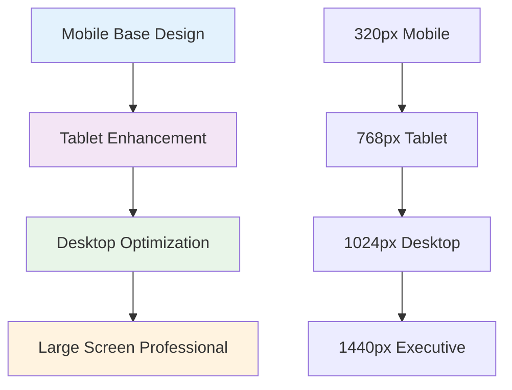

# Responsive Design Architecture for Environmental Display

## Executive Summary

This document defines the comprehensive responsive design architecture for the enhanced environmental display system, ensuring optimal viewing and interaction across all device types while maintaining professional presentation standards for C-level executives and technical stakeholders.

## Responsive Design Strategy

### Mobile-First Approach



### Breakpoint System

```css
/* Environmental Display Responsive System */
:root {
  /* Breakpoint Definitions */
  --env-mobile-sm: 320px;
  --env-mobile-lg: 480px;
  --env-tablet-sm: 768px;
  --env-tablet-lg: 1024px;
  --env-desktop-sm: 1200px;
  --env-desktop-lg: 1440px;
  --env-executive: 1920px;
  
  /* Responsive Typography Scale */
  --env-text-scale-mobile: 0.875;
  --env-text-scale-tablet: 1.0;
  --env-text-scale-desktop: 1.125;
  --env-text-scale-executive: 1.25;
  
  /* Spacing Scale by Device */
  --env-spacing-scale-mobile: 0.75;
  --env-spacing-scale-tablet: 1.0;
  --env-spacing-scale-desktop: 1.25;
  --env-spacing-scale-executive: 1.5;
}
```

## Layout Architecture

### Container Query Integration

```css
/* Modern Container Queries for Environmental Components */
.environmental-dashboard {
  container-type: inline-size;
  container-name: env-dashboard;
}

/* Container-based responsive design */
@container env-dashboard (max-width: 768px) {
  .env-hero {
    grid-template-columns: 1fr;
    text-align: center;
    padding: var(--env-spacing-md);
  }
  
  .improvement-gauge {
    width: 150px;
    height: 150px;
    margin: 0 auto;
  }
  
  .pue-details {
    margin-top: var(--env-spacing-lg);
  }
}

@container env-dashboard (min-width: 769px) and (max-width: 1023px) {
  .env-hero {
    grid-template-columns: 300px 1fr;
    gap: var(--env-spacing-xl);
  }
  
  .env-metrics-grid {
    grid-template-columns: repeat(2, 1fr);
  }
}

@container env-dashboard (min-width: 1024px) {
  .env-hero {
    grid-template-columns: 350px 1fr;
    gap: calc(var(--env-spacing-xl) * 1.5);
  }
  
  .env-metrics-grid {
    grid-template-columns: repeat(3, 1fr);
  }
}

@container env-dashboard (min-width: 1440px) {
  .environmental-dashboard {
    max-width: 1400px;
    margin: 0 auto;
  }
  
  .env-metrics-grid {
    grid-template-columns: repeat(4, 1fr);
  }
  
  .improvement-value {
    font-size: calc(var(--env-text-hero) * 1.2);
  }
}
```

### Grid System Architecture

```css
/* Environmental Grid System */
.env-grid {
  display: grid;
  gap: var(--env-spacing-md);
  padding: var(--env-spacing-md);
}

/* Mobile Layout (320px+) */
.env-grid {
  grid-template-columns: 1fr;
  grid-template-areas:
    "hero"
    "metrics"
    "charts"
    "summary";
}

/* Tablet Layout (768px+) */
@media (min-width: 768px) {
  .env-grid {
    grid-template-columns: 1fr 1fr;
    grid-template-areas:
      "hero hero"
      "metrics metrics"
      "charts charts"
      "summary summary";
    gap: var(--env-spacing-lg);
    padding: var(--env-spacing-lg);
  }
}

/* Desktop Layout (1024px+) */
@media (min-width: 1024px) {
  .env-grid {
    grid-template-columns: 2fr 1fr 1fr;
    grid-template-areas:
      "hero hero metrics"
      "charts charts summary"
      "charts charts summary";
    gap: var(--env-spacing-xl);
    padding: var(--env-spacing-xl);
  }
}

/* Executive Layout (1440px+) */
@media (min-width: 1440px) {
  .env-grid {
    grid-template-columns: 1fr 1fr 1fr 1fr;
    grid-template-areas:
      "hero hero hero metrics"
      "charts charts summary summary";
    max-width: 1600px;
    margin: 0 auto;
  }
}
```

## Component Responsive Behavior

### Environmental Hero Section

```css
/* PUE Improvement Hero - Responsive */
.pue-improvement-hero {
  display: flex;
  flex-direction: column;
  align-items: center;
  text-align: center;
  padding: var(--env-spacing-lg);
}

/* Mobile (320px+) */
@media (max-width: 767px) {
  .pue-improvement-hero {
    padding: var(--env-spacing-md);
  }
  
  .improvement-gauge {
    width: 120px;
    height: 120px;
  }
  
  .improvement-value {
    font-size: 2rem;
  }
  
  .pue-comparison {
    flex-direction: column;
    gap: var(--env-spacing-sm);
  }
  
  .pue-arrow {
    transform: rotate(90deg);
  }
}

/* Tablet (768px+) */
@media (min-width: 768px) {
  .pue-improvement-hero {
    flex-direction: row;
    text-align: left;
    gap: var(--env-spacing-xl);
  }
  
  .improvement-gauge {
    width: 180px;
    height: 180px;
    flex-shrink: 0;
  }
  
  .pue-comparison {
    flex-direction: row;
    align-items: center;
    gap: var(--env-spacing-lg);
  }
  
  .pue-arrow {
    transform: none;
  }
}

/* Desktop (1024px+) */
@media (min-width: 1024px) {
  .improvement-gauge {
    width: 220px;
    height: 220px;
  }
  
  .improvement-value {
    font-size: 3.5rem;
  }
}

/* Executive (1440px+) */
@media (min-width: 1440px) {
  .pue-improvement-hero {
    padding: calc(var(--env-spacing-xl) * 1.5);
  }
  
  .improvement-gauge {
    width: 280px;
    height: 280px;
  }
  
  .improvement-value {
    font-size: 4rem;
  }
}
```

### Metric Cards Grid System

```css
/* Environmental Metrics Cards - Responsive Grid */
.env-metrics-grid {
  display: grid;
  gap: var(--env-spacing-md);
}

/* Mobile: Single Column */
@media (max-width: 767px) {
  .env-metrics-grid {
    grid-template-columns: 1fr;
  }
  
  .metric-card {
    padding: var(--env-spacing-md);
  }
  
  .primary-metric .metric-value {
    font-size: 2rem;
  }
  
  .contextual-comparisons {
    display: none; /* Hide on very small screens */
  }
}

/* Tablet: Two Columns */
@media (min-width: 768px) and (max-width: 1023px) {
  .env-metrics-grid {
    grid-template-columns: repeat(2, 1fr);
    gap: var(--env-spacing-lg);
  }
  
  .metric-card {
    padding: var(--env-spacing-lg);
  }
  
  .contextual-comparisons {
    display: block;
  }
  
  .comparison-item {
    margin-bottom: var(--env-spacing-sm);
  }
}

/* Small Desktop: Three Columns */
@media (min-width: 1024px) and (max-width: 1439px) {
  .env-metrics-grid {
    grid-template-columns: repeat(3, 1fr);
    gap: var(--env-spacing-lg);
  }
  
  .metric-card:last-child {
    grid-column: span 3; /* Full width for last card */
  }
}

/* Large Desktop: Four Columns */
@media (min-width: 1440px) {
  .env-metrics-grid {
    grid-template-columns: repeat(4, 1fr);
    gap: var(--env-spacing-xl);
  }
  
  .metric-card:last-child {
    grid-column: span 1; /* Reset span */
  }
  
  .primary-metric .metric-value {
    font-size: 2.5rem;
  }
}
```

## Chart Responsive Behavior

### Responsive Chart Configuration

```javascript
class ResponsiveChartManager {
  constructor() {
    this.breakpoints = {
      mobile: 768,
      tablet: 1024,
      desktop: 1440
    };
    
    this.currentBreakpoint = this.getCurrentBreakpoint();
    this.setupResizeHandler();
  }
  
  getCurrentBreakpoint() {
    const width = window.innerWidth;
    
    if (width < this.breakpoints.mobile) {
      return 'mobile';
    } else if (width < this.breakpoints.tablet) {
      return 'tablet';
    } else if (width < this.breakpoints.desktop) {
      return 'desktop';
    } else {
      return 'executive';
    }
  }
  
  getResponsiveChartOptions(chartType, baseOptions = {}) {
    const breakpoint = this.currentBreakpoint;
    const responsiveOptions = {
      responsive: true,
      maintainAspectRatio: false,
      ...baseOptions
    };
    
    switch (breakpoint) {
      case 'mobile':
        return this.getMobileChartOptions(chartType, responsiveOptions);
      case 'tablet':
        return this.getTabletChartOptions(chartType, responsiveOptions);
      case 'desktop':
        return this.getDesktopChartOptions(chartType, responsiveOptions);
      case 'executive':
        return this.getExecutiveChartOptions(chartType, responsiveOptions);
      default:
        return responsiveOptions;
    }
  }
  
  getMobileChartOptions(chartType, baseOptions) {
    const mobileOptions = {
      ...baseOptions,
      plugins: {
        ...baseOptions.plugins,
        legend: {
          display: chartType !== 'doughnut',
          position: 'bottom',
          labels: {
            fontSize: 10,
            padding: 8,
            usePointStyle: true
          }
        },
        tooltip: {
          titleFont: { size: 12 },
          bodyFont: { size: 11 },
          padding: 8
        }
      }
    };
    
    // Chart-specific mobile optimizations
    switch (chartType) {
      case 'doughnut':
        mobileOptions.cutout = '60%';
        mobileOptions.plugins.centerText = {
          ...mobileOptions.plugins.centerText,
          fontSize: 18
        };
        break;
        
      case 'line':
        mobileOptions.scales = {
          x: {
            ticks: {
              maxRotation: 45,
              font: { size: 10 }
            }
          },
          y: {
            ticks: {
              font: { size: 10 },
              callback: (value) => this.abbreviateNumber(value)
            }
          }
        };
        break;
        
      case 'bar':
        mobileOptions.indexAxis = 'y'; // Horizontal bars on mobile
        mobileOptions.scales = {
          x: {
            ticks: {
              font: { size: 10 },
              callback: (value) => this.abbreviateNumber(value)
            }
          },
          y: {
            ticks: { font: { size: 10 } }
          }
        };
        break;
    }
    
    return mobileOptions;
  }
  
  getTabletChartOptions(chartType, baseOptions) {
    return {
      ...baseOptions,
      plugins: {
        ...baseOptions.plugins,
        legend: {
          display: true,
          position: chartType === 'radar' ? 'bottom' : 'top',
          labels: {
            fontSize: 12,
            padding: 12
          }
        },
        tooltip: {
          titleFont: { size: 14 },
          bodyFont: { size: 12 }
        }
      },
      scales: baseOptions.scales ? {
        ...baseOptions.scales,
        x: {
          ...baseOptions.scales.x,
          ticks: {
            ...baseOptions.scales.x?.ticks,
            font: { size: 11 }
          }
        },
        y: {
          ...baseOptions.scales.y,
          ticks: {
            ...baseOptions.scales.y?.ticks,
            font: { size: 11 }
          }
        }
      } : undefined
    };
  }
  
  getDesktopChartOptions(chartType, baseOptions) {
    return {
      ...baseOptions,
      plugins: {
        ...baseOptions.plugins,
        legend: {
          display: true,
          position: 'top',
          labels: {
            fontSize: 14,
            padding: 16,
            usePointStyle: true
          }
        },
        tooltip: {
          titleFont: { size: 16 },
          bodyFont: { size: 14 },
          padding: 12
        }
      }
    };
  }
  
  getExecutiveChartOptions(chartType, baseOptions) {
    return {
      ...baseOptions,
      plugins: {
        ...baseOptions.plugins,
        legend: {
          display: true,
          position: 'top',
          labels: {
            fontSize: 16,
            padding: 20,
            usePointStyle: true,
            pointStyle: 'rectRounded'
          }
        },
        tooltip: {
          titleFont: { size: 18, weight: 'bold' },
          bodyFont: { size: 16 },
          padding: 16,
          cornerRadius: 8
        }
      },
      layout: {
        padding: 20
      }
    };
  }
  
  abbreviateNumber(value) {
    if (value >= 1000000) {
      return (value / 1000000).toFixed(1) + 'M';
    } else if (value >= 1000) {
      return (value / 1000).toFixed(1) + 'K';
    }
    return value.toString();
  }
  
  setupResizeHandler() {
    let resizeTimeout;
    
    window.addEventListener('resize', () => {
      clearTimeout(resizeTimeout);
      resizeTimeout = setTimeout(() => {
        const newBreakpoint = this.getCurrentBreakpoint();
        
        if (newBreakpoint !== this.currentBreakpoint) {
          this.currentBreakpoint = newBreakpoint;
          this.handleBreakpointChange();
        }
      }, 250);
    });
  }
  
  handleBreakpointChange() {
    // Trigger chart recreate for all environmental charts
    const event = new CustomEvent('environmentalBreakpointChange', {
      detail: { breakpoint: this.currentBreakpoint }
    });
    
    window.dispatchEvent(event);
  }
}
```

### Chart Container Responsive Layout

```css
/* Chart Container Responsive System */
.env-visualizations {
  display: grid;
  gap: var(--env-spacing-lg);
}

/* Mobile Chart Layout */
@media (max-width: 767px) {
  .env-visualizations {
    grid-template-columns: 1fr;
  }
  
  .chart-display-area {
    height: 250px; /* Fixed height for mobile */
  }
  
  .env-chart-container canvas {
    max-height: 200px;
  }
  
  /* Stack chart controls vertically */
  .chart-controls {
    flex-direction: column;
    gap: var(--env-spacing-sm);
  }
  
  .view-btn {
    width: 100%;
    padding: var(--env-spacing-sm) var(--env-spacing-md);
    font-size: 0.9rem;
  }
}

/* Tablet Chart Layout */
@media (min-width: 768px) and (max-width: 1023px) {
  .env-visualizations {
    grid-template-columns: 1fr;
  }
  
  .chart-display-area {
    height: 350px;
  }
  
  .chart-controls {
    justify-content: center;
    flex-wrap: wrap;
    gap: var(--env-spacing-md);
  }
  
  .env-charts-grid {
    grid-template-columns: repeat(2, 1fr);
    gap: var(--env-spacing-lg);
  }
}

/* Desktop Chart Layout */
@media (min-width: 1024px) and (max-width: 1439px) {
  .env-visualizations {
    grid-template-columns: 2fr 1fr;
    gap: var(--env-spacing-xl);
  }
  
  .chart-display-area {
    height: 400px;
  }
  
  .env-charts-grid {
    grid-template-columns: repeat(2, 1fr);
    gap: var(--env-spacing-lg);
  }
  
  .chart-insights {
    grid-column: span 2;
  }
}

/* Executive Chart Layout */
@media (min-width: 1440px) {
  .env-visualizations {
    grid-template-columns: 1fr;
  }
  
  .chart-display-area {
    height: 500px;
  }
  
  .env-charts-grid {
    grid-template-columns: repeat(4, 1fr);
    gap: var(--env-spacing-xl);
  }
  
  .env-chart-container {
    padding: var(--env-spacing-xl);
  }
}
```

## Typography Responsive System

### Fluid Typography Scale

```css
/* Fluid Typography for Environmental Display */
.environmental-dashboard {
  /* Base font sizes with fluid scaling */
  --fs-hero: clamp(2rem, 4vw + 1rem, 4rem);
  --fs-title: clamp(1.25rem, 2.5vw + 0.5rem, 2rem);
  --fs-subtitle: clamp(1rem, 2vw + 0.25rem, 1.5rem);
  --fs-body: clamp(0.875rem, 1.5vw + 0.25rem, 1.125rem);
  --fs-caption: clamp(0.75rem, 1vw + 0.125rem, 1rem);
}

/* Apply fluid typography */
.improvement-value {
  font-size: var(--fs-hero);
  line-height: 1.1;
  font-weight: 800;
}

.card-title {
  font-size: var(--fs-title);
  line-height: 1.2;
  font-weight: 700;
}

.metric-value {
  font-size: var(--fs-subtitle);
  line-height: 1.1;
  font-weight: 600;
}

.comparison-text {
  font-size: var(--fs-body);
  line-height: 1.4;
}

.metric-unit {
  font-size: var(--fs-caption);
  line-height: 1.3;
  opacity: 0.8;
}

/* Responsive typography adjustments */
@media (max-width: 480px) {
  .environmental-dashboard {
    --fs-hero: 2rem;
    --fs-title: 1.25rem;
    --fs-subtitle: 1.125rem;
    --fs-body: 1rem;
    --fs-caption: 0.875rem;
  }
}

@media (min-width: 1920px) {
  .environmental-dashboard {
    --fs-hero: 5rem;
    --fs-title: 2.5rem;
    --fs-subtitle: 2rem;
    --fs-body: 1.25rem;
    --fs-caption: 1.125rem;
  }
}
```

## Touch and Interaction Responsive Design

### Touch-Friendly Interactive Elements

```css
/* Touch-optimized interaction targets */
@media (hover: none) and (pointer: coarse) {
  /* Touch device optimizations */
  .view-btn {
    min-height: 44px; /* WCAG AA touch target size */
    min-width: 44px;
    padding: var(--env-spacing-md) var(--env-spacing-lg);
  }
  
  .chart-action {
    min-height: 44px;
    min-width: 44px;
  }
  
  .metric-card {
    /* Increase padding for easier touch interaction */
    padding: var(--env-spacing-lg);
  }
  
  /* Remove hover states on touch devices */
  .metric-card:hover {
    transform: none;
    box-shadow: var(--env-shadow-sm);
  }
}

/* Mouse/trackpad optimizations */
@media (hover: hover) and (pointer: fine) {
  .metric-card {
    transition: all var(--env-duration-normal);
  }
  
  .metric-card:hover {
    transform: translateY(-2px);
    box-shadow: var(--env-shadow-md);
  }
  
  .view-btn:hover {
    transform: translateY(-1px);
    box-shadow: var(--env-shadow-sm);
  }
}
```

## Performance-Optimized Responsive Images and Assets

### Responsive Asset Loading

```javascript
class ResponsiveAssetManager {
  constructor() {
    this.devicePixelRatio = window.devicePixelRatio || 1;
    this.viewportWidth = window.innerWidth;
    this.connectionType = this.getConnectionType();
  }
  
  getConnectionType() {
    if ('connection' in navigator) {
      const connection = navigator.connection;
      return connection.effectiveType || 'unknown';
    }
    return 'unknown';
  }
  
  shouldLoadHighResolution() {
    // Load high-res assets only on:
    // 1. High DPI displays
    // 2. Fast connections
    // 3. Desktop/tablet devices
    
    const highDPI = this.devicePixelRatio >= 2;
    const fastConnection = ['4g', 'unknown'].includes(this.connectionType);
    const largeScreen = this.viewportWidth >= 768;
    
    return highDPI && fastConnection && largeScreen;
  }
  
  getOptimalChartResolution() {
    if (this.shouldLoadHighResolution()) {
      return {
        width: Math.floor(this.viewportWidth * 0.8),
        height: Math.floor(this.viewportWidth * 0.4),
        pixelRatio: 2
      };
    }
    
    return {
      width: Math.floor(this.viewportWidth * 0.9),
      height: Math.floor(this.viewportWidth * 0.5),
      pixelRatio: 1
    };
  }
}
```

## Print-Optimized Responsive Design

### Print Stylesheet for Environmental Reports

```css
/* Print-optimized responsive design */
@media print {
  .environmental-dashboard {
    background: white;
    color: black;
    box-shadow: none;
    padding: 0;
    max-width: none;
  }
  
  .env-hero {
    background: white;
    color: black;
    border: 2px solid #333;
    break-inside: avoid;
    margin-bottom: 1cm;
  }
  
  .improvement-value {
    color: black;
    text-shadow: none;
  }
  
  .metric-card {
    border: 1px solid #333;
    break-inside: avoid;
    margin-bottom: 0.5cm;
    page-break-inside: avoid;
  }
  
  /* Hide interactive elements */
  .chart-controls,
  .chart-actions,
  .view-btn {
    display: none;
  }
  
  /* Optimize charts for print */
  .env-chart-container canvas {
    max-width: 100%;
    height: auto;
  }
  
  /* Add page breaks */
  .env-visualizations {
    page-break-before: always;
  }
  
  /* Print-specific typography */
  .improvement-value {
    font-size: 2.5rem;
  }
  
  .card-title {
    font-size: 1.2rem;
  }
  
  .metric-value {
    font-size: 1.5rem;
  }
  
  /* Print URL for references */
  .environmental-dashboard::after {
    content: "Generated from: " attr(data-url);
    font-size: 0.75rem;
    margin-top: 1cm;
    text-align: center;
    display: block;
  }
}

/* A4 page optimization */
@page {
  size: A4;
  margin: 2cm;
}

@media print and (orientation: landscape) {
  .env-metrics-grid {
    grid-template-columns: repeat(4, 1fr);
  }
  
  .env-charts-grid {
    grid-template-columns: repeat(3, 1fr);
  }
}
```

## Accessibility Responsive Considerations

### Responsive Accessibility Features

```css
/* Responsive accessibility enhancements */

/* Reduced motion preferences */
@media (prefers-reduced-motion: reduce) {
  * {
    animation-duration: 0.01ms !important;
    animation-iteration-count: 1 !important;
    transition-duration: 0.01ms !important;
    scroll-behavior: auto !important;
  }
  
  .improvement-gauge canvas,
  .metric-card,
  .view-btn {
    transition: none;
  }
}

/* High contrast mode */
@media (prefers-contrast: high) {
  .environmental-dashboard {
    background: white;
    color: black;
  }
  
  .metric-card {
    border: 2px solid black;
    background: white;
  }
  
  .improvement-value {
    color: black;
    text-shadow: none;
  }
  
  .view-btn {
    background: black;
    color: white;
    border: 2px solid black;
  }
  
  .view-btn:hover,
  .view-btn.active {
    background: white;
    color: black;
  }
}

/* Large text preferences */
@media (prefers-font-size: large) {
  .environmental-dashboard {
    --fs-hero: calc(var(--fs-hero) * 1.2);
    --fs-title: calc(var(--fs-title) * 1.2);
    --fs-subtitle: calc(var(--fs-subtitle) * 1.2);
    --fs-body: calc(var(--fs-body) * 1.2);
    --fs-caption: calc(var(--fs-caption) * 1.2);
  }
  
  .metric-card {
    padding: calc(var(--env-spacing-lg) * 1.2);
  }
  
  .view-btn {
    padding: calc(var(--env-spacing-md) * 1.2) calc(var(--env-spacing-lg) * 1.2);
  }
}

/* Focus indicators for keyboard navigation */
.metric-card:focus-visible,
.view-btn:focus-visible,
.chart-action:focus-visible {
  outline: 3px solid #4CAF50;
  outline-offset: 2px;
}

/* Ensure focus indicators are visible on all screen sizes */
@media (max-width: 767px) {
  .metric-card:focus-visible {
    outline-width: 2px;
    outline-offset: 1px;
  }
}
```

This comprehensive responsive design architecture ensures that the environmental display system provides optimal user experience across all device types, from mobile phones to executive presentation displays, while maintaining accessibility and performance standards.